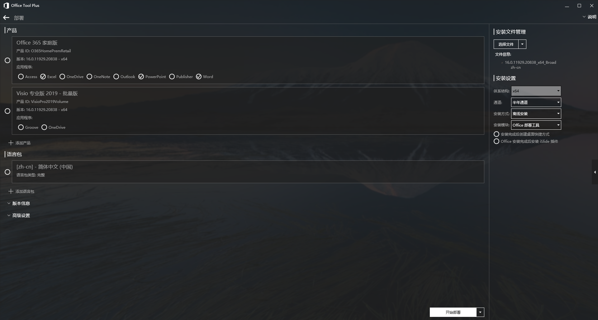
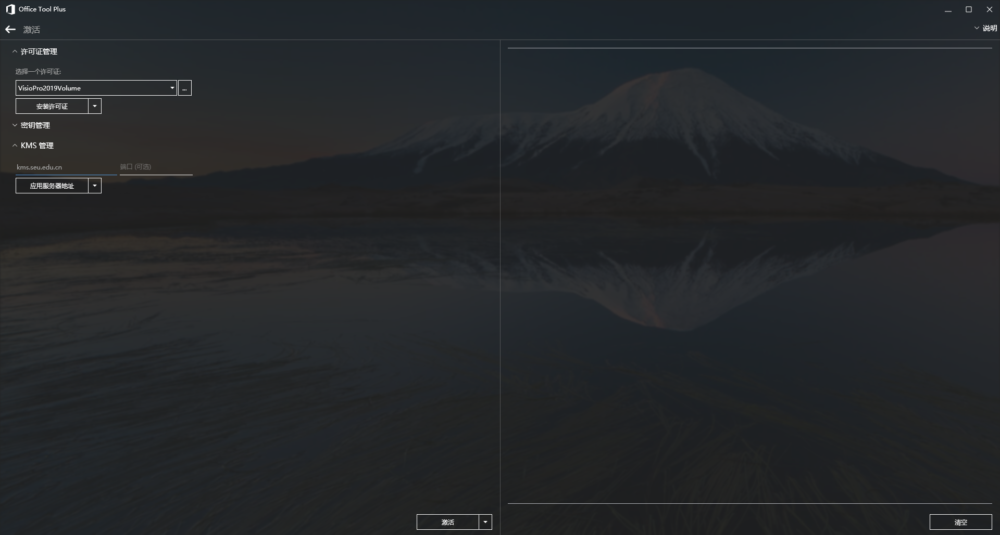

::: slot page-top

:::

# 东南大学 Visio 正版激活

完全不需要 [网络与信息中心](https:/nic.seu.edu.cn)

1. 下载 [OTP](https://otp.landian.vip/zh-cn/)，解压并打开
2. 进入 *部署*
3. 左栏选择 *Visio 专业版 2019 - 批量版*，右栏 *选择文件* 下拉栏内点击 *下载安装文件*，如图所示
   
4. 下载完成后，点击 *开始部署*
5. 部署完成后，已经能够在 *开始菜单* 中看到 Visio
6. 切换到 *激活*。请确保在东南大学校园网内，或已 [使用 EasyConnect 连入 VPN](https://vpn.seu.edu.cn)
   
7. 上方选择 *VisioPro2019Volume*
8. 下方在 KMS 服务器内填入 `kms.seu.edu.cn`，端口号默认即可，点击 *应用服务器地址*
9.  点击 *激活*
