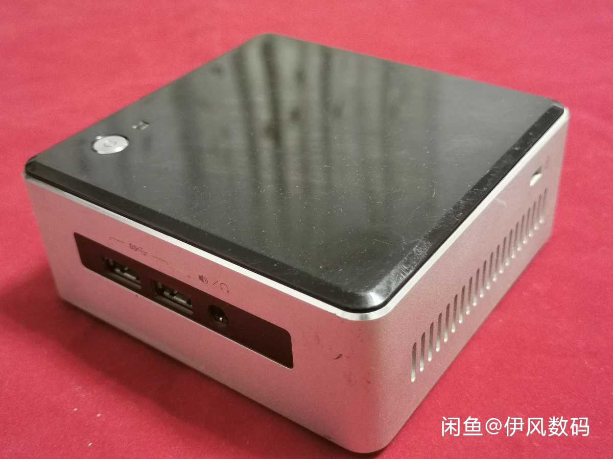

::: slot page-top

:::

# 把 NUC 变成 NAS

## 前言

笔者先前一直使用的是铁威马家的F2-220，说实话这货性价比不错，￥1300的价格，x86架构的J1800，并且铁威马的系统和服务都挺到位，一步步看着 TOS 系统逐渐完善起来感觉还是很棒的。

<!--  TODO -->

不过，J1800 的性能实在是太过羸弱，备份点文件就会轻松拉满CPU占用。而且由于学生党的笔者需要频繁在宿舍和家里往返，这个体积不小的机器，说不带吧，用不了各种内网服务实在是难受；说带吧，不仅带着麻烦，还怕颠坏了硬盘。而20年突如其来的疫情让我与 F2-220 分隔半年，更让我感受到了便携化 NAS 的必要性。所以就决定要换个轻巧的 NAS。

## 硬件选择

然而新NAS的选择却十分棘手，因为通常来看，便携性和安全性是势不两立的存在。当时笔者共有以下几个选项：
1. 有3.5硬盘位的itx主机
   - 因为itx主机本身就不可能达到迷你主机那样的轻薄，因此索性让主机内部装载硬盘会比较合理。这样也就相当于纯粹提升了NAS性能，而完全舍弃了便携性提升。不过可能可以选择ECC内存，而且电源也很可靠，所以安全性应该是最高的。
   - 性能：★★★
   - 便携：☆☆☆
   - 安全：★★★
   - 价格：>￥1600（A320M主板+速龙200GE+8G内存+酷鱼MGP+电源+散热器）
2. 有2.5或3.5硬盘位的迷你主机+硬盘盒
   - 迷你主机的CPU性能基本在下图范围内（50%~100%），而上面itx方案里的200GE性能大约是175%，所以性能一般。但是也比F2-220的J1800要强不少，而且小巧的机身，也极具可玩性。USB硬盘盒是我比较纠结的点，因为硬盘盒往往供电不稳，速度受限（一般是USB3.0的5Gbps）。
   - 性能：★☆☆
   - 便携：★★★
   - 安全：★☆☆
   - 价格：￥1290（NUC5i3RYH+双盘位USB3.0阵列盒）
3. 大厂 NAS
   - 就以F2-220为例
   - 性能：☆☆☆
   - 便携：★☆☆
   - 安全：★★★
   - 价格：￥1300

最终我还是选择了闲鱼￥790 入手 NUC5i3RYH。



这台NUC的CPU是1k内迷你主机里中上水平的Corei3 5010U，有一个支持NGFF或PCIEx4（好像是老款nvme？）的m.2槽，还有一个2.5的SATA硬盘位。外部有4个USB3.0，主板还留有一个8pin USB2.0x2接口。主板上还惊喜地留有一个F_PANEL，一个AUX辅助电源，以及一个惊为天人的 NFC接口（虽然我也不知道咋用）。

以下是我找到的相关文档：
- [NUC5i3RYH产品介绍](https://www.intel.com/content/www/us/en/products/docs/boards-kits/nuc/nuc-kit-nuc5i3ryh-brief.html)
- [NUC5i3RYH可换顶盖](https://www.intel.com/content/dam/support/us/en/documents/motherboards/desktop/sb/nucreplaceablelids.pdf)
- [NUC系列图纸](https://www.intel.cn/content/www/cn/zh/support/articles/000006820/intel-nuc.html)

## 软件选择

### 操作系统

目前的NAS可用的操作系统非常丰富，在此罗列一下我当时考虑过的几种：
1.  群晖：
   - 群晖显然是最成功的NAS操作系统，从各种方面来说都是很好的选择。不过我不喜欢用破解版的系统，指不定哪天就被封了？因此并没有选用黑群晖。
2.  TrueNAS：
   - TureNAS就是FreeNAS的套壳版，有基于FreeBSD的普通版，也有基于Debian的Scale版（目前还在Beta中）。由于我不可避免的会用到Docker，因此就在虚拟机上体验了一下TrueNAS Scale。说实话，体验非常好，漂亮的WebUI，加上成熟而简便的硬盘管理，以及浓厚的社区文化，都很合我意。但是在进行深入调研后，我发现TrueNAS坚持的zfs成了绊脚石。根据[这篇文章](https://www.truenas.com/community/threads/ecc-vs-non-ecc-ram-and-zfs.15449/)记述，不使用ECC内存的zfs很可能导致灾难性问题。虽然据说zfs创始人指出[zfs对于ECC的依赖和其他操作系统是一样的](https://arstechnica.com/civis/viewtopic.php?p=26303271#p26303271)，但我认为这十分牵强，创始人的意思应该是ECC远比zfs重要。既然这样，考虑到我不可能上ECC内存，那zfs也绝不可能使用了。
3.  OpenMedaiVault：
   - OMV估计是最适合我的NAS系统了，尽管其UI朴素地离谱，但是功能似乎健全。然而在我的试用中，OMV5的插件生态极其恶劣，好评如潮的可视化Docker插件甚至都没有支持。因此我最终选择了直接使用我非常熟悉的Ubuntu Desktop。
4.  Unraid：
   - Unraid是最近好像很火的收费NAS系统，不过我从头到尾没看见官方对于安全技术的介绍，作为一个NAS系统，似乎太不专业了。游戏性介绍倒是很多。。。

好的，绕了一大圈，我最终选择了不是NAS系统的Ubuntu Desktop作为NAS系统（笑。

### NAS应用

1.  NextCloud：一个几乎全功能的云盘系统，集网盘、备份、WebDAV于一身，基本实现了我对NAS的大部分需求。
2.  Transmission：PT下载，懂的都懂。
3.  Emby：Upnp多媒体服务器。我没有使用其开源版本Jellyfins，是因为Jellyfins好像不能显示我硬盘上大多数视频的封面图。相比之下，Emby的免费功能简单便捷，而且绝对够用了。

## 遇到的问题

### 电源键一键关机

最终采用这一解决方法：[StackExchange](https://unix.stackexchange.com/a/473626/459642)

### Nextcloud 无法访问应用商店

在 nextcloud 配置文件中的 `config/config.php` 中：
```php
'proxy' => 'http://ip:7890' # ip 为 NAS 的局域网 ip
```

##  UNRAID

结果同步文件的时候不小心把系统盘爆满了，直接 Ubuntu 开机不能。一气之下决定上 Unraid。

### 一些教程

#### Proxy

编辑 `/boot/config/go`:

```Bash
http_proxy=http://server:port https_proxy=http://server:port /usr/local/sbin/emhttp &
echo "export http_proxy=\"http://server:port\"" >> /root/.bash_profile
echo "export https_proxy=\"http://server:port\"" >> /root/.bash_profile
```

#### 有用的东西

插件：
- https://gitee.com/BlueBuger/community.applications/raw/master/plugins/community.applications.plg
- https://github.com/dlandon/unassigned.devices/raw/master/unassigned.devices.plg

APP:
- Nerd Pack
  - Python3 # 通过 Nerd Pack 安装
  - pip
  - python-setuptools
    - docker-compose # 通过 pip 安装
- Unassigned Devices Plus (Addon)

## 网络配置

我现在才知道内网ip已经不仅限于[传统的三段了](https://www.sciroccogti.top/2020/08/11/%E8%AE%A1%E7%BD%91/cn-0/#ipv4-%E7%BC%96%E5%9D%80)，
`100.64.0.0/10`已经被用于[运营商NAT](https://tools.ietf.org/html/rfc6598)。

因此，`100.64.*.*~100.127.*.*` 都不再是公网地址了

