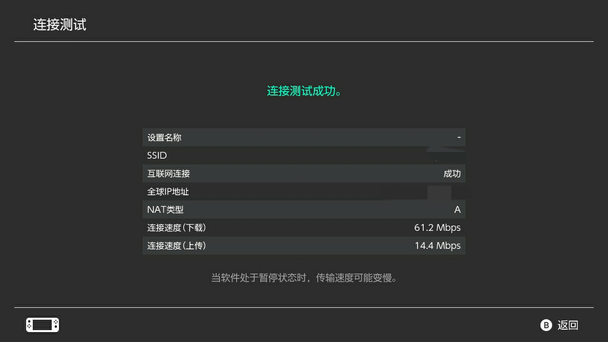

# Nintendo Switch 使用指北

终于，模拟器玩家还是入正了。

## TV 模式充电器

由于入手的是港版，那个硕大的充电器实在是不能接受。自然就掏出了雪藏多年的倍思 65W 氮化镓充电器。

不过，switch 的 TV 模式 仅能使用 15V * 2.6A = 39W 的 PD 2.0 模式，这导致氮化镓充电器和底座有时候会鬼畜，
每次重连充电线都是抽奖。。具体充电头评测请见 [充电头网的专业测试](https://www.chongdiantou.com/wp/archives/45157.html)。

## 5GHz WiFi

switch 很顶的只支持 `36-48` 信道的 5GHz WiFi，所以导致有些 5GHz WiFi 根本搜不到。

## 网络设置

switch 在国内常常难以联机，因此需要进行一些设置。

### http 代理

就跟平常的一样，没什么可说的

### DNS

http 代理只能解决下载速度问题，而 联机 则最好要修改 DNS。网上有很多 DNS 推荐，我一般就用 Cloudflare 的 `1.1.1.1`

### NAT 类型

其实我也不知道这有什么用，但是似乎各类加速器都推荐把 NAT 类型搞到 A。也有人说 NAT A和B都够用了，尚不知是否正确。

要把 NAT 类型 搞到 A 其实很简单，就是 路由器上把 switch 的端口暴露到公网即可（当然你得是公网路由器，像我宿舍目前 WISP 的套娃路由器就最多到 NAT B）。

我用 *wireshark* 抓了一会包，发现 switch 的 *连接测试* 主要由三部分组成：网络类型检测，下载速度测试，上传速度测试。

~~理论上，我们只要把网络类型检测所用到的端口暴露出去就可以了。可惜的是 *任天堂* 用的是随机端口，因此我们只能范围转发。目前我抓到的最小的端口号是 `21424`，最大的是 `58603`，范围很广。。不过为了迁就潜在的 其它需求），~~（这里的端口似乎并不和 NAT 类型检测直接相关）我就把 switch 的端口转发范围限定在了 `50000 ~ 65535`，不出意外的话应该够用了。

当然，为了能够设置端口转发，自然需要将 switch 的 ip 地址固定下来。



### 配套 clash

说实话到目前我还没有尝试成功。由于宿舍没有宽带，只能用 *wisp* 转发校园网 WiFi 信号，导致 NAT 类型最好也只可能是 B。

据[一些大佬](https://github.com/Dreamacro/clash/issues/971)和[另一些大佬测试](https://github.com/vernesong/OpenClash/issues/522)，通过使用 clash 的 tun 模式，能够使得 switch 正常进行联机。因此我也进行了一定的探索。

首先，docker 的 clash 似乎不能处理 UDP；其次，即便我成功跑通了 tun 模式（大概？），switch 仍不能正常联机，不过从先前的完全不能连，变成了现在的连几秒就断（进步了，但是完全没进步）。

奉上失败的配置文件：
```yaml
port: 7890

socks-port: 7891

redir-port: 7892

mixed-port: 

allow-lan: true

bind-address: '*'

mode: rule

log-level: info

ipv6: false

external-controller: 0.0.0.0:9090

external-ui: yacd

interface-name: br0 # unraid 中很坑，必须用 ifconfig 看才能知道真正的网卡，webui 上的是假的

hosts:
  # '*.clash.dev': 127.0.0.1
  # '.dev': 127.0.0.1
  # 'alpha.clash.dev': '::1'

profile:
  store-selected: true

dns:
  enable: true
  listen: 0.0.0.0:53
  # ipv6: false # when the false, response to AAAA questions will be empty

  default-nameserver:
    - 114.114.114.114
    - 1.2.4.8
    - 8.8.8.8
  enhanced-mode: redir-host # or fake-ip
  fake-ip-range: 198.168.0.1/24 # Fake IP addresses pool CIDR
  # use-hosts: true # lookup hosts and return IP record
  
  # Hostnames in this list will not be resolved with fake IPs
  # i.e. questions to these domain names will always be answered with their
  # real IP addresses
  # fake-ip-filter:
  #   - '*.lan'
  #   - localhost.ptlogin2.qq.com
  
  # Supports UDP, TCP, DoT, DoH. You can specify the port to connect to.
  # All DNS questions are sent directly to the nameserver, without proxies
  # involved. Clash answers the DNS question with the first result gathered.
  nameserver:
    - 114.114.114.114
    - 1.2.4.8
    - 1.1.1.1

  # This is a countermeasure against DNS pollution attacks.
  fallback-filter:
    geoip: true
    ipcidr:
      # - 240.0.0.0/4
    # domain:
    #   - '+.google.com'
    #   - '+.facebook.com'
    #   - '+.youtube.com'

tun:
  enable: true
  stack: system # or gvisor
  # dns-hijack:
  #   - 8.8.8.8:53
  #   - tcp://8.8.8.8:53
  auto-route: true # auto set global route
  auto-detect-interface: false # Linux 下必须为 false

```
