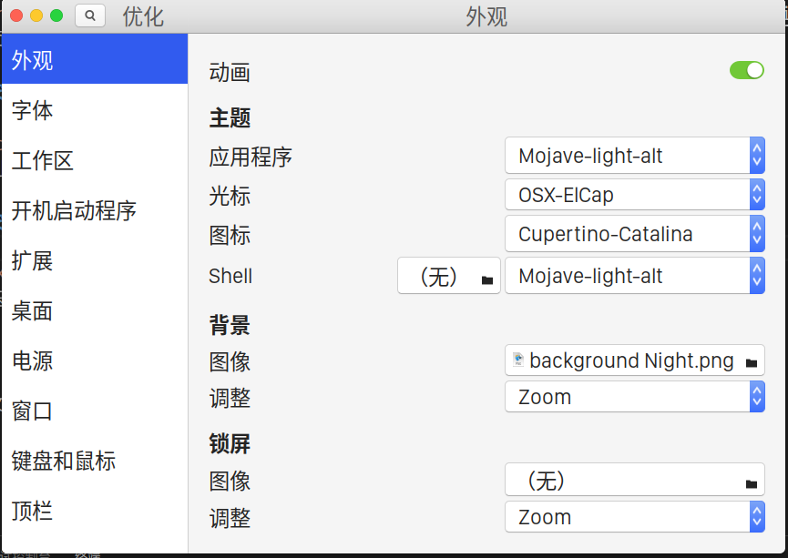

# 让你的 Ubuntu 看起来像 Mac

参考教程：[史上最良心的 Ubuntu desktop 美化优化指导(1)](https://zhuanlan.zhihu.com/p/63584709)

在 Ubuntu 18.04 测试通过

## 安装美化必要的工具

```Bash
sudo apt update
sudo apt install gnome-tweaks
sudo apt install chrome-gnome-shell
```

打开 `https://extensions.gnome.org/` ，根据提示安装 Firefox 浏览器的 gnome 扩展（事实证明 Chrome 系支持更好）

### 安装主题

- [User Themes](https://extensions.gnome.org/extension/19/user-themes/)
- [WhiteSur 主题](https://github.com/vinceliuice/WhiteSur-gtk-theme)：
建议源码安装以获得最新更新。WhiteSur 主题目前自带 `tweak.sh` 来提供 firefox、dash-to-dock、锁屏 gdm 的对应风格主题
- ~~[模糊效果 blyr 插件](https://extensions.gnome.org/extension/1251/blyr/)~~

### 安装图标

- [WhiteSur 图标](https://github.com/vinceliuice/WhiteSur-icon-theme)

### 安装光标

- [WhiteSur 光标](https://github.com/vinceliuice/WhiteSur-cursors)：目前好像大小不对劲

### 更换 dock

- ~~[Dash to Dock](https://extensions.gnome.org/extension/307/dash-to-dock/)~~Dash to Dock 目前对 Gnome 40 支持不好，推荐用 [Floating Dock](https://extensions.gnome.org/extension/3730/floating-dock/)

以上文件安装后均需在 *tweaks* 软件中设置，如图：


### 启动动画

[Darwin Plymouth](https://www.gnome-look.org/p/1009320/)

由于这是一个老款主题，需要修改其中路径。

解压缩后，修改其中的文件 `darwin.plymouth`，将 `/lib` 替换为 `/usr/share`：
```
[Plymouth Theme]
Name=Darwin OS X Plymouth
Description=A Plymouth of OS X Yosemite
ModuleName=script

[script]
ImageDir=/usr/share/plymouth/themes/darwin
ScriptFile=/usr/share/plymouth/themes/darwin/darwin.script
```

复制到 `/usr/share/plymouth/themes/darwin`

运行：
```Bash
sudo update-alternatives --install /usr/share/plymouth/themes/default.plymouth default.plymouth /usr/share/plymouth/themes/darwin/darwin.plymouth 100
sudo update-alternatives --config default.plymouth
# 选择对应主题
sudo update-initramfs -u
```

### 自动深色模式

[night theme switcher](https://extensions.gnome.org/extension/2236/night-theme-switcher/)

自动切换终端配色：[参考此处](https://gitlab.com/rmnvgr/nightthemeswitcher-gnome-shell-extension/-/issues/33)，注销后登录即可生效。