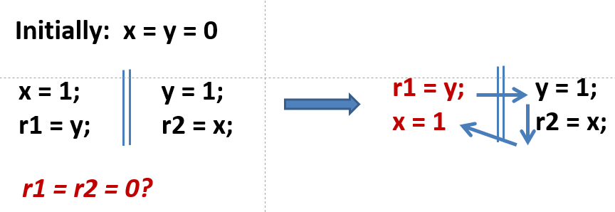
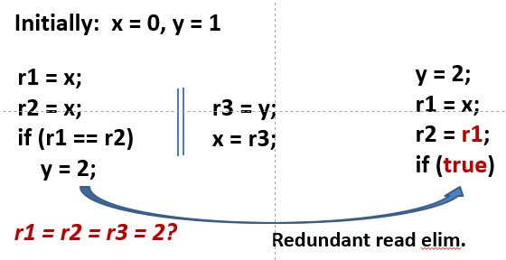

对应课程：[南京大学并发算法与理论](https://cs.nju.edu.cn/hongjin/teaching/concurrency/)

试图像追番一样学习

不过时间有限，就做个简短的笔记好了

## 0 绪论

并发存在交织性，例如以下程序虽能编译，但会断言错误：
```cpp
#include <thread>
#include <assert.h>

int x = 0;

void foo() {
    while (true) {
        x = 1;
        x = 0;
        assert(x == 0);
    }
}

int main() {
    std::thread t(foo);
    std::thread t2(foo);

    t.join();
    t2.join();
}
// g++ ./main.cpp -lpthread -o main.o
```

## 1 JMM

Java Memory Model (JMM)

### 1-1 SC 模型

Sequential Consistency (SC) Model，顺序存储模型



这种与顺序存储模型不符的 reordering 优化在 Java 或其它编译器中存在

### 1-2 DRF 程序

Data-Race-Freedom (DRF)，无数据竞争：读写冲突/写写冲突

DRF 程序就不用担心受 reordering 优化影响。
因此编译器也可以大肆优化：



### 1-3 Happens-Before

操作A happens before 操作B，就是要求 操作A 对于 操作B 可见，且本质上应先于操作B 执行。譬如：
```cpp
i = 1; // 操作A
j = i; // 操作B
```
则如果 A hb B，则 `j=1`；若没有声明 hb，就不能保证这个结果。

不过，即便声明 hb，也并不一定要顺序执行，只要保证结果上一致即可。

> 这课好像纯 Java 啊目前
