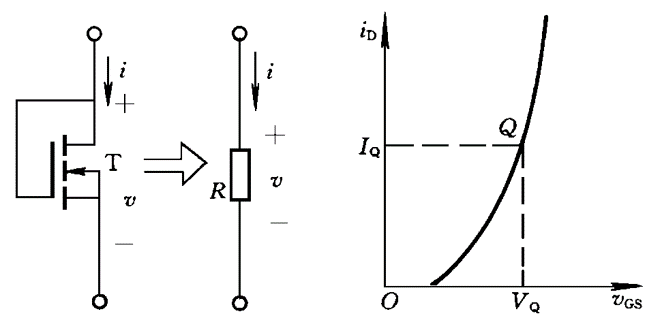
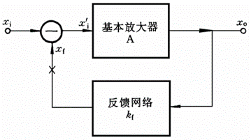
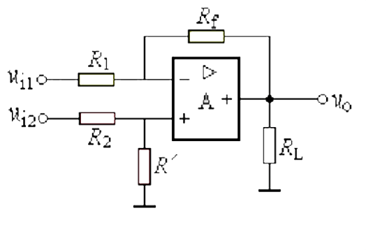
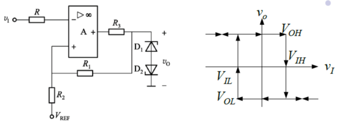

# 模电小结

##  1 晶体二极管

直流通路：信号源短路，耦合电容开路

交流通路：直流电源短路，耦合电容短路

### 1-1 半导体物理基础知识

热平衡载流子浓度值$n_i=AT^{3/2}e^{\frac{-E_{g0}}{2kT}}$

热平衡条件：$n_0p_0=n_i^2$

电中性方程：掺杂低价离子时：$p_0=N_a+n_0,N_a$为掺杂浓度

空穴，自由电子

电场：漂移电流；浓度差：扩散电流

### 1-2 PN结

**内建电位差**：$V_B\approx{V_T}ln\frac{N_aN_d}{n^2_i}$，其中热电压$V_T=\frac{kT}{q}$，室温下约为26mV

**伏安特性**：$I=I_S(e^{V/V_T}-1)$，S：反向饱和（Saturate），I、V在二极管中常有下标D（Diode）

>   此处`-1`或变换后的`+1`常忽略

### 1-3 晶体二极管电路的分析方法

伏安特性曲线在导通电压后以$R_D$的斜率上升

**小信号模型-交流模型**：串联一个微变电阻（增量结电阻/肖特基电阻）==$r_j=\frac{V_T}{I_Q}$==，与静态工作点有关，此模型下的电流$i_d$

### 1-4 晶体二极管的应用

轮流假设各管导通或截止

### 1-5 其它二极管

#### 齐纳二极管

又称**稳压二极管**，工作在反向击穿区

$R_Z$相当于小信号模型中的电阻

可将波动的输出范围视作源

可靠击穿即电流足够大

## 2 晶体三极管

### 2-1 晶体三极管的工作原理

$I_E=I_C+I_B$

$I_C=\bar{\beta}I_B\approx\bar{\alpha}I_E$

>>  共基极直流电流放大系数：$\bar{\alpha}=\frac{I_C-I_{CBO}}{I_E}=\frac{I_{Cn1}}{I_E}\approx\frac{I_C}{I_E}$
>>
>>  共射极直流电流放大系数：$\bar{\beta}=\frac{\bar{\alpha}}{1-\bar{\alpha}}=\frac{I_C-I_{CBO}}{I_B+I_{CBO}}\approx\frac{I_C}{I_B}$
>
>   穿透电流：$I_{CEO}=(1+\bar{\beta})I_{CBO}$

$I_C=I_S(e^{V_{BE}/V_T}-1)$

$r_{ce}\approx\frac{-V_A}{I_{CQ}}=\frac{|V_A|}{I_{CQ}}$

*   **放大模式**：发射结加正向电压，集电结加反向电压，$V_{CE}>0.3V$
*   **饱和模式**：均正偏，$V_{CB}=0.4V,V_{BE}=0.7V$（掺杂浓度不同）
*   **截止模式**：均反偏

基区宽度调制效应：集射电压变化导致基极电流变化

### 2-2 晶体三极管模型

#### 共射大信号电路

**放大模式**：只考虑发射结电压，其余按电流关系

**饱和模式**：考虑发射结电压和集电结电压（$V_{CE}=0.3V$）

1.  **放大模式**：输入端接正向电压源（相当于半导体大信号模型中的电压源。即正向导通电压），输出端接正向受控电流源（相当于EM模型中的电流源），发射极为负端
2.  **饱和模式**：输入端、输出端都接正向电压源，都约为正向导通电压
3.  **截止模式**：输入端、输出端都断路

#### 小信号-混合π型微变等效电路

**简化**：
*   忽略$r_{b'c}$、$r_{ce}$
*   低频时：忽略$C_{b'c}$、$C_{b'e}$

$\beta=g_mr_{b'e}$：反映三极管的放大能力

**跨导**$g_m=\frac{\alpha}{r_e}=\frac{αI_{EQ}}{V_T}\approx\frac{I_{CQ}}{V_T}$

NPN和PNP的小信号模型一样

#### 频率参数

$\beta(j\omega)\approx\frac{\beta}{1+j\omega/\omega_\beta},\omega_\beta=\frac{1}{r_{b'e}(C_{b'e}+C_{b'c})}\approx\frac{1}{r_{b'e}C_{b'e}}$

**特征频率**$f_T$：β为1时对应的频率

**截止频率**$f_β$：β为最大时的0.707时对应的频率

### 2-3 三极管电路分析方法

先假设为放大模式，然后求$V_{ce}$证明成立

### 2-4 三极管应用原理

#### 分压式偏置电路

**放大模式**：
*   $V_{BB}=V_{CC}\frac{R_{B2}}{R_{B1}+R_{B2}}$（由戴维宁）
*   $R_B=R_{B1}//R_{B2}$（由戴维宁）
*   $I_B=\frac{|V_{BB}|-|V_{BE(on)}|}{R_B+(1+\beta)R_E}$

#### 跨导线性环电路

偶数个BE结环状相接，其中一半按顺时针方向，另一半按逆时针方向，则所有环中顺时针集电极电流之积等于逆时针集电极电流之积。

$\prod_{CW}i_{Ck}=\lambda\prod_{CCW}i_{Ck},\lambda=\prod_{CW}S_k/\prod_{CCW}S_K$，i为集电极电流，S为发射结面积

## 3 场效应管

### 3-1 绝缘栅场效应管MOSFET

N：箭头向内。箭头方向：PN结正偏时正向电流方向

$I_D=I_S$

衬偏效应：衬底和源极间有电压差

#### EMOS(Enhancement)

N沟道：$v_{GS}>0$；P沟道相反

#### DMOS(Depletion)

N沟道：$v_{GS}<0$；P沟道相反

在生产时已经制作了沟道，因此$v_{GS}=0$时就有沟道

**非饱和区**：$I_D=\frac{\mu_nC_{OX}W}{2l}[2(V_{GS}-V_{GS(th)})V_{DS}-V_{DS}^2]$
*   $v_{DS}$很小时：$I_D=\frac{\mu_nC_{OX}W}{l}(V_{GS}-V_{GS(th)})V_{DS}$
*   计及沟道长度调制效应时：$I_D=\frac{\mu_nC_{OX}W}{2l}(V_{GS}-V_{GS(th)})(1-\frac{V_{DS}}{V_A})=\frac{\mu_nC_{OX}W}{2l}(V_{GS}-V_{GS(th)})(1-{\lambda}V_{DS})$（源漏电压差导致漏极电流变化）

计及沟道调制效应

**饱和区**：$I_D=\frac{\mu_nC_{OX}W}{2l}(V_{GS}-V_{GS(th)})^2$

**饱和区小信号电路模型**：$g_m=2\sqrt{\frac{\mu_nC_{OX}W}{2l}I_{DQ}(1+{\lambda}V_{DSQ})}\approx{K}(V_{GSQ}-V_{GS(th)})$，在ds间接一个电阻$r_{ds}=\frac{Δv_{DS}}{Δi_D}=\frac{|V_A|+V_{DSQ}}{I_{DQ}}\approx\frac{|V_A|}{I_{DQ}}$

$g_{mb}={\eta}g_m$

**非饱和区小信号电路模型**：$r_{ds}\approx\frac{l}{\mu_nC_{OX}W}(\frac{1}{V_{GSQ}-V_{GS(th)}})$

||N沟道|P沟道|
|---|---|---|
|非饱和区|$v_{GS}>V_{GS(th)}$ $v_{DS}<v_{GS}-V_{GS(th)}$|$v_{GS}<V_{GS(th)}$ $v_{DS}>v_{GS}-V_{GS(th)}$|
|饱和区|$v_{GS}>V_{GS(th)}$ $v_{DS}>v_{GS}-V_{GS(th)}$|$v_{GS}<V_{GS(th)}$ $v_{DS}<v_{GS}-V_{GS(th)}$|

n沟道中所有不等号取反即是p沟道

### 3-2 结型场效应管

**非饱和区**：$I_D\approx2I_{DSS}\frac{V_{GS}-V_{GS(off)}}{V_{GS(off)}}\frac{V_{DS}}{V_{GS(off)}}$

**饱和区**：$I_D=I_{DSS}(\frac{V_{GS}-V_{GS(off)}}{V_{GS(off)}})^2$

**饱和区计及沟道长度调制效应**：$I_D=I_{DSS}(\frac{V_{GS}-V_{GS(off)}}{V_{GS(off)}})^2(1-\frac{V_{DS}}{V_A})$

**截止区**：$v_{GS}<V_{GS(off)},i_D=0$

**击穿区**：随着$v_{DS}$增加，近漏端PN结发生雪崩击穿，$V_{GS}$越负，$V_{(BR)DS}$越小

电路模型与MOS管一致

$g_m=-\frac{2I_{DSS}}{V_{GS(off)}}\frac{V_{GS}-V_{GS(off)}}{V_{GS(off)}}$

### 3-3 场效应管应用原理

#### 有源电阻

**N沟道EMOS**：GD相连

$i_D=\frac{\mu_nC_{OX}W}{2l}(v_{GS}-V_{GS(th)})^2$

交流阻值：$\frac{1}{g_m}$

**N沟道DMOS**：GS相连

交流阻值：$r_{ds}$

#### 逻辑门电路

N沟道MOS等效为栅压高时闭合的开关

P沟道MOS等效为栅压高时打开的开关

## 4 放大器基础

==增益方向！==

### 4-1 放大器的基本概念

**负载开路时**$A_v=A_{vt}\frac{R_L}{R_o+R_L}=\frac{v_{ot}R_L}{v_i(R_o+R_L)}$

**负载短路时**$A_i=A_{in}\frac{R_o}{R_o+R_L}=\frac{i_{on}R_o}{i_i(R_o+R_L)}$

**源增益**：$A_{vs}=A_v\frac{R_i}{R_s+R_i},A_{is}=A_i\frac{R_s}{R_s+R_i}$，必须用分压算！

**输入电阻**：==输入电压除以输入电流==（考虑负载）

**输出电阻**：==移除信号源，不考虑负载==，从负载看到的等效电阻

$R'_o$：不考虑$R_D$等与负载并联的电阻

有时考虑用电流增益算电压增益

能利用三极管放大就用

vt：三极管；$A_vt$：三极管自身电压增益

### 4-2 基本放大器

|性能|共源|共栅|共漏|
|---|---|---|---|
|$R_i$|$\infty$|$\frac{1}{g_m}$|$\infty$|
|$R'_o$|$r_{ds}$|$r_{ds}+R_s+g_mR_sr_{ds}$|$r_{ds}//\frac{1}{g_m}$|
|$A_v$|$-g_m(r_{ds}//R_D//R_L)$|$g_m(r_{ds}//R_D//R_L)$|$\frac{g_mR'_L}{1+g_mR'_L}$|

|性能|共射|发射极接电阻的共射|共基|共集|
|---|---|---|---|---|
|$R_i$|$r_{be}$|$R_B//[r_{be}+(1+β)R_{E1}]$|$\frac{r_{be}}{1+\beta}$|$r_{be}+(1+\beta)R'_E$|
|$R'_o$|$r_{ce}$||$r_{ce}(1+g_m(R_S//r_{be}))$|$\frac{r_{be}+R_S}{1+\beta}$|
|$A_v$|$-g_mR'_L$||$g_mR'_L$|$\frac{(1+\beta)R'_E}{r_{be}+(1+\beta)R'_E}$|

共基：发射极为输入端正极，基极接地

共集：基极作为输入端正极

**要点：电流源两端不能接信号源**

#### 共射放大器

**基本共射放大器**
*   **输入电阻**：$R_i=r_{be}=r_{bb'}+r_{b'e}$
*   **输出电阻**：$R'_o=r_{ce},R_o=r_{ce}//R_C$
*   **电流增益**：$A_i=\beta\frac{R_o}{R_o+R_L}=g_mr_{b'e}\frac{R_o}{R_o+R_L}$
*   **电压增益**：$A_v=-g_mR'_L$

**有源负载放大器**
*   **电压增益**：$A_v=-g_m\frac{r_{ce}}{2}=-\frac{|V_A|}{2V_T}$

**发射极接电阻的共射放大器**
*   **输入电阻**：$R_i=r_{bb'}+r_{b'e}+R_E\frac{(1+\beta)r_{ce}+R'_L}{r_{ce}+R'_L+R_E}$
*   **输出电阻**：$R'_o=(1+\frac{βR_E}{R_S+r_{bb'}+r_{b'e}+R_E})r_{ce}+\frac{R_s+r_{bb'}+r_{b'e}}{R_s+r_{bb'}+r_{b'e}+R_E}R_E,R_o=R'_o//R_C$
*   **电流增益**：$A_i=\beta\frac{R_C}{R_C+R_L}$
*   **电压增益**：$A_v=-\frac{\beta{R'_L}}{r_{bb'}+r_{b'e}+(1+\beta)R_E}\approx-\frac{R'_L}{R_E}$

#### 集成MOS放大器

**E/E和E/D MOS放大器**：只用N型，负载实质为纯电阻
1.  E/E：放大器和负载均为EMOS
2.  E/D：放大器为EMOS，负载为DMOS

### 4-3 差分放大器

**共模信号**$v_c=(v_1+v_2)/2$：两信号和的一半，即均值

**差模信号**$v_d=v_1-v_2$：两信号差

$v_1=v_c+v_d/2,v_2=v_c-v_d/2$

$v_{id}$为两端输入之差，因此差模输入电阻要算两倍

##### 差模等效电路

对差模信号而言，$R_{ss}$可视为短路。

**性能指标定义**
*   双端增益$A_{vd}=\frac{v_{od}}{v_{id}}$
*   单端输出时差模电压增益$A_{vdi}=\pm\frac{1}{2}A_{vd}$
*   差模输入电阻$R_{id}=\frac{v_{id}}{i_{id}}$（常为两倍）
*   差模输出电阻：单端输出时，为放大器任一输出端到地的输出电阻，而双端输出电阻则是以两端向放大器看过去的输出电阻，即为两放大器输出电阻之和。（将输入电压短路）
*   共模增益$A_{vc}=\frac{-g_mR_D}{1+2g_mR_{SS}}$
*   共模抑制比：$K_{CMR}=|\frac{A_{vd}}{2A_{vc}}|=|\frac{A_{vdi}}{2A_{vci}}|$

**指标计算**
*   $v_{odi}=-g_{mi}v_{idi}(R_D//R_L)$
*   $v_{IDmax}=\sqrt{2}(V_{GS}-V_{GS(th)}$，即差模输入的一半的峰值必须保证管子仍处于放大

|差模|共模|
|---|---|
|$v_{id}=v_{1i}-v_{2i}$|$v_{ic}=\frac{v_{1i}+v_{2i}}{2}$|
|$v_{od}=v_{1o}-v_{2o}$|$v_{oc}=\frac{v_{1o}+v_{2o}}{2}$|
|$A_{vd}=\frac{v_{do}}{v_{di}}$||
|$A_{vdi}=\pm{A_{vd}}$|$A_{vci}=\frac{v_{1o}}{v_{1c}}$|

##### 共模等效电路

对共模信号而言，相当于接入$2R_{ss}$。

双端共模增益为零

双极型差模增益$A_{vd}=-\frac{\beta{R_C}}{r_{bb'}+r_{b'e}}$

### 4-4 电流源电路及其应用

#### 镜像电流源

**基本镜像电流源电路**

==T1接成二极管，T2接成电流源==

$i_{C2}=I_O=(I_{S2}/I_{S1})i_{C1}=(S_{E2}/S_{E1})i_{C1}$

$I_R=\frac{V_{CC}-V_{BE(on)}}{R}$

$I_O=\frac{I_R}{1+2/\beta}$

### 4-5 多级放大器

划分为多个常见电路模型

### 4-6 放大器的频率响应

#### 复频域分析方法

一个独立电抗元件对应一对极零点

**幅频**：波特图为20lg

真实：s换为jω

波特：$-20lg\sqrt{1+(\omega/\omega_p)^2}$近似为20dB

遇到零点则斜率加，遇到极点则斜率减，最后叠加/求和

**相频**：$-arctan(\omega/\omega_p)$

从$\omega_p$开始非0，单极点斜率为-45°

**中频增益**：将传递函数写为一极一零连乘形式，利用高低通特性将传递函数化为常数

**上限频率**：
1.  根据定义：
    *   多极无零系统：$\omega_H\approx\frac{1}{\sqrt{1/\omega^2_{p1}+1/\omega^2_{p2}+...}}$，主极点是n重极点时：$\omega_H\approx\omega_p\sqrt{2^{1/n}-1}$
    *   重极点：$\omega_H\approx\omega_p\sqrt{2^{1/n}-1}$，n为极点个数
2.  用主极点近似求解

**主极点**：
*   **低频主极点**：比其它极点值都大4倍以上
*   **高频主极点**：比其它极点值都小4倍以上，又称**主极点**

#### 共源、共发放大器的频率特性

**密勒定理**

图(a)为输入输出端跨接阻抗Z(s)(或Y(s)=1/Z(s))的网络，它可以用图(b)来等效:
$\begin{cases}Y_1(s)=\frac{1}{Z_1(s)}=Y(s)[1-A(s)]\\Y_2(s)=\frac{1}{Z_2(s)}=Y(s)[1-A(s)]\end{cases}$，其中A(s)=V2(s)/V1(s)，即Y(s)可以用分别并接在输入输出端的导纳Y1(s)，Y2(s)来代替

中频增益即小信号等效电路的电压增益（20lg）

$C_{b'e}=\frac{g_m}{\omega_T}-C_{b'c}$

|放大器|CS|CE|
|---|---|---|
|密勒效应D因子|$D=1+(C_{gd}/C_{gs})g_mR'_L\approx1+\omega_TR'_LC_{gd}$|$D=1+(C_{b'c}/C_{b'e})g_mR'_L\approx1+\omega_TR'_LC_{b'c}$|
|单向化近似条件|$g_m>>{\omega}C_{gd}$ $R'_L<<1/{\omega}C_{gd}$|$g_m>>{\omega}C_{b'c}$ $R'_L<<1/{\omega}C_{b'c}$|
|$\omega_H$|$\frac{1}{R_tC_{tF}}$|$\frac{1}{R_tC_t}$|
|电容|$C_{tF}=DC_{gs}$|$C_{t}=DC_{b'c}$|
|电阻|$R_s$|$R_t=(R_s+r_{bb'})//r_{b'e}$|

## 5 放大器中的负反馈

### 5-1 反馈放大器的基本概念

输出信号$x_o=Ax'_i$

反馈系数$k_f=\frac{x_f}{x_o}$

误差信号$x'_i=x_i-x_f$

反馈放大器的增益（闭环增益）：$A_f=\frac{A}{1+T}=\frac{A}{F}$

环路增益$T=k_fA$，反馈深度$F=1+T=1+k_fA$

反馈网络的输入端在原输出端侧

#### 四种类型负反馈放大器

电压型：输出端并联；电流型：输出端串联

并联型：输入端并联，接电流源；串联型：输入端串联，接电压源

反馈信号类型一定与输入信号类型一致。

**类型判别**

分别短路输入输出
1.  短路**输入**时，若反馈网络的输出对放大器产生影响，如$v'_i=-v_f$，则为**串联**
2.  短路**输出**时，若反馈网络有输入，则为**电流**

简化：
*   与输出连：电压
*   与输入连：并联

**极性判别**

极性主要指增益的正负

削弱净输入信号的为负反馈，增强净输入信号的为正反馈，即$x_f$的正负

在闭合环路的任一处断开，并在此处假定信号极性，而后不考虑信号源，按顺时针判定信号流经该闭合环路时电压极性的转换，直到返回断开点。
若此时极性与假设相同，则为正反馈。

顺时针指先经过放大器输入，到输出，再到反馈网络输入，到输出。

经过 *地* 时反相，经过 * 电阻* 时不变

### 5-2 负反馈对放大器性能的影响

**串联负反馈**：输入端是基本放大器的输入与反馈网络的输出串联连接，故输入电阻增加到基本放大器输入电阻的F倍

#### 增益及其稳定性

**源电压增益**：$A_{fs}=\frac{R_{if}}{R_{if}+R_s}A_f=\frac{A_s}{1+k_fA_s}$

**增益灵敏度**：$S^{A_f}_A=\frac{\Delta{A_F}}{A_f}\frac{A}{\Delta{A}}$

$S^{A_f}_A=\frac{1}{1+T}$

#### 输出电阻

*   输出阻抗低适合输出电压
*   输入阻抗低适合输入电流

#### 失真和噪声

|反馈类型|输入阻抗$R_{if}$|输出阻抗$R_{of}$|类型|
|---|---|---|---|
|电压串联负反馈|$R_iF$|$\frac{R_o}{F_{st}}$|电压增益|
|电压并联负反馈|$\frac{R_i}{F}$|$\frac{R_o}{F_{st}}$|
|电流串联负反馈|$R_iF$|$R_oF_{sn}$|
|电流并联负反馈|$\frac{R_i}{F}$|$R_oF_{sn}$|电流增益|

$A_{vt}=A_v\frac{R_o+R_L}{R_L}$

$A_{vst}=\frac{R_i}{R_s+R_i}A_{vt}$

### 5-3 负反馈放大器的性能分析

**拆环方法**：
*   考虑反馈放大器输入时，将反馈网络的输出
    *   电压：短路
    *   电流：开路
*   考虑反馈放大器输出时，将反馈网络的输入
    *   并联：短路
    *   串联：开路

电压：假设输出电流
电流：假设输出电压
并联：假设输入电流
串联：假设输入电压

假设网络的输入、输出电流，并用电压来表示之，最后将电流搬回放大器，得到反馈系数

#### 深度负反馈

**深度负反馈条件**

$T>>1$或$T_s>>1$

## 6 集成运算放大器及其应用电路

### 6-1 集成运算电路

### 6-2 集成运放应用电路的组成原理

**理想化条件**

虚短虚断

**基本应用电路**
1.  反相放大器$A_{vf}=-\frac{R_f}{R_1}$，$R_1$为负向端到地间电阻
2.  同相放大器$A_{vf}=1+\frac{R_f}{R_1}$，$R_f=0,R_1\rightarrow\infty$时构成同相跟随器
    1.  $R_1>>R_o$

#### 闭环应用

##### 加法和减法电路

|反相加法器|同相加法器|
|---|---|
|$v_o=-(\frac{v_1}{R_1}+\frac{v_2}{R_2}+\frac{v_3}{R_3})R_F$|${v_o}=(1+\frac{R_F}{R_1})v_+$ $v_+=(\frac{v_1}{R'_1}+\frac{v_2}{R'_2}+\frac{v_3}{R'_3})R_P$，其中$R_P=R'_1$、$R'_2$、$R'_3$、$R'$并联|
|||

|加法器实现的减法器|差动减法器|
|---|---|
|$v_o=\frac{R_f}{R_2}v_{i2}-\frac{R_f}{R_1}v_{i1}$|$v_{o1}=-\frac{R_f}{R_1}v_{i1}$ $v_{o2}=(1+\frac{R_f}{R_1})\frac{R'}{R'+R_2}v_{i2}$ 当$\frac{R_f}{R_1}=\frac{R'}{R_2}$时，$v_o=\frac{R_f}{R_1}(v_{i2}-v_{i1})$|
|||

|积分运算电路|微分运算电路|
|---|---|
|$v_o=-\frac{1}{RC}\int{v_i}dt$|$v_o=-RC\frac{dv_I}{dt}$|
|||

|对数运算电路|指数运算电路
|---|---|
|$v_o=V_Tln\frac{v_I}{RI_S}$，其中$i_D\approx{I_S}e^\frac{V_D}{V_T}$|$v_o=-RI_Se^\frac{v_S}{V_T}$|
|||

##### 有源滤波器

可以带负载，可以提供增益

|带通|带阻|
|---|---|
|||

#### 开环应用

|电压比较器|单限电压比较器|
|---|---|
|$V_+>V_-$时输出高电平|$V_{OH}=V_{Z1}+V_{D2(on)}$ $V_{OH}=-(V_{Z2}+V_{D1(on)})$|
|||

##### 迟滞比较器

$V_{IH}=\frac{R_2}{R_1+R_2}V_{OH}+\frac{R_1}{R_1+R_2}V_{REF}$

$V_{IL}=\frac{R_2}{R_1+R_2}V_{OL}+\frac{R_1}{R_1+R_2}V_{REF}$

$\Delta{V}=V_{IH}-V_{IL}=\frac{R_2}{R_1+R_2}V_{OH}$

先求输出范围，再通过电路求输入范围

输入接电容：方波发生器
