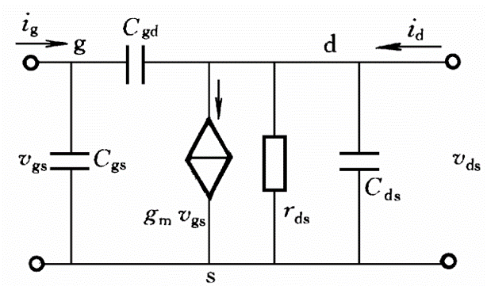

**电流方向**

# 模电 上

##  1 晶体二极管

### 1-1 半导体物理基础知识

热平衡载流子浓度值$n_i=AT^{3/2}e^{\frac{-E_{g0}}{2kT}}$

热平衡条件：$n_0p_0=n_i^2$

电中性方程：掺杂低价离子时：$p_0=N_a+n_0,N_a$为掺杂浓度

#### N型半导体(Negative)

在本征半导体中掺入5价杂质原子形成，空穴浓度远高于电子浓度

*   **多数载流子（多子）**：自由电子，由杂质原子提供，因此此处杂质原子又称施主杂质(Donor)
*   **少数载流子（少子）**：空穴，由热激发形成

#### P型半导体(Positive)

在本征半导体中掺入3价杂质原子形成，电子浓度远高于空穴浓度

*   **多子**：空穴，易俘获电子，使杂质原子成为负离子，因此此处杂质原子又称受主杂质(Acceptor)
*   **少子**：电子

### 1-2 PN结

本征半导体两侧分别形成P、N型半导体


graph TB
    A[浓度差] --> B[多子扩散];
    B --> C[由杂质离子形成空间电荷区];
    C --> D[空间电荷区形成内电场];
    D --> E[内电场促使少子漂移];
    D --> F[内电场阻止多子扩散]


多子扩散（浓度差）和少子漂移（电场力）形成动态平衡，离子薄层形成*空间电荷区*，由于缺少多子，又称*耗尽层*、*阻挡层*、*势垒区*

**内建电位差**：$V_B\approx{V_T}ln\frac{N_aN_d}{n^2_i}$，其中热电压$V_T=\frac{kT}{q}$，==室温下约为26mV==

**阻挡层宽度**：$l_0=x_n+x_p=(\frac{2\epsilon}{q}V_B\frac{N_a+N_d}{N_aN_d})$，N为多子浓度

*   **正偏**：加正向电压，P区电位高于N区
*   **反偏**：加反向电压，P区电位低于N区

*   正偏时，内电场被削弱，扩散运动加剧，漂移电流可忽略，PN结呈低阻性，导通
*   反偏时，内电场被增强，扩散运动减弱，扩散电流可忽略，PN结呈高阻性，截止

#### 伏安特性

==**伏安特性**：$I=I_S(e^{V/V_T}-1)$==

**正向特性**：
*   导通电压$V_{on}$：小于该电压时电流几乎为0，大于该电压时电流按指数增长

**反向特性**：
*   反向击穿电压$V_{BR}$（为负）：大于该电压时电流几乎为0，小于该电压时二极管被击穿

**反向恢复过程**（导通->截止）：截止前电流会突然反向，$I_R\approx\frac{U_R}{R_L}$，该段时间称为*存储时间*，随后电流逐渐归零，称为*渡越时间*，总称*反向恢复时间*

减小*存储时间*的方法：
*   结面积尽可能小
*   正向电流不要过大，防止积累过多载流子
*   反向电压大一些，只要不超过击穿电压

**二极管开通时间**（截止-导通）：忽略不计

#### 电击穿

逐步增大反向电压至足够大时，会使反向电流急剧增加

**可恢复击穿**：
*   **齐纳击穿**：掺杂浓度较高，耗尽层较窄时形成，此时较低的反向电压即可形成强电场破坏空穴对
*   **雪崩击穿**：耗尽层较宽时形成，此时高电压形成电子-空穴对，使载流子雪崩式倍增

#### 温度特性

温度每升高10℃，$I_S$约增加一倍

正偏时，近似于温度每升高10℃，$V_{on}$约减小2.5mV

温度升高时，雪崩击穿电压变高，齐纳击穿电压变低

#### 电容效应

**势垒电容**$C_T=\frac{C_T(0)}{(1-\frac{V}{V_B})^n}$：离子薄层的变化，导致存储电量变化

**扩散电容**$C_D=k_D(I+I_S)$：多子扩散后，在PN结的另一侧积聚而成

正偏时，势垒电容可忽略；反偏时，扩散电容可忽略

#### 开关特性

### 1-3 晶体二极管电路的分析方法

**结构**：PN结+引线+管壳，正极为P区，负极为N区

#### 主要参数

*   最大整流电流$I_F$
*   反向击穿电压$U_{BR}$
*   最大反向工作电压$U_R$：一般按反向击穿电压的一半计算
*   **反向电流**$I_S$：一般时最大反向工作电压下的反向电流值，又称反向饱和电流
*   最高工作频率$f_{max}$
*   结电容$C_j$
*   正向压降$U_{D(on)}$
*   动态电阻$r_d=\frac{dU}{dI}\approx\frac{26}{I_D}$：交变信号下的等效电阻，与工作电流大小有关
*   静态电阻

#### 数学模型

$I=I_S(e^{\frac{V-Ir_s}{nV_T}}-1)$

$V=Ir_S+nV_Tln(1+\frac{I}{I_S})$

#### 电路模型

**理想模型-直流模型**：不考虑开启电压、导通电压等。全黑或戴框的二极管表示理想。电源电压远比二极管的压降大时适用。

**恒压降模型-直流模型**：导通后管压降视为恒定。理想二极管串接一个电压源。二极管电流不小于1mA时适用。一般认为压降为0.7V

**折线模型-直流模型**：串接一个等效于门槛电压的电池和一个等效于管压降随电流线性增加的电阻$r_D=(U_D-V_{th})/1mA$

**小信号模型-交流模型**：串联一个微变电阻（增量结电阻/肖特基电阻）$r_j=\frac{V_T}{I_Q}$，与静态工作点有关，此模型下的电流$i_d$

#### 分析方法

**图解分析法**：
*   $\begin{cases}V+\Delta{V}=V_{DD}+\Delta{V}_{DD}-(I+\Delta{I})R\\I+{\Delta}I=f(V+\Delta{V})\end{cases}$，其中$V_{DD}$为直流电源
*   作出两方程所对应的曲线，求其交点

**等效电路分析法**：使用对应的电路模型

### 1-4 晶体二极管的应用

#### 整流电路

即：**仅选通正向电流**

#### 稳压电路

使用反向击穿后的二极管，即**稳压二极管**，使得不管电流多少，电压始终稳定在$V_Z$

#### 限幅电路

上门限$V_{IH}=V_1+V_{D(on)}$

下门限$V_{IL}=-(V_2+V_{D(on)})$

#### 钳位电路

用于将周期性信号的峰值固定在某直流电位上

正峰钳位电路

#### 与门

#### 或门

### 1-5 其它二极管

#### 齐纳二极管

又称**稳压二极管**

工作在反向击穿区

**主要参数**：
*   **稳定电压**：与反向击穿电压相等
*   **动态电阻**：该电阻越小，稳压特性越好
*   **最大耗散功率**$P_{ZM}$：反向工作时有$P_{Z}=U_ZI_Z$
*   **最大稳定电流**$I_{Z_{max}}$：取决于最大耗散功率
*   **最小稳定电流**$I_{Z_{max}}$：取决于最小工作电压
*  **稳定电压温度系数**α:稳压管工作电流不变时，每升高一度所引起的稳定电压变化的百分比，
   *  稳定电压值$|U_Z|>7V$时，α为正，反向击穿为雪崩击穿
   *  稳定电压值$|U_Z|<4V$时，α为负，反向击穿为齐纳击穿
   *  稳定电压值$4V<|U_Z|<7V$时，α接近0，稳压管可作为标准稳压管使用

使用小信号模型分析输入电压变化量对输出电压的影响

#### 光电二极管

符号：箭头入射

#### 发光二极管

符号：箭头出射

## 2 晶体三极管

### 2-1 晶体三极管的工作原理

**双极性半导体三极管**：简称三极管，有两种载流子参与导电，由两个PN结组合而成，是CCCS器件

**场效应半导体三极管**：简称场效应管，仅有一种载流子参与导电，又称单极性器件，是VCCS器件

#### 三极管结构

发射极Emitter，基极Base，集电极Collector

**NPN型**

**PNP型**

发射区掺杂浓度大，集电区掺杂浓度小，且基区很薄，集电结面积大，

工作时一定要加上适当的直流偏置电压

*   **放大模式**：发射结加正向电压，集电结加反向电压
*   **饱和模式**：均正偏，$V_{CE}<0.3V,V_{BE}=0.7V$
*   **截止模式**：均反偏

*   发射区发射载流子
*   基区传送载流子（扩散和复合）
*   集电区收集载流子

#### 电流关系

$I_E=I_{En}+I_{Ep}$

$I_C=I_{Cn1}+I_{CBO},I_{CBO}=I_{Cn2}+I_{Cp}$

$I_B=I_{Ep}+(I_{En}-I_{Cn1})-I_{CBO}$

$I_E=I_C+I_B$

**组态**：三极管必有一个输入，一个输出，一个公共（既输出又输入），由此有三种组态
1.  **共发射极接法CE**：发射极作为公共电极，发射极同时存在于输入、输出端口，基极为输入
2.  **共基极接法CB**：基极作为公共电极，发射极为输入
3.  **共集电极接法CC**：集电极作为公共电极，基极为输入

>   只有发射极和基极可作输入，只有发射极和集电极可作输出，公共端除外

==令$\bar{\alpha}=\frac{I_C-I_{CBO}}{I_E}\approx\frac{I_C}{I_E}$==，称为**共基极直流电流放大系数**，表示$I_E$转化为$I_{Cn1}$的能力，有$\bar{\alpha}<1$但接近1

同理，==$\bar{\beta}=\frac{\bar{\alpha}}{1-\bar{\alpha}}=\frac{I_C-I_{CBO}}{I_B+I_{CBO}}\approx\frac{I_C}{I_B}$==，称为**共发射极直流电流放大系数**，有$\bar{\beta}>>1$

可知$I_E\approx(1+\bar{\beta})I_B$

**穿透电流**$I_{CEO}=(1+\bar{\beta})I_{CBO}$:每升高一度，穿透电流增大一倍。O：第三极开路

### 2-2 晶体三极管模型

认为基极和发射极间电压差为0.7V

#### 埃伯尔斯-莫尔模型(Ebers-Moll)

把两个PN结分别看作一个二极管与一个$\bar{\alpha}I_F$受控电流源的并联，其中一个PN结的α为另一个PN结的放大系数，电流源大小为$I_C$

$I_F$(Forward)表示（与发射极电流同向的）流过发射结的电流，$I_R$(Reverse)表示（反向的）流过集电结的电流

**饱和模式**：三极管两个结均正偏，此时保留所有等效元件

**放大模式**：发射结正偏，集电结反偏，此时仅保留发射结对应的二极管和集电结对应的电流源

**截止模式**：三极管两个结均反偏，此时所有等效元件断路

#### 共射等效电路大信号模型

1.  **放大模式**：输入端接正向电压源（相当于半导体大信号模型中的电压源。即正向导通电压），输出端接正向受控电流源（相当于EM模型中的电流源），发射极为负端
2.  **饱和模式**：输入端、输出端都接正向电压源，都约为正向导通电压
3.  **截止模式**：输入端、输出端都断路

#### 交流小信号模型-线性模型

*   **直流量**：大写字母，大写下标
*   **交流量**：小写字母，小写下标
*   **总瞬时量**：小写字母，大写下标

**放大模式**：输入端接输入电阻$r_{be}=(1+\beta)r_e$，输出端接正向受控电流源$g_mv_{be}$

**跨导**$g_m=\frac{d{I_C}}{d{B'E}}|_{u_{CE}=const}=\frac{\beta}{r_{b'e}}$：反映三极管的放大能力

**有$g_m=\frac{\alpha}{r_e}=\frac{αI_{EQ}}{V_T}\approx\frac{I_{CQ}}{V_T}$**

即π型等效电路

只有高频工作时要考虑结电容，否则电容视作断路

若不考虑基极引线电阻和基区体电阻$r_{bb'}$时

NPN和PNP的小信号电路模型一样

#### 混合π型微变等效电路

**简化**：
*   忽略$r_{b'c}$、$r_{ce}$
*   低频时：忽略$C_{b'c}$、$C_{b'e}$

#### 参数计算

$r_e=\frac{U_T}{I_E}$

$r_{bb'}$：基区的体电阻，b'为假想点

$r_e=\frac{V_T}{I_{EQ}}$：发射结电阻

$r_{b'e}$：$r_e$归算到基极回路的电阻

$C_{b'e}$：发射结电容，又作$C_\pi$

$r_{b'c}$：集电结电阻

$C_{b'c}$：集电结电容，又作$C_\mu$

>   以下以NPN共射组态为例

#### 输入特性曲线

1.  $V_{CE}=0$时，与二极管特性相近
2.  $V_{CE}>=0.3V$时，集电结进入反偏状态，三极管处于放大状态，特性曲线将略向右移（右移是由于**基区宽度调制效应**：集电结阻挡层宽度增大，基区宽度减小）

#### 输出特性曲线

1.  $V_{CE}=0$时，集电极无收集作用，$i_C=0$，饱和区
2.  $V_{CE}$稍增大时，$i_C$与之正相关，线性放大区
3.  $V_{CE}$再增大时，$i_C$不再明显变化，体现**基区宽度调制效应**，截止区

$i_C=\beta{i_B}+I_{CEO}\approx{I_S}e^\frac{v_{BE}}{V_T}(1-\frac{v_{CE}}{V_A}),V_A$为**厄尔利电压**

$r_{ce}\approx\frac{-V_A}{I_{CQ}}=\frac{|V_A|}{I_{CQ}}$

#### 开关特性

截止状态、饱和状态可模拟开关

**集电极饱和电流**：$I_{CS}\approx\frac{V_{CC}}{R_C}$

**基极临界饱和电流**：$I_{BS}=\frac{I_{CS}}{\beta}=\frac{V_{CC}}{R_C\beta}$

**开通时间**：$t_{on}=t_d+t_r$

**关闭时间**：$t_{off}=t_s+t_f$

### 2-3 三极管电路分析方法

先假设为放大模式，然后求$V_{ce}$证明成立

#### 图解分析法

将电路分为
*   晶体三极管
*   输入端管外电路
*   输出端管外电路

**直流分析**：分别在三极管输入、输出特性曲线上作管外电路方程代表的输入、输出负载线，交点即为直流工作点。

**交流分析**

#### 等效电路分析法

求三极管基极**开路电压**$V_{BB}$和**短路电阻**$R_B=R_{B1}//R_{B2}$

$V_E=I_ER_E=I_B(1+\beta)R_E$

$I_B=\frac{V_{BB'}-0.7}{R_B+(1+\beta)R_E}\approx\frac{V_{BB'}-0.7}{(1+\beta)R_E}$：相当于把$R_E$折算到基极

**交流分析**：
*   先求工作点电流$I_{CQ}$

#### 直流参数

**直流电流放大系数**：
1.  共射接法直流电流放大系数$\bar{\beta}$：在放大区基本不变。
2.  共基接法直流电流放大系数$\bar{\alpha}$

**极间反向电流**：
1.  集电极基极间反向饱和电流$I_{CBO}$
2.  集电极发射极间反向饱和电流$I_{CEO}$

#### 交流参数

**交流电流放大系数**：
1.  共射接法交流电流放大系数$\beta={\Delta}I_C/{\Delta}I_B|_{U_{CE}=const}$：在放大区基本不变，近似等于直流β，故后续只考虑交流β。β随频率变化
2.  共基极接法交流电流放大系数$\alpha={\Delta}I_C/{\Delta}I_E|_{U_{CB}=const}$

**特征频率**$f_T$：β为1时对应的频率

#### 频率参数

$\beta(j\omega)\approx\frac{\beta}{1+j\omega/\omega_\beta},\omega_\beta=\frac{1}{r_{b'e}(C_{b'e}+C_{b'c})}\approx\frac{1}{r_{b'e}C_{b'e}}$

$\beta(\omega)=\frac{\beta}{\sqrt{1+(\omega/\omega_\beta)^2}}$
*   $\omega=\omega_\beta$
*   $\omega=\omega_T:\beta=1,\omega_T=\frac{1}{r_eC_{b'e}}$为特征角频率
*   $\omega>>\omega_\beta,\beta(\omega)\approx\beta\omega_\beta/\omega$

#### 极限参数

**集电极最大允许电流**$I_{CM}$：集电极电流增加时β会下降，当β达到线性放大区β值的2/3时所对应的集电极电流即为*集电极最大允许电流*

**集电极最大允许功耗**$P_{CM}=I_CU_{CB}{\approx}I_CU_{CE}$

**反向击穿电压**：
1.  $U_{(BR)CBO}$：Breakdown、集电极、基极、发射极开路
2.  $U_{(BR)CEO}$：基极开路时集电极和发射极间的击穿电压

### 2-4 三极管应用原理

#### 电压源

#### 放大器

**偏置电路**
*   输入工作点偏低：截止失真——信号最小值低于0V
*   输入工作点偏高：饱和失真——信号最大值高于VCC

**分压式偏置电路**

#### 跨导线性环电路

偶数个BE结环状相接，其中一半按顺时针方向，另一半按逆时针方向

$\prod_{CW}i_{Ck}=\lambda\prod_{CCW}i_{Ck},\lambda=\prod_{CW}S_k/\prod_{CCW}S_K$

#### TTL电路

## 3 场效应管

按参与导电的载流子，可分为：N沟道器件、P沟道器件

按结构分：**结型场效应绝缘管JFET**，**绝缘栅型场效应管IGFET/MOSFET**

判断：
*   N沟道：$V_{DS}>0$（为形成源到漏的电流）
*   MOS：$V_{DS},V_{GS}$极性相同

### 3-1 绝缘栅场效应管MOSFET

**增强型-EMOS**、**耗尽型-DMOS**分别有N、P沟道两种

增强型：虚线；耗尽型：实线

箭头方向：PN结正偏时正向电流方向

栅极靠近源极

源极/漏极可互换

栅长：l；栅宽：w

#### EMOS工作原理

N型：漏源电压为正；P型：漏源电压为负

源极、漏极接N+，栅极接N沟道

$v_{GS}$为正，使得电子被吸附到P衬底，最终将部分P型转为N型，形成沟道

$v_{DS}$为正，使得沟道中靠近漏极的电压较小，靠近漏极的沟道较窄，易夹断

**栅源电压的控制作用**：$v_{GS}>V_{GS(th)}$时，沟道才形成，MOS管才导通，$V_{GS(th)}$称为*开启电压*。
*   $v_{GS}$越大，导电沟道越深
*   N区掺杂浓度越高，衬底掺杂浓度越低，$V_{GS(th)}$越小

**漏源电压对漏极电流的控制作用**：
*   $u_{GS}>U_{GS(th)}$且固定时，当$u_{DS}$增加到使$u_{GD}<U_{GS(th)}$时，沟道截止，预夹断区加长，DS间电流趋于饱和
*   $u_{GS}<0$时，继续减小，最终DS间电流为0，此时$u_{GS}$称为*夹断电压*，用$u_{GS(off)}/U_P$表示

#### EMOS特性

**伏安特性**（P、N均成立）
*   非饱和区：$v_{GS}>V_{GS(th)},0<v_{DS}<v_{GS}-V_{GS(th)}$
*   饱和区：~~$v_{GS}>V_{GS(th)}$~~==$v_{DS}>v_{GS}-V_{GS(th)}$==
*   截止区：$i_D=0$
*   击穿区：$v_{DS}$过大引起雪崩击穿和穿通击穿，$v_{GS}$过大引发栅极击穿
*   亚阈区：$v_{GS}{\leq}V_{GS(th)},i_D$极小

**转移特性曲线**：漏源电压固定时，漏极电流与栅源电压间的关系。其斜率反映了栅源电压对漏极电流的控制作用，称为*跨导*$g_m=\Delta{I_D}/\Delta{U_{GS}}|_{U_{DS}=const}$

**衬底效应**

若源极不在电路的最低电位，则源极与衬底无法在沟道夹断后相连，其间就会有负的$v_{BS}$，P型硅衬底中的空间电荷区将向衬底底部扩展，$V_{GS(th)}$相应增大。在$v_{GS}$一定时，$i_D$就减小。可见$v_{BS}$也可控制$i_D$故又称衬底电极为背栅极，不过它的控制作用很小。

#### DMOS

在生产时已经制作了沟道，因此$v_{GS}=0$时就有沟道

**伏安特性**

#### 主要参数

**开启电压**$V_{GS(th)}$：是MOS管的参数

**夹断电压**$V_{GS(off)}/U_P$：是JFET的参数

**饱和漏极电流**$I_{DSS}$：是耗尽型场效应管的参数

**输入电阻**$R_{GS}$

**低频跨导**$g_m$

**最大漏极功耗**$P_{DM}=U_{DS}I_D$

**常量**$C_{OX},\eta$

#### 电路模型

**大信号**：
*   非饱和区：$i_D=\frac{\mu_nC_{ox}W}{l}(v_{GS}-V_{GS(th)})V_{DS}$
*   饱和区：$i_D=\frac{\mu_nC_{OX}W}{2l}(|v_{GS}|-V_{GS(th)})^2(1+{\lambda}V_{DS})$，λ：沟道长度调制效应参数，不考虑时取0

**小信号模型**
*   饱和区小信号模型：$i_D=\frac{\mu_nC_{OX}W}{2l}(v_{GS}-V_{GS(th)})^2(1+{\lambda}V_{DS}),g_m\approx2\sqrt{\frac{\mu_nC_{OX}W}{2l}I_{DQ}}$

*   计及沟道长度调制效应：在ds间接一个i而电阻$r_{ds}=\frac{Δv_{DS}}{Δi_D}=\frac{|V_A|+V_{DSQ}}{I_{DQ}}\approx\frac{|V_A|}{I_{DQ}}$
*   考虑衬底效应：在上一个模型的基础上在ds间接$g_{mb}v_{bs}$的电流源，方向与原有的相同，$g_{mb}=\eta{g_m}$
*   高频小信号模型：

*   源极与衬底相连时：

>   MOS管截止频率：$\omega_T=\frac{g_m}{C_{gs}+C_{gd}}$

**非饱和区小信号模型**：
*   $I_D=\frac{\mu_nC_{OX}W}{2l}[2(V_{GS}-V_{GS(th)})V_{DS}-V_{DS}^2]$
*   $r_{ds}\approx\frac{l}{\mu_nC_{OX}W}(\frac{1}{V_{GSQ}-V_{GS(th)}})$

### 3-2 结型场效应管原理

#### 结型场效应三极管的结构

N、P互换，成为P沟道场效应管，箭头从P到N
*   g：gate
*   d：drip
*   s：source

#### 结型场效应三极管的工作原理

$i_D=i_S$

**栅源电压对沟道的控制作用**：$v_{GS}$越小，（沟道的）耗尽层越厚，最终将沟道全部耗尽，三极管截止

**漏源电压对沟道的控制作用**：$v_{DS}=|V_{GS(off)}|$时，靠近漏端的沟道耗尽，但靠近源极的沟道并没有，$U_{DS}$继续增大，沟道继续耗尽，漏极电流趋于饱和

#### 结型场效应三极管的特性曲线

**漏极输出特性曲线**

**非饱和区**：$I_D\approx2I_{DSS}\frac{V_{GS}-V_{GS(off)}}{V_{GS(off)}}\frac{V_{DS}}{V_{GS(off)}}$

**饱和区**：$I_D=I_{DSS}(\frac{V_{GS}-V_{GS(off)}}{V_{GS(off)}})^2$

**饱和区计及沟道长度调制效应**：$I_D=I_{DSS}(\frac{V_{GS}-V_{GS(off)}}{V_{GS(off)}})^2(1-\frac{V_{DS}}{V_A})$

**截止区**：$v_{GS}<V_{GS(off)},i_D=0$

**击穿区**：随着$v_{DS}$增加，近漏端PN结发生雪崩击穿，$V_{GS}$越负，$V_(BR)DS$越小

#### 比较

||晶体三极管|场效应三极管|
|---|---|---|
|结构|NPN型、PNP型|结型耗尽型 N/P|
|^|C与E一般不可互易|绝缘栅增强型 N/P|
|^|^|绝缘栅耗尽型 N/P|
|^|^|有的型号D与S可以互易|
|载流子|多子扩散，少子漂移|多子漂移|
|输入量|电流输入|电压输入|
|控制|CCCS，β|VCCS，$g_m$|
|噪声|较大|较小|
|温度特性|受温度影响大|较小，可有零温度系数点|
|输入电阻|几十到几千欧姆|几兆欧姆以上|
|静电影响|不受静电影响|易受静电影响|
|集成工艺|不易大规模集成|易大规模/超大规模集成|

### 3-3 场效应管应用原理

#### 有源电阻

**N沟道EMOS**：GD相连

$i_D=\frac{\mu_nC_{OX}W}{2l}(v_{GS}-V_{GS(th)})^2$

交流阻值：$\frac{1}{g_m}$

**N沟道DMOS**：GS相连

交流阻值：$r_{ds}$

**有源电阻组成的分压器**：

$V_2=\frac{V_{DD}+(\sqrt{\frac{(W/l)_2}{(W/l)_1}}-1)V_{GS(th)}}{\sqrt{\frac{(W/l)_2}{(W/l)_1}}+1}$

#### MOS开关

**NMOS开关**：

**CMOS开关**：

#### 逻辑门电路

NMOS看作栅极高时断开的开关，PMOS看作栅极低时断开的开关。

**CMOS反相器**：

**CMOS或非门**：

**CMOS与非门**：

**CMOS传输门**：

**锁存器**：

