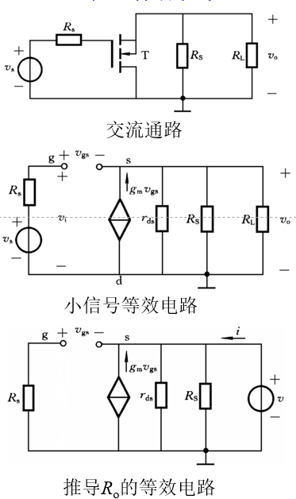
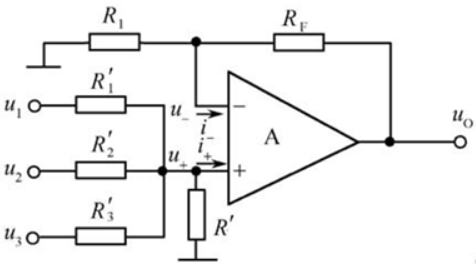

# 模电 中

##  4 放大器基础

由一个三极管与相应库组成的基本组态放大电路

### 4-1 放大器的基本概念

字母小写，下标大写：瞬时信号，即交流信号+直流信号

#### 放大的原理和实质

**小信号**：$I_{BQ},V_{BQ}$变化幅度足够小，可以看作在工作点处呈线性

$P_D=P_L+P_C$

**放大对象**：微弱、变化的信号，又称交流小信号

**放大的实质**：由直流能转为交流能

**功能分类**：电压增益、电流增益、跨阻增益、跨导增益

#### 放大器的性能指标

**输入电阻**：若放大器之前为另一级放大器，则该输入电阻为前一级的负载

**输出电阻**：$R_o=v/i$

开路电压：$v_{ot}=-R_oi_{on}$，短路电流：$i_{on}$

**小信号放大器电路一般模型**：$v_{ot}=-i_{on}\cdot{R_o},V_{ot}$为移除负载的输出电压，$i_{on}$为负载短路的输出电流

**对输入、输出电阻的要求**：尽量使输入、输出不变
*   输入电压时，$R_i>>R_s$
*   输入电流时，$R_i<<R_s$
*   输出电压时，$R_o<<R_L$
*   输出电流时，$R_o>>R_L$

**增益**
*   电压增益$A_v=\frac{v_o}{v_i}$
*   电流增益$A_i=\frac{i_o}{i_i}$
*   互导增益$A_g=\frac{i_o}{v_i}$
*   互阻增益$A_r=\frac{v_o}{i_i}$
*   增益转换$A_v=-\frac{i_oR_L}{i_iR_i}=-\frac{A_iR_L}{R_i}$

>   不可用增益间互相推导

**负载开路时**$A_v=A_{vt}\frac{R_L}{R_o+R_L}=\frac{v_{ot}R_L}{v_i(R_o+R_L)}$

**负载短路时**$A_i=A_{in}\frac{R_o}{R_o+R_L}=\frac{i_{on}R_o}{i_i(R_o+R_L)}$

**源增益**：$A_{vs}=A_v\frac{R_i}{R_s+R_i},A_{is}=A_i\frac{R_s}{R_s+R_i}$

#### 频率响应

具有电抗元件的放大器的增益是频率的复函数：
*   $A(jω)=A(ω)e^{jφ_A(ω)}$
*   $A(jω)|_{dB}=20lgA(ω)$

#### 失真

中频区增益下降到$1/\sqrt{2}$倍或3dB所对应的频率分别称为**上限频率**$f_L$和**下限频率**$f_H$，并把差值称为**通频带**$BW_{0.7}$

**线性失真：频率失真**
*   幅度失真
*   相位失真

**线性失真：瞬变失真**：由于电抗元件电压电流无法突变而引起的失真

**非线性失真**：由半导体的伏安特性非线性引起，产生了新的频率分量

### 4-2 基本放大器

**分类**：
*   **双极型**：共发射极、共集电极、共基极
*   **场效应**：共源极、共漏极、共栅极

**区别**：
*   双极型有源极电流，必须用戴维宁定理
*   场效应管没有栅极电流，直接分流

$R'_o$：不考虑$R_D$

#### 共源放大器

*   **输入电阻**：$R_i\rightarrow\infty$
*   **输出电阻**：$R'_o=r_{ds}, R_o=r_{ds}//R_D$
*   **电压增益**：$A_{v}=-g_m(R_o//R_L)$

1.  **静态工作点**：直流通路，电容断路。用于求跨导
2.  **电路性能**：交流通路，电容短路，直流电压接地。用于求输入、输出电阻和增益

#### 共栅放大器

*   **输入电阻**：$R_i=\frac{r_{ds}+R'L}{1+g_mr_{ds}}=\frac{1}{g_m}$
*   **输出电阻**：$R_o=R'_o//R_D$
*   **电流增益**：$A_i=\frac{R_D}{R_D+R_L}$
*   **电压增益**：$A_v=(1+g_mr_{ds})\frac{R'_L}{r_{ds}+R'_L}$

#### 共漏放大器

*   **输入电阻**：$R_i\rightarrow\infty$
*   **输出电阻**：$R_o=r_{ds}//R_S//\frac{1}{g_m}\approx\frac{1}{g_m}$
*   **电压增益**：$A_v=\frac{g_mR'_L}{1+g_mR'}\approx1$

#### 小结

|性能|共源|共栅|共漏|
|---|---|---|---|
|$R_i$|$\infty$|$\frac{1}{g_m}$|$\infty$|
|$R'_o$|$r_{ds}$|$r_{ds}+R_s+g_mR_sr_{ds}$|$r_{ds}//\frac{1}{g_m}\approx\frac{1}{g_m}$|
|$R_o$|$R'_o//R_D\approx{R_D}$|$R'_o//R_D\approx{R_D}$|$R'_o//R_S\approx\frac{1}{g_m}$|
|$A_v$|$-g_m(r_{ds}//R_D//R_L)$|$g_m(r_{ds}//R_D//R_L)$|$\frac{g_mR'L}{1+g_mR'_L}\approx1$|

#### 共射放大器

**基本共射放大器**
*   **输入电阻**：$R_i=r_{be}=r_{bb'}+r_{b'e}$
*   **输出电阻**：$R'_o=r_{ce},R_o=r_{ce}//R_C$
*   **电流增益**：$A_i=\beta\frac{R_o}{R_o+R_L}=g_mr_{b'e}\frac{R_o}{R_o+R_L}$
*   **电压增益**：$A_v=-g_mR'_L$

**有源负载放大器**
*   **电压增益**：$A_v=-g_m\frac{r_{ce}}{2}=-\frac{|V_A|}{2V_T}$

**发射极接电阻的共射放大器**
*   **输入电阻**：$R_i=r_{bb'}+r_{b'e}+R_E\frac{(1+\beta)r_{ce}+R'_L}{r_{ce}+R'_L+R_E}$
*   **输出电阻**：$R'_o=(1+\frac{βR_E}{R_S+r_{bb'}+r_{b'e}+R_E})r_{ce}+\frac{R_s+r_{bb'}+r_{b'e}}{R_s+r_{bb'}+r_{b'e}+R_E}R_E,R_o=R'_o//R_C$
*   **电流增益**：$A_i=\beta\frac{R_C}{R_C+R_L}$
*   **电压增益**：$A_v=-\frac{\beta{R'_L}}{r_{bb'}+r_{b'e}+(1+\beta)R_E}\approx-\frac{R'_L}{R_E}$

#### 共基放大器

*   **输入电阻**：$R_i=\frac{r_{bb'}+r_{b'e}}{1+\beta}$
*   **输出电阻**：$R'_o=R_S//r_{be}+[1+g_m(R_S//r_{be})],R_o=R_C//r_{ce}(1+\frac{βR_S}{R_S+r_{be}}\approx{R_C}$
*   **电流增益**：$A_i=-\alpha\frac{R_C}{R_C+R_L}$
*   **电压增益**：$A_v=\frac{\beta{R'_L}}{r_{bb'}+r_{b'e}}\approx{g_m}{R'_L}$

#### 共集放大器

*   **输入电阻**：$R_i=r_{bb'}+r_{b'e}+(1+\beta)R'_E$
*   **输出电阻**：$R'_o=\frac{r_{bb'}+r_{b'e}+R_S}{1+\beta},R_o=R'_o//R_E\approx{R'_o}$
*   **电流增益**：$A_i=-(1+\beta)\frac{R_E}{R_E+R_L}$
*   **电压增益**：$A_v=\frac{(1+\beta)R'_E}{r_{bb'}+r_{b'e}+(1+\beta)R'_E}$

#### 小结

|性能|共射|共基|共集|
|---|---|---|---|
|$R_i$|$r_{bb'}+r_{b'e}$|$\frac{r_{bb'}+r_{b'e}}{1+\beta}$|$r_{bb'}+r_{b'e}+(1+\beta)R'_E$|
|$R'_o$|$r_{ce}$|$r_{ce}(1+\frac{βR_S}{R_S+r_{be}})$|$R'_o=\frac{r_{bb'}+r_{b'e}+R_S}{1+\beta}$|
|$A_{in}$|$\beta$|$-\alpha$|$-(1+\beta)$|
|$A_v$|$-g_mR'_L$|$g_mR'_L$|$\frac{g_mR'_L}{1+g_mR'_L}\approx1$|

#### 集成MOS放大器

只有源极不与衬底相连时要考虑衬底效应，即源漏间的$g_{mb}$

$\eta_1=\frac{g_{mb1}}{g_{m1}}$

**E/E和E/D MOS放大器**：只用N型
1.  E/E：放大器和负载均为EMOS
    *   $R_o=r_{ds1}//R_d,R_d=\frac{1}{g_{ds2}+g_{m2}+g_{mb2}}$
    *   $A_v=-g_mR_o$
2.  E/D：放大器为EMOS，负载为DMOS
    *   $R_d=\frac{1}{g_{ds2}+g_{mb2}}$
    *   $A_v=-g_mR_o$

**CMOS放大器**
1.  电流源负载CMOS放大器
    1.  NMOS做放大管，PMOS接成电流源作负载管
    2.  信号加在PMOS栅极，NMOS栅极接偏置电压作负载管
2.  推挽CMOS放大器
    *   将电流源负载放大器中的NMOS与PMOS栅极相接作输入端

**共栅放大器**
*   $R_i=\frac{r_{bb'}+r_{b'e}}{1+\beta}$
*   $A_i=-\alpha\frac{R_C}{R_C+R_L}$
*   $A_v=\frac{\beta{R'_L}}{r_{bb'}+r_{b'e}}$

**共漏放大器**
*   $A_v=\frac{g_{m1}}{g_{m1}+g_{mb1}+1/r{ds1}+1/r_{ds2}}$

#### 组合放大器

**共集-共射放大器**

$R_i=r_{be1}+(1+\beta_1)r_{be2}$

**共集-共基放大器**

$R_i=r_{be1}+\frac{1+\beta_1}{1+\beta_2}r_{be2}$

$A_v=\frac{βR_L}{2r_{be}}$

**达林顿连接**
*   **同一种导电类型**的BJT构成复合管时，前一只BJT的发射极接至后一只BJT的基极，以实现两次电流放大作用；等效为同一类型的BJT
*   **不同导电类型**的BJT构成复合管时，前一只的集电极接至后一只的基极，以实现两次电流放大作用；等效为与第一只BJT相同类型的BJT
*   **要求**：
    *   两个BJT的电流方向必须统一，内部电机的电流流向不能冲突
    *   第二只BJT的发射极必须单独引出，作为相同导电类型等效BJT的发射极，或不同导电类型等效BJT的集电极

**复合管电参数**
*   **电流放大系数**：$\beta=\beta_1+\beta_2+\beta_1\beta_2\approx\beta_1\beta_2$
*   **输入电阻**：
    *   相同类型：$r_{be}=r_{be1}+(1+\beta_1)r_{be2}$
    *   不同类型：$r_{be}=r_{be1}$

**复合管的改进**

为提高复合管的热稳定性，一般在第二只管的基极与发射极间连接一个穿透电流泄发电阻

### 4-3 差分放大器

由于电路中往往噪声一致，故用差分放大器来消除噪声

#### 4-3-1 电路结构

#### 4-3-2 性能特点

**共模信号**$v_c=(v_1+v_2)/2$：两信号和的一半，即均值

**差模信号**$v_d=v_1-v_2$：两信号差

$v_1=v_c+v_d/2,v_2=v_c-v_d/2$

##### 差模等效电路

电路两边对称，所以在差模输入电压作用下，两管产生等值反向的增量电流，当它们共同流入$R_{ss}$时，两管增量电流相消，流经$R_{ss}$的电流不变，因而对差模信号而言，$R_{ss}$可视为短路。

**性能指标定义**
*   双端增益$A_{vd}=\frac{v_{od}}{v_{id}}$: 双端差模输出电压对差模输入电压的比值
*   单端输出时差模电压增益$A_{vdi}=\pm\frac{1}{2}A_{vd}$:单端差模输出电压对差模输入电压的比值
*   差模输入电阻$R_{id}=\frac{v_{id}}{i_{id}}$
*   差模输出电阻：单端输出时，为放大器任一输出端到地的输出电阻，而双端输出电阻则是以两端向放大器看过去的输出电阻，即为两放大器输出电阻之和。（将输入电压短路）
*   共模增益$A_{vc}=\frac{-g_mR_D}{1+2g_mR_{SS}}$
*   共模抑制比：$K_{CMR}=|\frac{A_{vd}}{2A_{vc}}|=|\frac{A_{vdi}}{2A_{vci}}|$

**指标计算**
*   $v_{odi}=-g_{mi}R_Dv_{idi}$

##### 共模等效电路

电路两边对称，所以在共模输入电压作用下，两管产生等值同向的增量电流，当它们共同流入$R_{ss}$时，流经$R_{ss}$的电流翻倍，因而对共模信号而言，相当于接入$2R_{ss}$。

输入共模信号时输出$v_{oc}$始终为零，所以双端共模增益为零

**性能指标定义**
*   共模输出电阻：单端输出电阻是任一输出端到地的输出电阻

**指标计算**
*   $v_{odi}=-g_{mi}R_Dv_{idi}$

##### 双极型差分放大器
*   $A_{vd}=\frac{\beta{R_C}}{r_{bb'}+r_{b'e}}\approx-g_mR_C$
*   $A_{vc}=-\frac{\beta{R_C}}{r_{bb'}+r_{b'e}+(1+\beta)2R_{EE}}\approx-\frac{R_C}{2R_{EE}}$

#### 4-3-3 电路两边不对称对性能的影响

**双端输出时的共模抑制比**

此时两输出电压不相等，故输出电压包含差模分量

$v_o=A_{v(d-d)}v_{id}+A_{v(c-d)}v_{ic}$

$K_{CMR}=|\frac{A_{v(d-d)}}{A_{v(c-d)}}|$，$A_{v(d-d)}$是差模输入电压转换为差模输出电压的增益，$A_{v(c-d)}$是共模输入电压转换为差模输出电压的增益

**失调及其温漂**：
*   **输入失调电压**：$V_{IO}=\frac{V_O}{A_{vd}}$
*   **输入失调电流**：$I_{IO}=|I_{BQ1}-I_{BQ2}|$
*   **输入基极电流**：$I_B=(I_{BQ1}+I_{BQ2})/2$

**失调模型和调零电路**

**失调电压电流的温漂**

调零电路无法消除温漂

#### 4-3-4 差模传输特性

**双极性差放的差模传输特性**

用理想电流源代替$R_{EE}$

$i_{c1}-i_{c2}=I_{EE}\frac{v_{ID}}{2V_T}$

$v_{ID}=0$时，$i_{C1}=i_{C2}=I_{CQ}=I_{EE}/2$

$|v_{ID}|\le26mV$时，差模传输特性曲线近似为直线。$|vID|>4V_T=104mV$时，差放进入限幅区，其中一管导通，一管截止，但要限制$v_{ID}$。

**MOS差放的差模传输特性**

$i_{D1}-i_{D2}=I_{SS}(\frac{v_{ID}}{V_{GSQ}-V_{GS(th)}})\sqrt{1-\frac{1}{4}(\frac{v_{ID}}{V_{GSQ}-V_{GS(th)}})^2}$

$v_{ID}$很小时，差模传输特性斜率为常数$g_m=\frac{i_{D1}-i_{D2}}{v_{ID}}$

### 4-4 电流源电路及其应用

#### 4-4-1 镜像电流源

##### 双极性晶体管镜像电流源

**基本镜像电流源电路**

==T1接成二极管，T2接成电流源==

$i_{C2}=I_O=(I_{S2}/I_{S1})i_{C1}=(S_{E2}/S_{E1})i_{C1}$

$I_R=\frac{V_{CC}-V_{BE(on)}}{R}$

$I_O=\frac{I_R}{1+2/\beta}$

**减小β影响的镜像电流源电路**

$I_O=\frac{I_R}{1+\frac{2}{\beta(1+\beta)}}$

$I_R=\frac{V_{CC}-2V_{BE(on)}}{R}$

**比例式镜像电流源**

集电极电流与发射极电阻成反比

$I_O\approx{I_R}R_1/R_2$

$I_R=\frac{V_{CC}-V_{BE(on)}}{R+R_1}$

$R_o=(1+\frac{\beta{R_E}}{R_s+r_{bb'}+r_{b'e}+R_E})r_{ce}+\frac{(R_S+r_{bb'}+r_{b'e})R_E}{R_S+r_{bb'}+r_{b'e}+R_E}$

$R_S=R//(\frac{r_{be1}}{1+\beta_1})$

**微电流源**

$I_R\approx{I_{E1}}\approx{I_{S1}e^{V_{BE1}/V_T}}$

$I_O=I_{C2}\approx{I_{E2}}\approx{I_{S2}e^{V_{BE2}/V_T}}$

###### MOS镜像电流源电路

**基本镜像电流源电路**

$I_O=i_{D2}=\frac{(W/l)_2}{(W/l)_1}I_R$

**动态电流镜**

**开关电流电路**

#### 4-4-2 其它改进型电流源电路

##### 级联型电流源电路

##### 威尔逊电流镜

#### 4-4-3 电流源的应用

##### 有源负载差分放大器

$I_{SS}=2I_R$

**差模电压作用**

$i_o=g_mv_{id}$

$v_{od}=i_oR'_L=g_mv_{id}(r_{ds2}//r_{ds4})$

$A_{vd}=\frac{v_{od}}{v_{id}}=g_m(r_{ds2}//r_{ds4})$

### 4-5 多级放大器

#### 4-5-1 多级放大器的基本问题

**换能器的接入**：
*   将换能器的输出有效地输入放大器
*   不影响放大器的静态工作点

**级间连接**：
1.  隔直流连接：电容耦合
2.  直接连接

#### 4-5-2 多级放大器的性能指标计算

划分为多个常见电路模型

### 4-6 放大器的频率响应

#### 4-6-1 复频域分析方法

##### 传递函数法

常用复频率s进行分析，求出放大电路的电压增益、电流增益、输入阻抗和输出阻抗等关于s的方程

系统传递函数$A(s)=\frac{Y(s)}{X(s)}=\frac{b_ms^m+b_{m-1}s^{m-1}+...+b_0}{a_ns^n+a_{n-1}s^{n-1}+...+a_0}$

$A(s)=A_0\frac{(s-z_1)(s-z_2)...(s-z_m)}{(s-p_1)(s-p_2)...(s-p_n)},A_0=\frac{b_m}{a_n}$称为标尺因子，z为零点，p为极点

一个独立电抗元件对应一对极零点

频率特性：A；频率响应：Y=AX

##### 实数极零点的波特图和渐进波特图

**常数因子**：$A_1(s)=A(j\omega)=A_0$，与频率无关

**极零点在原点的因子**：-20log(ω)

**一阶因子**：

极点：$A(S)=\frac{1}{S+\omega_p}=\frac{1}{\omega_p}\frac{1}{1+S/\omega_p}$，其中前一项并入标尺因子，后一项称作一阶因子的标准形式$A_4$
*   $\omega<<\omega_p$时，$A_4(\omega)\approx1$或0dB，$\phi_4(\omega)\approx0^\circ$
*   $\omega=\omega_p$时，$A_4(\omega)\approx1/\sqrt{2}$或-3dB，$\phi_4(\omega)\approx-45^\circ$
*   $\omega>>\omega_p$时，$A_4(\omega)\approx\omega_p/\omega$或$-20lg\omega/\omega_pdB$，$\phi_4(\omega)\approx-90^\circ$

零点：$A_5(s)=1+\frac{s}{\omega_z}$

用折线逼近的波特图，称为渐近波特图。

每个极零点的幅频特性用两条渐近线逼近：一条为零分贝水平线；一条为按$A4(\omega)=-20log\omega/\omega_p$描述的直线，在半对数坐标轴上这条直线的斜率是-20dB/10倍频。这两条直线在$\omega=\omega_p$上转折。

每个极零点的相频特性用三条渐近线逼近，一条是通过点$(\omega_p,-45^\circ)$、且斜率为-45°/10倍频的直线；另两条是0°和-90°的水平线，它们分别在$0.1\omega_p,10\omega_p$处转折。

起始水平线：常数因子的对数乘以20

遇到零点则斜率加，遇到极点则斜率减

**相频**：从$\omega_p$开始非0，单极点斜率为-45°

计算真实增益：s替换为jω

##### 中频增益和上下限频率

**中频增益**
1.  方法一：直接作出幅频特性渐近波特图，图中最高幅值平坦部分的值为中频增益。
2.  方法二：将传递函数直接分解成一极一零连乘形式，根据极零点位置确定其具有低通或高通特性，若具有高通特性则令s→∞，若具有低通特性则令s→0，再将各系数连乘即为中频增益。 

**上下限频率**
1.  根据定义：
    *   多极无零系统：$\omega_H\approx\frac{1}{\sqrt{1/\omega^2_{p1}+1/\omega^2_{p2}+...}}$
    *   重极点：$\omega_H\approx\omega_p\sqrt{2^{1/n}-1}$，n为极点个数
2.  用主极点近似求解

考虑上下限截止频率时零点往往不及极点，可以忽略

**主极点**：
*   **低频主极点**：比其它极点值都大4倍以上
*   **高频主极点**：比其它极点值都小4倍以上，又称**主极点**

**波特图**：
*   **幅频特性**：以中频段为基准，低频段+20dB/dec，高频段-20dB/dec
*   **相频特性**：第一个极点相移±45°，第二个极点相移±135°，以此类推

#### 4-6-2 共源、共发放大器的频率特性

##### 密勒定理

图(a)为输入输出端跨接阻抗Z(s)(或Y(s)=1/Z(s))的网络，它可以用图(b)来等效:
$\begin{cases}Y_1(s)=\frac{1}{Z_1(s)}=Y(s)[1-A(s)]\\Y_2(s)=\frac{1}{Z_2(s)}=Y(s)[1-A(s)]\end{cases}$，其中A(s)=V2(s)/V1(s)，即Y(s)可以用分别并接在输入输出端的导纳Y1(s)，Y2(s)来代替

中频增益即小信号等效电路的电压增益（20lg）

密勒倍增因子$D=1+(C_{gd}/C_{gs})g_mR'_L\approx1+\omega_TR'_LC_{gs}$

## 5 放大器中的负反馈

反馈：输出信号被送回输入端

负反馈：使得实际输入信号减小

正反馈无用（振荡器），会使得放大器自激。故反馈信号不能和输入信号同向。

### 5-1 反馈放大器的基本概念

#### 5-1-1 反馈放大器的组成

输出信号$x_o=Ax'_i$

反馈系数$k_f=\frac{x_f}{x_o}$

误差信号$x'_i=x_i-x_f$

反馈放大器的增益（闭环增益）：$A_f=\frac{A}{1+T}=\frac{A}{F}$

环路增益$T=k_fA$，反馈深度$F=1+T=1+k_fA$

反馈网络的输入端在原输出端侧

#### 5-1-2 四种类型负反馈放大器

电压型：输出端并联；电流型：输出端串联

并联型：输入端并联，接电流源；串联型：输入端串联，接电压源

反馈信号类型一定与输入信号类型一致。

#### 5-1-3 反馈放大器的判别

**分别画出输入和输出回路**

反馈元件有两种：
1.  输入和输出回路共用（不认为是反馈元件）
2.  跨接在输入输出之间

**类型判别**

分别短路输入输出
1.  短路**输入**时，若反馈网络的输出对放大器产生影响，如$v'_i=-v_f$，则为**串联**
2.  短路**输出**时，若反馈网络有输入，则为**电流**

简化：
*   与输出连：电压
*   与输入连：并联

**极性判别**

极性主要指增益的正负

削弱净输入信号的为负反馈，增强净输入信号的为正反馈，即$x_f$的正负

在闭合环路的任一处断开，并在此处假定信号极性，而后不考虑信号源，按顺时针判定信号流经该闭合环路时电压极性的转换，直到返回断开点。
若此时极性与假设相同，则为正反馈。

顺时针指先经过放大器输入，到输出，再到反馈网络输入，到输出。

经过 *地* 时反相，经过 * 电阻* 时不变

断开点选取：尽量使分析简化为从放大器输入端看到输出端

### 5-2 负反馈对放大器性能的影响

#### 5-2-1 输入电阻

不考虑输出方式，故将输出端统一用$x_o$表示

**串联负反馈**：输入端是基本放大器的输入与反馈网络的输出串联连接，故输入电阻增加到基本放大器输入电阻的F倍

#### 5-2-2 增益及其稳定性

**源电压增益**：$A_{fs}=\frac{R_{if}}{R_{if}+R_s}A_f=\frac{A_s}{1+k_fA_s}$

**增益灵敏度**：$S^{A_f}_A=\frac{\Delta{A_F}}{A_f}\frac{A}{\Delta{A}}$

$S^{A_f}_A=\frac{1}{1+T}$

#### 5-2-3 输出电阻

*   输出阻抗低适合输出电压
*   输入阻抗低适合输入电流

#### 5-2-4 失真和噪声

|反馈类型|输入阻抗$R_{if}$|输出阻抗$R_{of}$|类型|
|---|---|---|---|
|电压串联负反馈|$R_iF$|$\frac{R_o}{F_{st}}$|电压增益|
|电压并联负反馈|$\frac{R_i}{F}$|$\frac{R_o}{F_{st}}$|
|电流串联负反馈|$R_iF$|$R_oF_{sn}$|
|电流并联负反馈|$\frac{R_i}{F}$|$R_oF_{sn}$|电流增益|

$A_{vt}=A_v\frac{R_o+R_L}{R_L}$

$A_{vst}=\frac{R_i}{R_s+R_i}A_{vt}$

### 5-3 负反馈放大器的性能分析

#### 5-3-1 负反馈放大器的分析方法

分解为基本放大器和反馈网络，须考虑反馈网络对放大器的负载效应

**拆环方法**：
*   考虑反馈放大器输入时，将反馈网络的输出
    *   电压：短路
    *   电流：开路
*   考虑反馈放大器输出时，将反馈网络的输入
    *   并联：短路
    *   串联：开路

电压：假设输出电流
电流：假设输出电压
并联：假设输入电流
串联：假设输入电压

假设网络的输入、输出电流，并用电压来表示之，最后将电流搬回放大器，得到反馈系数

#### 5-3-3 深度负反馈

**深度负反馈条件**

$T>>1$或$T_s>>1$

此时：$A_f=\frac{A}{1+T}\approx\frac{1}{k_f}$或$A_{fs}=\frac{A_s}{1+k_fA_s}\approx\frac{1}{k_f}$

有：输入、输出电阻趋近于零或无穷（根据反馈类型）

**虚短虚断**

### 5-4 负反馈放大器的稳定性

#### 5-4-1 判别稳定性的准则

**自激条件**：$T(\omega_{osc})=1,φ_T(\omega_{osc})=\pm\pi$

**稳定裕量**：反馈放大器远离自激的程度
*   **相位裕量**：$\gamma_φ=180°-|φ_T(\omega_g)|$，为正时不自激
*   **增益裕量**：$\gamma_g=\frac{1}{T(\omega_φ)}$，为正时不自激，越大越稳定

综上，更大的相位裕度，系统更稳定，但时域响应速度也越慢。所以，工程上一般选取$\gamma_φ$为45°～ 60°，此时放大器稳定且响应速度也可接受。 

**稳定裕量的确定**

将$A_f=\frac{1}{k_f}$写成$20lg A_f=20lg\frac{1}{k_f}$，做出对应水平线：**反馈增益线**，其与增益波特图交点即为$\omega_g$。

反馈增益线与幅频特性交点处的相位与180°相位的差值的绝对值越大，放大器越稳定；绝对值为0时，取到最大反馈系数。

在多极点系统中，若$\omega_{P3}\geq10\omega_{P2}$,则$\omega_{P2}$上的相角绝对值恒小于或等于135°。

#### 5-4-2 集成运放的相位补偿技术

相位补偿技术：在基本放大器或反馈网络中添加电阻、电容等元件，修改环路增益的波特图，使得增大$k_f$时能获得所需的相位裕量。

基本出发点：保证中频增益不变的情况下，增大波特图上第一和第二个极点角频率的间距。

**简单电容补偿技术**：

将一只补偿电容并接在集成运放中产生第一个极点频率的节点上，使第一个极点角频率自$\omega_{p1}=\frac{1}{RC}$降低到$\omega_d=\frac{1}{R(C+C_φ)}$。

用密勒倍增效应实现相位补偿技术

## 6 集成运算放大器及其应用电路

### 6-1 集成运算电路

#### 6-1-1 集成运放概述

#### 6-1-2 MOS运放核心电路

### 6-2 集成运放应用电路的组成原理

**理想化条件**

虚短虚断

**分类**

**基本应用电路**
1.  反相放大器$A_{vf}=-\frac{R_f}{R_1}$，$R_1$为负向端到地间电阻
2.  同相放大器$A_{vf}=1+\frac{R_f}{R_1}$，$R_f=0,R_1\rightarrow\infty$时构成同相跟随器
    1.  $R_1>>R_o$

### 6-3 集成运放应用电路

#### 6-3-1 闭环应用

**闭环**：反馈电路

针对不同信号，一个个分别分析

简单电路直接套模型，不能套模型的用虚短虚断

##### 加法和减法电路

**反相加法器**

$v_o=-(\frac{v_1}{R_1}+\frac{v_2}{R_2}+\frac{v_3}{R_3})R_F$

**优点**：
*   要改变权值，只要改动对应支路
*   **虚地**，共模小

**同相加法器**

${v_o}=(1+\frac{R_F}{R_1})v_+$

$v_+=(\frac{v_1}{R'_1}+\frac{v_2}{R'_2}+\frac{v_3}{R'_3})R_P$，其中$R_P=R'_1$、$R'_2$、$R'_3$、$R'$并联

**缺点**：
*   结果复杂
*   调试不便
*   不**虚地**

**加法器实现的减法器**

$v_o=\frac{R_f}{R_2}v_{i2}-\frac{R_f}{R_1}v_{i1}$

**差动减法器**

$v_{o1}=-\frac{R_f}{R_1}v_{i1}$

$v_{o2}=(1+\frac{R_f}{R_1})\frac{R'}{R'+R_2}v_{i2}$

当$\frac{R_f}{R_1}=\frac{R'}{R_2}$时，$v_o=\frac{R_f}{R_1}(v_{i2}-v_{i1})$

**缺点**：
*   不**虚地**
*   共模大
*   要选*共模抑制比*大的运放

积分、微分、指数、对数电路

##### 积分运算电路

$v_o=-\frac{1}{RC}\int{v_i}dt$

##### 微分运算电路

$v_o=-RC\frac{dv_I}{dt}$

##### 对数运算电路

$v_o=V_Tln\frac{v_I}{RI_S}$，其中$i_D\approx{I_S}e^\frac{V_D}{V_T}$

通常用三极管解成二极管，以增大工作区域

##### 指数运算电路

$v_o=-RI_Se^\frac{v_S}{V_T}$

##### 仪器放大器

**特点**：
*   高共模抑制比
*   高输入阻抗
*   高放大倍数

$v_o=\frac{R_4}{R_3}(1+\frac{2R_2}{R_1})(v_{S2}-v_{S1})$

$R_1$作用：调节增益

##### 电流-电压变换器

$v_o=-i_SR_f$

>   负载电阻不变时可视为电流放大电路

##### 电压-电流变换器

1.  负载不接地
$i_o=\frac{v_S}{R}$

2.  负载接地
$i_o=-\frac{R_2}{R_1}\times\frac{v_S}{R_3+(\frac{R_3}{R_4}-\frac{R_2}{R_1})R_L}$，其中须避免分母为0。

##### 电流传输器

$i_z=i_x$

$R_{yi}\rightarrow\infty, R_{xi}\rightarrow0$

##### 有源滤波器

可以带负载，可以提供增益

**带通**

**带阻**

#### 6-3-2 开环应用

##### 电压比较器

$V_+>V_-$时输出高电平

##### 单限电压比较器

$V_{OH}=V_{Z1}+V_{D2(on)}, V_{OH}=-(V_{Z2}+V_{D1(on)})$

##### 迟滞比较器

$V_{IH}=\frac{R_2}{R_1+R_2}V_{OH}+\frac{R_1}{R_1+R_2}V_{REF}$

$V_{IL}=\frac{R_2}{R_1+R_2}V_{OL}+\frac{R_1}{R_1+R_2}V_{REF}$

$\Delta{V}=V_{IH}-V_{IL}=\frac{R_2}{R_1+R_2}V_{OH}$

先求输出范围，再通过电路求输入范围

输入接电容：方波发生器

#### 6-3-2 混合应用

##### 整流电路

工作原理：利用运放开环的过零比较和闭环的线性运用，有效克服二极管导通电压的影响。

#### F007

单位增益频率$BW_G=A_{vf}BW_f$，增益为n倍时，带宽就为1/n倍