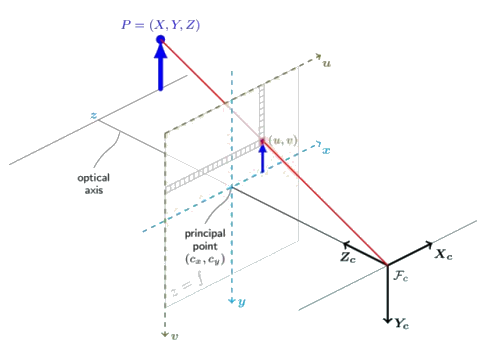

# 计算机视觉

3周实验，1周报告

## 1 图像处理基础

### 1-1 图像定义

- 图像：二维函数 $f(x,y)$
- 数字图像：由像素构成
  - 用二维矩阵描述
  - 像素值为整数
  - 原点为左上角

### 1-2 空间滤波

图像 * 模板

### 1-3 空间滤波的应用

边缘检测
- 图像梯度 ${\Delta}f=[\frac{∂f}{∂x},\frac{∂f}{∂y}]$
- 通过梯度计算边缘点

### 1-4 Hough 变换

Hough 变换原理：
- 利用图像空间和 Hough 参数空间的点－线对偶性
- 把图像空间中的检测问题转换到参数空间
- 通过检测参数空间中的极值点来估计该曲线的参数

#### 直线

参数空间：y=mx+b，m和b为变量，x和y为参数

由此每个点(x, y)对应一条参数空间m,b上的直线

直线拟合：
多个点则得到多条参数空间中的直线，获得一或多个交点。
相交最多的参数交点即为拟合得到的直线。

还可以用极坐标：$\rho=x\cos\theta+y\sin\theta$

||方程式|参数空间|
|---|---|---|
|斜截式|$y=mx+b$|m, b|
|极坐标|$xcos\theta+tsin\theta=\rho$|θ, ρ|

#### 圆

若圆的半径未知，参数空间是圆锥

||方程式|参数空间|
|---|---|---|
|半径已知|$(x-a)^2+(y-b)^2=r^2$|a, b|
|半径未知|$(x-a)^2+(y-b)^2=r^2$|a, b, r|

## 2 相机与成像模型

### 2-1 小孔成像

透视投影方程：（相似三角形）

$P,O,P'$ 三点共线 $\Rightarrow\overrightarrow{OP'}=\lambda\overrightarrow{OP}\Rightarrow\begin{cases}x'={\lambda}x\\y'={\lambda}y\\f'={\lambda}z\end{cases}$
$\Rrightarrow\begin{cases}x'=f'\frac{x}{z}\\y'=f'\frac{y}{z}\end{cases}$

### 2-2 成像特点

1. 近大远小
2. 不保持平行性：平面上的平行线在像平面上可能相交（铁轨）

聚焦条件：$\frac{1}{f}=\frac{1}{z}+\frac{1}{z'}$

变焦：改变焦距（移动镜头组中镜片的相对位置）

对焦：让像成在底片上，通常移动镜头来实现

薄透镜：透镜厚度在计算中可忽略不计

## 3 相机标定

相机标定：求解 3D 到 2D 的映射的参数

***
**相机的几何模型**：

### 3-1 齐次坐标

用 n+1 维向量表示 n 维向量：
- 原坐标 $[x_1,x_2,\dots,x_n]$
- 齐次坐标 $[hx_1,hx_2,\dots,hx_n,h]$

平面：
- $ax+by+cz-d=0$
- $\begin{pmatrix}a\\b\\c\\-d\end{pmatrix}\cdot
\begin{pmatrix}x\\y\\z\\1\end{pmatrix}=0$

球面：
- $x^2+y^2+z^2=R^2$
- $\begin{pmatrix}x,y,z,1\end{pmatrix}
\begin{pmatrix}1&0&0&0\\0&1&0&0\\0&0&1&0\\0&0&0&-R^2\end{pmatrix}
\begin{pmatrix}x\\y\\z\\1\end{pmatrix}=0$

### 3-2 坐标系变换

世界坐标系，相机坐标系，

两个几何变换：
- 从世界坐标系到相机坐标系的刚体变换（相机的外参数）
- 从相机坐标系中三维坐标到成像平面上二维坐标的透视投影变换（相机的内参数）

#### 刚体变换

**刚体**：形状、大小不变，内部各点的相对位置不变

**刚体变换**：把刚体做旋转、平移等坐标变换

是两个正交坐标系间的变换

1. **平移变换**：
$$^BO_A=^BP-^AP$$
2. **旋转变换**：
   1. 例如坐标系 A 绕 k 轴旋转：
$$\begin{bmatrix}^Bx\\^By\\^Bz\end{bmatrix}=
\begin{bmatrix}cos\theta&sin\theta&0\\-sin\theta&cos\theta&0\\0&0&1\end{bmatrix}
\cdot\begin{bmatrix}^Ax\\^Ay\\^Az\end{bmatrix}$$
$$=\begin{pmatrix}i_B{\cdot}i_A&i_B{\cdot}j_A&0\\j_B{\cdot}i_A&j_B{\cdot}j_A&0\\0&0&1\end{pmatrix}
\begin{bmatrix}^Ax\\^Ay\\^Az\end{bmatrix}$$
   2.  通用旋转矩阵：
$$^B_AR=\begin{pmatrix}i_A{\cdot}i_B&j_A{\cdot}i_B&k_A{\cdot}i_B\\
i_A{\cdot}j_B&j_A{\cdot}j_B&k_A{\cdot}j_B\\
i_A{\cdot}k_A&j_A{\cdot}k_B&k_A{\cdot}k_B\end{pmatrix}$$
3. **刚体变换**：
$$^BP=^B_AR^AP+^BO_A$$
$$\begin{pmatrix}^BP\\1\end{pmatrix}=\begin{pmatrix}^B_AR&^BO_A\\0^T&1\end{pmatrix}
\begin{pmatrix}^AP\\1\end{pmatrix}$$

下标指示被表示的对象，上标指示用来表示对象的坐标系，
如$^AP$是坐标系 A 下 P 的表示，$^B_AR$是坐标系 A 在坐标系 B 中的旋转矩阵。

### 3-3 相机建模

**虚拟成像平面**：与物理成像平面平行，在光轴上距光心为 f

$$\left(\begin{array}{l}
u \\
v \\
1
\end{array}\right)=\frac{1}{z}\left(\begin{array}{cccc}
\alpha & -\alpha \cdot \cot \theta & u_{0} & 0 \\
0 & \frac{\beta}{\sin \theta} & v_{0} & 0 \\
0 & 0 & 1 & 0
\end{array}\right)\left(\begin{array}{cc}
r_{1}^{T} & t_{x} \\
r_{2}^{T} & t_{y} \\
r_{3}^{T} & t_{z} \\
0 & 1
\end{array}\right)\left(\begin{array}{c}
w_{x} \\
w_{y} \\
w_{z} \\
1
\end{array}\right)$$

像素坐标$=$尺度$\cdot$内参$\cdot$外参$\cdot$世界坐标

注意：r 为三维列向量

**歪斜角** $\theta$ ：相机传感器非矩形而是平行四边形

**像素纵横系数**：$\alpha=kf,\beta=lf$，将虚拟成像平面映射到物理成像平面（像素坐标系）

### 3-4 参数求解

#### 最小二乘法

$$\left\{\begin{array}{l}
u_{11} x_{1}+u_{12} x_{2}+\cdots+u_{1 q} x_{q}=y_{1} \\
u_{21} x_{1}+u_{22} x_{2}+\cdots+u_{2 q} x_{q}=y_{2} \\
\vdots \\
u_{p 1} x_{1}+u_{p 2} x_{2}+\cdots+u_{p q} x_{q}=y_{p}
\end{array}\right.$$
当 $p>q$时，最小化误差函数 E
$$E=\sum_{i=1}^{p}\left(u_{i 1} x_{1}+u_{i 2} x_{2}+\cdots+u_{i q} x_{q}-y_{i}\right)^{2}=||Ux-Y||^2$$

$$x=(U^TU)^{-1}U^TY$$

若 y 均为0，则为齐次方程，解为 $U^TU$ 的最小特征根所对应的特征向量

#### 算法步骤

- 物点的世界坐标，像点的像素坐标）经由多组数据的最小二乘法，得到（矩阵 M 的 12 个元素值）
$$\left(\begin{array}{l}
u \\
v \\
1
\end{array}\right)=\frac{1}{z} M \cdot\left(\begin{array}{c}
^wx \\
^wy \\
^wz \\
1
\end{array}\right)$$
- 再算出相机的内外参数之积 M 
$$M=\left(\begin{array}{cc}
\alpha \cdot r_{1}^{T}-\alpha \cdot \cot \theta \cdot r_{2}^{T}+u_{0} \cdot r_{3}^{T} & \alpha \cdot t_{x}-\alpha \cdot \cot \theta \cdot t_{y}+u_{0} \cdot t_{z} \\
\frac{\beta}{\sin \theta} \cdot r_{2}^{T}+v_{0} \cdot r_{3}^{T} & \frac{\beta}{\sin \theta} \cdot t_{y}+v_{0} \cdot t_{z} \\
r_{3}^{T} & t_{z}
\end{array}\right)$$

#### 计算 M

令 $P=\left(\begin{array}{c}w_{x} \\w_{y} \\w_{z} \\1\end{array}\right)$，有
$\left(\begin{array}{l}u \\v \\1\end{array}\right)=\frac{1}{z}
\left(\begin{array}{l}m_{1}^{T} \\m_{2}^{T} \\m_{3}^{T}\end{array}\right) P$，
得$\left\{\begin{array}{l}\left(m_{1}-u m_{3}\right)^{T} \cdot P=0 \\
\left(m_{2}-v m_{3}\right)^{T} \cdot P=0\end{array}\right.$

将 n 组点代入（即 n 个 u，v，P）

转为齐次方程：$$\left(\begin{array}{ccc}P_{1}^{T} & 0 & -u_{1} P_{1}^{T} \\
0 & P_{1}^{T} & -v_{1} P_{1}^{T} \\\vdots & \vdots & \vdots \\
P_{n}^{T} & 0 & -u_{n} P_{n}^{T} \\0 & P_{n}^{T} & -v_{n} P_{n}^{T}
\end{array}\right)\left(\begin{array}{c}m_{1} \\m_{2} \\m_{3}\end{array}\right)=0$$

则得 $\left(m_{1}^{T}, m_{2}^{T}, m_{3}^{T}\right)^{T}$ 为矩阵 $A^TA$ 最小特征根对应的特征向量
$$M=\rho\left(\begin{array}{l}m_{1}^{T} \\m_{2}^{T} \\m_{3}^{T}\end{array}\right)_{3 \times 4}
=\rho\left(\begin{array}{ll}a_{1}^{T} & b_{1} \\a_{2}^{T} & b_{2} \\a_{3}^{T} & b_{3}\end{array}\right)$$
其中 ρ 为齐次方程的系数。由此解出 M。

$$\rho\left(\begin{array}{l}a_{1}^{T} \\a_{2}^{T}\\a^T_3\end{array}\right)
=\left(\begin{array}{c}
\alpha \cdot r_{1}^{T}-\alpha \cdot \cot \theta \cdot r_{2}^{T}+u_{0} \cdot r_{3}^{T} \\
\frac{\beta}{\sin \theta} \cdot r_{2}^{T}+v_{0} \cdot r_{3}^{T} \\r_{3}^{T}\end{array}\right)$$

$\left\{\begin{array}{l}u_{0}=\rho^{2}\left(a_{1}^{T} a_{3}\right) \\
v_{0}=\rho^{2}\left(a_{2}^{T} a_{3}\right)\end{array}\right.$，且
$\left\{\begin{array}{l}\rho=\frac{\varepsilon}{\left|a_{3}\right|} \\
r_{3}=\rho a_{3}\end{array}\right.$，$\epsilon=\pm1$

其中 ε 表征物体与相机是否在世界坐标系的同一侧（1 为同）

#### 估计参数

$$\left\{\begin{aligned}
\cos \theta &=-\frac{\left(a_{1} \times a_{3}\right)^{T} \cdot\left(a_{2} \times a_{3}\right)}{\left|a_{1} \times a_{3}\right| \cdot\left|a_{2} \times a_{3}\right|} \\
\alpha &=\rho^{2}\left|a_{1} \times a_{3}\right| \sin \theta \\
\beta &=\rho^{2}\left|a_{2} \times a_{3}\right| \sin \theta
\end{aligned}\right.$$

$$\left\{\begin{array}{c}
r_{1}=\frac{a_{2} \times a_{3}}{\left|a_{2} \times a_{3}\right|} \\
r_{2}=r_{3} \times r_{1}
\end{array}\right.$$

$$\begin{aligned}
&t_{x}=\rho \cdot \frac{1}{\alpha} \cdot\left[b_{1}+\frac{\alpha}{2 \beta} \sin 2 \theta \cdot b_{2}-\left(\frac{\alpha}{2 \beta} \sin 2 \theta \cdot v_{0}+u_{0}\right) \cdot b_{3}\right]\\
&t_{y}=\rho \cdot \frac{\sin \theta}{\beta}\left(b_{2}-v_{0} b_{3}\right)\\
&t_{z}=\rho b_{3}
\end{aligned}$$

$$z=m^T_3{\cdot}P$$

## 4 图像配准

### 4-1 图像配准

- 图像配准可以视为源图像 I2 和目标图像 I1 关于空间和灰度的映射关系：
$$I_{2}(x, y)=g\left(I_{1}(f(x, y))\right)$$
其中： f 为二维空间坐标变换（如仿射变换），g 为灰度变换。
- 图像配准问题的关键:**最佳几何变换 f**
  - 选取图像特征
  - 估计几何变换

图像配准的模式分类
- 按自动化程度分类：
  - 人工配准方法
  - 半自动方法
  - 全自动方法
- 按成像模式分类:
  - 不同视角(多视角分析）
  - 不同时间(多时段分析)
  - 不同传感器(多模式分析)
  - 场景与场景模型图像配准
- 按图像配准的应用领域分类
  - 医学、遥感、计算机视觉、军事等领域
- 按图像的维数分类
  - 2D-2D、2D-3D、3D-3D
- 按对图像信息的利用情况分类
  - 基于灰度信息
  - 基于特征信息

### 4-2 图像预处理

#### 4-2-1 图像的灰度变换

- 线性灰度变换
- 对数灰度变换
- 分段线性灰度变换
- 直方图的均衡化

#### 4-2-2 图像的平滑处理

- 邻域平均法
- 中值滤波

### 4-3 图像配准

#### 4-3-1 主要方法

**基于灰度的图像配准**

**基于特征的图像配准**

1. 特征提取
2. 特征匹配
3. 通过特征估计变换模型
4. 图像重采样

**图像配准的核心模块**
- 特征选取
  - 充分表达图像的内部结构
  - 消除畸变噪音的干扰
  - 降低参与计算的数据量
- 几何变换的选取
  - 选择合适的几何变换
- 搜索策略
  - 动态规划、牛顿法、最速下降法、共轭梯度法
- 相似度度量

#### 4-3-2 特征选取

1. 找到图像特征点
2. 特征点配对
3. 图像拼接：通过匹配的特征点，估计参数

**角点检测**
- 角点：像素值变化剧烈的点
- 定义移动窗口的像素变化值
  - W 为窗口
  - 移动量为 (u,v)
  - 窗口内像素变化函数 $E(u, v)=\sum_{(x, y) \in W}[I(x+u, y+v)-I(x, y)]^{2}$

**Harris 角点检测**
- 假定窗口滑动微小，图像平滑，则通过泰勒展开
$$\begin{aligned}
I(x+u, y+v) & \approx I(x, y)+\frac{\partial I}{\partial x} u+\frac{\partial I}{\partial y} v \\
& \approx I(x, y)+\left[I_{x} I_{y}\right]\left[\begin{array}{c}
u \\
v
\end{array}\right]
\end{aligned}$$

$$I_x=\frac{\partial{I}}{\partial{x}},I_y=\frac{\partial{I}}{\partial{y}}$$

则：$$E(u, v)\approx \sum_{(x, y) \in W}\left[\left[I_{x} I_{y}\right]\left[\begin{array}{l}
u \\v\end{array}\right]\right]^{2}\\
=\left[\begin{array}{ll}u & v\end{array}\right]\left(\sum_{(x, y) \in W}
\left[\begin{array}{cc}I_{x}^{2} & I_{x} I_{y} \\I_{y} I_{x} & I_{y}^{2}
\end{array}\right]\right)\left[\begin{array}{l}u \\v\end{array}\right]$$

圆括号内的 求和 记为矩阵 H

根据特征值的计算公式：

$$\operatorname{det}\left[\begin{array}{cc}
h_{11}-\lambda & h_{12} \\
h_{21} & h_{22}-\lambda
\end{array}\right]=0$$

得到H的两个特征值：

$$\lambda_{\pm}=\frac{1}{2}\left[\left(h_{11}+h_{22}\right) \pm \sqrt{4 h_{12} h_{21}+\left(h_{11}-h_{22}\right)^{2}}\right]$$

- 几何关系
  - $x_+$表示 E 的最大变化分量
  - $x_-$征表示 E 的最小变化分量
  - $\lambda_+$ 在$x_+$方向的增量值
  - $\lambda_-$ 在$x_-$方向的增量值

- 平坦区域：$\lambda_+$ 和 $\lambda_-$ 都很小
- 边缘区域：$\lambda_+$ 大， $\lambda_-$ 小
- 角点区域：$\lambda_+$ 和 $\lambda_-$ 都很大

**Harris 算子**
$$f=\frac{\lambda_{-} \lambda_{+}}{\lambda_{-}+\lambda_{+}}=\frac{\text { determinant }(H)}{\operatorname{trace}(H)}$$

Harris 无需计算特征值，算子大则检测到角点。

#### 4-3-3 特征描述

**SIFT描述子**
- 提取图像的局部特征
- 具有平移、旋转、伸缩不变性
- 对光照变化、仿射变换和三维投影变换具有一定的鲁棒性

**SIFT描述子产生过程**
1. 方向分配
   - 在关键点为中心的邻域窗口，计算每个点的梯度
   - 用直方图统计邻域像素的梯度方向分布（每10度为一个统计区间）
   - 最大的梯度所在的方向即为关键点的主方向
2. 产生描述
   - 将坐标轴旋转为关键点的主方向，确保旋转不变性
   - (以窗口长度为8为例)
   1. 根据预设的尺度与角度，在特征点附近取窗口
   2. 获得窗口内每点的梯度
   3. 将原始窗口分为2×2共4个子窗口，计算每个窗口内的梯度直方图（仅考虑8个方向）
   4. 这2×2×8共32个数值（4个直方图）,获得特征描述
   5. 归一化以消除光照影响

#### 4-3-4 特征匹配

- 设特征 $f'_1$ 和 $f_2$ 是与特征 $f_1$ 最近和次近的特征
- 计算距离比例$r=\frac{||f_1-f'_1||_2}{||f_1-f_2||_2}$
- 当r小于某个阈值，则匹配成功
- 阈值的选取需根据图像确定（建议范围：0.4到0.8）

由于图片角点十分多，因此需要用 K-d 树等数据结构来加速

K-d 树略

#### 4-3-5 几何模型估计

