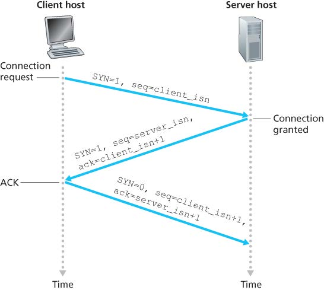
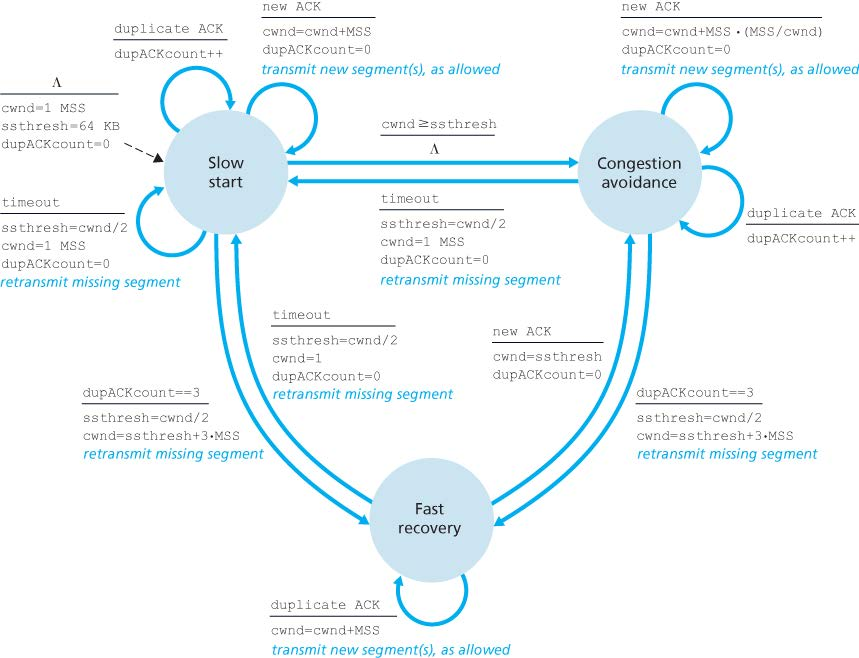
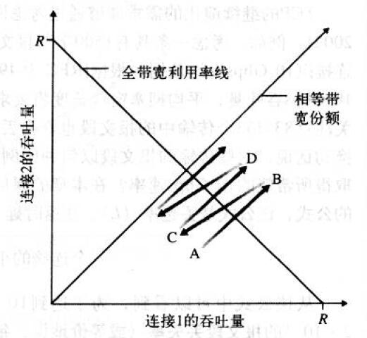
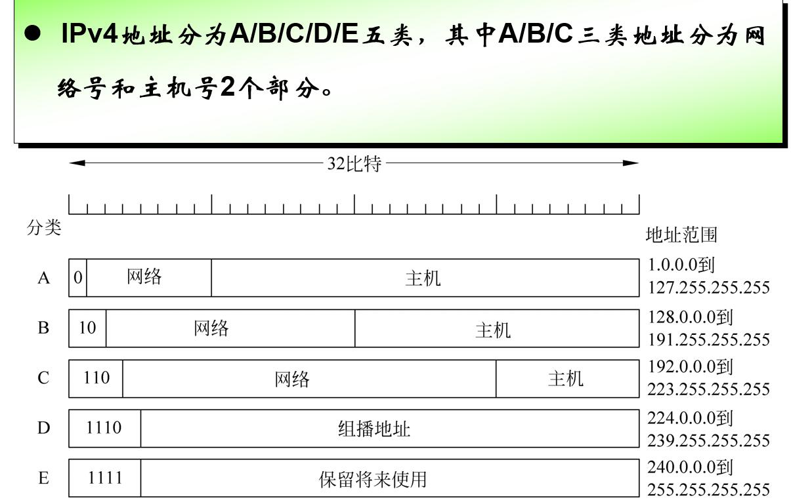
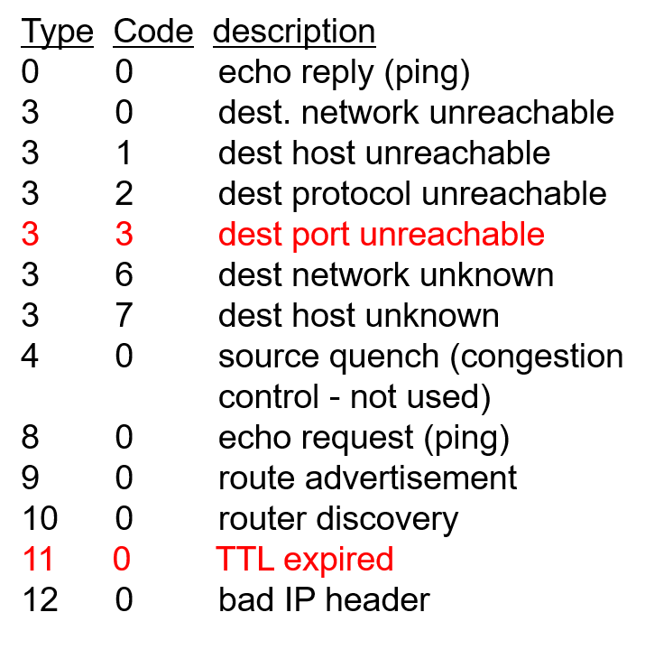
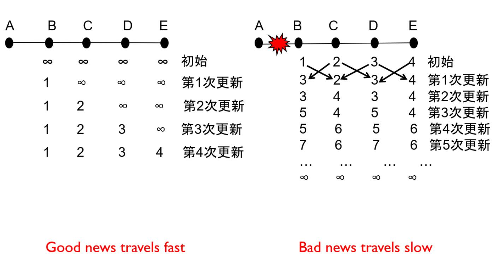
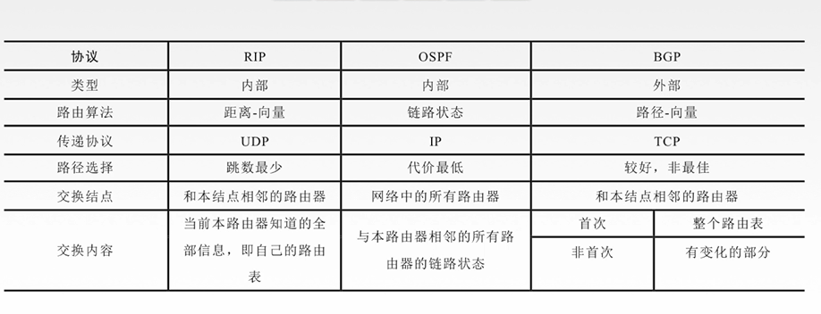

# 拾遗

|TCP/IP|OSI|数据单元|主体|协议|
|---|---|---|---|---|
||应用层|报文 message|进程|SMTP|
|应用层 Application|表示层 Presentation|
||会话层 Session|
|传输层 Transport||分段 segment|端口|TCP UDP|
|网络层 Network||分组/数据包 packet|主机|IP|
|链路层 Data Link||帧 frame|节点|以太|
|物理层 Physical|

socket：
- 相当于操作系统的 API 罢了
- [UDP socket 教程](https://www.jianshu.com/p/054fe6632bee)

网络协议:为进行网络中的数据交换而建立的规则、标准或约定。

由以下三个要素组成:
1. 语法:即数据与控制信息的结构或格式。
2. 语义:即需要发出何种控制信息，完成何种动作以及做出何种响应。
3. 规则:即事件实现顺序的详细说明。

要发给外网的报文：
- 目的 MAC 应该是路由器 LAN 口，因为是路由器负责转发
- 目的 IP 应该是服务器（废话

路由器转发后的报文：
- 源 MAC 和源 IP 都应该是路由器 WAN
- 目的 MAC 应该是网关，不过如果不用走网关（即服务器在同一子网内，但不归这个路由器管，因为有公网 IP），就直接写服务器 MAC，因为路由器 ARP 里有这个服务器
- 目的 IP 应该是服务器（废话

# 1 计算机网络与因特网

按范围分类
- Body Area Network
- Personal Area Network
- Metropolitan Area Network
- Wide Area Network
- InterPlanetary Network

按节点移动性分类
- The Internet
- Wireless Sensor Network
- Optical Network
- Mobile Communication System
- Satellite Communication Network
- Mobile Ad hoc Network

## 1.3 网络核心

### 分组交换

分组交换中不会预留带宽、缓存等

计算机网络是分组交换

### 电路交换

电路交换中会预留带宽和缓存，建立连接时，沿途所有交换机都为其维护连接

电话网络是电路交换

电路交换的优势是可确保服务质量，有专用资源，不会被干扰

## 1.4 分组交换网中的时延、丢包和吞吐量

### 端到端时延

$$d_{end-end} = N (d_{proc} + d_{trans} + d_{prop})$$

传播延时 prop只与链路长度有关，视为常量

- 消息 message：应用层中进程间交互的数据单元
- 分段 segment：传输层中端口间交互的数据单元
- 分组 packet：网络层中主机间交互的数据单元
- 帧 frame：数据链路层中节点间交互的数据单元

# 2 应用层

|应用|应用层协议|传输层协议|
|---|---|---|
|Email|SMTP/POP3|TCP
|The Web|HTTP|TCP
|File transfer|FTP|TCP
|Resolve domain names|DNS|UDP
|Trivial File Transfer|TFTP|UDP
|Remote login|Telnet|TCP

get 返回信息中的 content length 单位是字节

邮箱服务器之间使用 SMTP，POP3 纯收邮件，IMAP 在线直接访问邮件

[什么是POP3、SMTP和IMAP?](http://help.163.com/09/1223/14/5R7P6CJ600753VB8.html)

# 3 传输层

## UDP（User Datagram Protocol）

几乎等同裸的 IP，只能通过网络层（IP）提供的源地址信息分辨发送者

- 无连接传输，不可靠，可靠性要由应用层实现
- 首部 8 字节，总长不超过 64KB（$2^{16}$）
- 服务端一个套接字可接收多个客户端连接

### 校验

（每个字长 16 bit）

对包含伪首部、首部、数据在内的数据：
1. 每 16 位求和得到一个 32 位数
2. 若高 16 位不为 0，则高 16 位与低 16 位相加，得到新的 32 位数
3. 重复步骤 2 直到高 16 位为 0，将低 16 位 **取反** 得到校验和

> **取反**使得检验时只要将校验码和数据**一起相加**即可得到**全1**

能确保检测到 1bit 错误，2bit 及以上不一定能检测。

> 伪首部包含 源IP，目的IP，补位用的8位全0，协议代码（17），UDP数据包长度。伪首部仅用于计算校验和，不会真的发送。

## TCP（Transmission Control Protocol）

- 可靠传输，有持续连接和非持续两种
- 首部 20~24 字节
- 服务端一个套接字仅服务一个客户端连接

### Reliable Data Transfer

参考：[可靠数据传输基本原理](https://blog.csdn.net/zy010101/article/details/88981728)

rdt 是没有窗口的

1. rdt1.0：
   - 假设信道完全可靠
   - 收发双方都只有一个状态
2. rdt2.0 **停等**：
   - 假设信道只可能比特受损
   - 差错检测，接收方反馈，重传：NAK 的时候重传，ACK 的时候继续
   - 不能在等待反馈的时候接收上层数据，故称 **停等**
3. rdt2.1：
   - 考虑反馈受损
   - 加上分组编号，由于停等，故只要 0 1 两个编号
4. rdt2.2：
   - 不发 NAK，只发最新的包的 ACK
   - 冗余 ACK 相当于 NAK
5. rdt 3.0 **ABP，比特交换协议**：
   - 考虑数据丢失
   - 加入定时器 RTT（往返时间 round trip time），超时就重传
   - 利用率：$U_{sender}=\frac{L/R}{RTT+L/R}$

### Go Back N

- 发送方可以有 N 个未确认的数据包（也就是最多能 回退 N）
- 接收方只依次 ACK，不能跳跃。若收到的包不连续，则持续 ACK 上一个连续的包
- 计时器给最老的、未确认的包计时
- 刚建立连接时，接收方构造一个虚的 *上次确认*
- $N=2^k$，k 为数据包序号长度

### Selective Repeat

- 发送方可以有 N 个未确认的数据包
- 接收方为每个数据包单独 ACK
- 每个数据包都有一个计时器
- $N{\leq}2^{k-1}$，否则若 ACK 全丢失，会把重传数据当成新数据

### TCP

是 GBN 和 SR 的结合
- 像 GBN 一样只为最老的数据包计时
- 像 SR 一样支持不连续的ACK，即：支持累积确认，总是传 ACK 请求的包

#### ACK

确认的 ACK = 发送的 seq+1；确认的 SEQ = 发送的 ack。双方都是这样

序列号是当前字节在文件中的偏移量，确认号是希望收到的下一个字节的偏移量

> 只有 TCP 的 ACK 会超前，GBN、SR 的ACK 都不超前

#### RTT

计时器要长于 RTT
- 过短：不必要的重传
- 过长：效率低

估计 RTT：
- SampleRTT：忽略重传的，并且最近的传输权重大

> 忽略重传：是因为若出现 premature timeout，即第一次的 ACK 在超时重传后才送达，则发送方的 RTT 测量为错误结果

#### 重传

三种重传：
1. 超时重传：定时器结束时未收到 ACK，则重传
2. premature timeout：重传后收到 ACK，接收方收到重传后仍确认最大的序号
3. 跳过 ACK：没收到上一个 ACK，就收到了后面的 ACK，发送方仍继续发送收到的 ACK 请求的数据包

总之一切照常

**快速重传**：连续收到三个相同的 ACK 就立刻重传，不管定时器

#### 流量控制

发送方有一个接收窗口 rwnd，即未确认的数据包不能多于 rwnd。也就是 GBN 和 SR 里的 N。

#### 三次握手

第一、第二次握手的 seq 都是随机生成的，第一次握手无 ACK，其他正常。

第一、第二次握手的 SYN = 1，不能携带数据；第三次 SYN = 0，可以携带数据

若服务器的一个老第一次握手请求发送到了客户端，客户端会进行确认，但服务器会注意到过期的 ISN 编号，并忽略该第二次握手。

同样，客户端也会检查第二次握手中的 ISN 编号。

#### 四次挥手

第一、第二次挥手可以携带数据，第三第四次不行（因为连接已断开）

### 拥塞控制

流量控制是收发双方间的，是为保证来得及接收而控制发送速度；
拥塞控制是防止网络中数据过多，使网络过载，而控制发送速度。

加性增加，乘性减少

**TCP congestion-control algorithm**: (cwnd = congestion window, ssthresh = slow start threshold)

*   slow start：（指数，超时或初始进入，以窗口为1为开始）
    *   初始状态或出现超时时将发送窗口长度设置为1，此后每收到一个ACK则窗口长度+1（也就是每一轮之后翻倍）
    *   若窗口大小达到慢启动阈值则进入拥塞避免

> 窗口1+1=2后，发送的数据数也变为2，于是会收到2个ACK，则该RTT下窗口长度2+2=4，实现指数增长

*   congestion avoidance：（线性）
    *   收到新ACK时 cwnd = cwnd + MSS/cwnd

> MSS：最大报文段长度

*   fast recovery：（指数，三个重复ACK时进入，以窗口锐减为开始）
    *   每收到一个重复的ACK则恢复1个发送窗口长度（指数）
    *   收到了新的ACK则恢复拥塞避免
    *   若超时则进入慢启动状态，阈值设为窗口的一半，窗口设为1

- Tahoe：有重复三个 ACK 时将窗口设置为1（旧版）
- Reno：有重复三个 ACK 时将阈值设为先前窗口的一半，窗口为阈值（+3MSS）（常用）

> 窗口减半后，即进入快速恢复后，若窗口指数增长，则还是快速恢复；若窗口线性增长，则是拥塞避免

TCP 平均吞吐率：3 / 4 W，W 为拥塞窗口大小

TCP 公平性：

从 A 开始，到 B 时丢包，减半至 C（C 为 B 与原点的中点），如此反复不断逼近最优点

# 4 网络层1：数据

## 虚电路和数据报网络

虚电路：预先建立好路线；数据报：每个报文单独走

==都是分组交换！==

### Virtual Circuit 虚电路

在废物 ATM 网络用过（不是自动柜员机啦

**一条虚电路在不同路段的编号不同**。如果相同，那要修改就会影响整个网络。

#### 转发表

|入接口|入VC号|出接口|出VC号|
|---|---|---|---|
|1|12|2|22|
|2|63|1|18|
|3|7|2|17|
|1|97|3|87|

每经过该路由器创建一个新虚电路，就会在表里加一项

~~虚电路是单向的~~（只是有些题目的设定罢了！）

#### 选路和转发

- 选路是在网络中寻找到目的节点的路径，通常依赖选路算法进行；
- 转发是在已知路径的基础上，根据路径选择下一个节点，以便转交数据包
- 两者的关联：选路是转发的基础。

### Datagram Network 数据报网络

#### 最长前缀匹配

Prefix Match|Link Interface
|---|---|
11001000 00010111 00010*** ********|0
11001000 00010111 00011000 ********|1
11001000 00010111 00011*** ********|2
otherwise |3

Ex：11001000 00010111 00011000 00011000 10101010 -> 1

一般而言，路由器仅需将部分地址转发至内网，其它的统统指向外网即可，于是不用记忆四十亿地址

## 路由器

### 输入排队

HOL（Head of the line）Blocking 是一个 由于其队伍前面的数据报被阻塞，导致即使其自己的目标出口畅通，也被阻塞

## IP（internet protocol）

- 无连接，不可靠
- 首部 20~24 字节

- Time to live：每转发一次就减一，减到 0 时路由器必须抛弃该数据包
- Upper layer protocol：上层协议，仅会在到达终点的时候用到，6 = TCP，17 = UDP

### IPv4 数据包分片

分片可能在任一个节点进行，还可能出现多次分片

不同链路都有不同的最大传输单元 MTU（maximum transmission unit），即硬件限制。当要传输的数据包大于链路的 MTU 时，就要进行分片。

每次分片，IP 头部都会占用 20 字节。

- length：含 ip 头 的字节长度
- id：同一个分组的分片有相同 id
- flag：是否还有后续片
- offset：之前的（按原数据算）所有片的字节长度除以 8（不含 ip 头）

> 原数据总长也算了头部！

### IPv4 编址

IP 地址分给网卡而不是主机

- 全 0 为该网络的该主机
- 主机全 0 为网络地址，路由器路由表现
- 网络全 0 为本网络的某主机
- 全 1 为受限广播地址，本网络全部主机
- 主机全 1 为直接广播地址，某网络全部主机

> 127 开头为回环地址
> 
> 10.0.0.0～10.255.255.255，172.16.0.0～172.131.255.255，192.168.0.0～192.168.255.255 为内网 ip

>> 补充知识：`100.64.0.0/10`已经被用于[运营商NAT](https://tools.ietf.org/html/rfc6598)。

分子网只会减少能用的主机！子网只是方便路由器进行管理
- 子网：将主机位中的前几位设为子网号
- 子网掩码：将标准地址与掩码按位与得到子网号（故默认掩码为 255.255.255.0）
- 例如 255.255.240.0 （240=11110000）从B类网络的16位主机号借了4位作为子网号，即
- 子网号中全0全1保留，故子网至少要2位，主机号也至少2位

#### CIDR（Classless Interdomain Routing）

`a.b.c.d/x` 中 `x` 为子网长度

CIDR aggregation：聚合 CIDR，即把多个 CIDR 表示的子网聚合成一个 CIDR 表示的子网。目的是减小最长匹配的长度

#### 转发表

写转发表时，前缀越长越好。题目可能会对前缀数（即 entries）有要求，一般是 others 里加一条，补其它接口的空子：即写一个比之前接口更长的，且不影响那个接口转发的前缀

### DHCP（Dynamic Host Configuration Protocol）

1. 新加入的主机会用 UDP 向所有设备 67 端口广播
2. DHCP 服务器收到广播后会向所有设备广播要启用的新 IP（广播是因为新设备还没 IP 地址），即 DHCP offer
3. 新来的主机会选用一个 offer 并向对应的 DHCP server 请求
4. server 发送 ACK

#### NAT（Network Address Translation）

用端口号表示内网连接

穿越NAT方法：
1. 静态配置：绑定路由器某端口与内网设备的某端口
2. UPnP：动态配置
3. 中继：将NAT信息登记到应用提供商的服务器

|WAN side|LAN side|
|24.134.112.235:5001|192.168.1.3:3345|
|24.134.112.235:5002|192.168.1.3:3346|

其中`24.134.112.235`为路由器 WAN 口 ip，`192.168.1.3`为内网某主机

#### ICMP

internet control message protocol，主要通知报错信息

ICMP 报文包含一个类型字段和一个编码字段

ICMP通常被认为是IP的一部分，但从体系结构看是在IP之上，是3.5层。

traceroute就基于ICMP

### IPv6

- 128 位地址
- 固定的 40 字节头部
- 不再分片，要是过大就用 ICMP 发个“Packet Too Big”给发送方
- 可以用 Tunnel 把ipv6的报文封装在ipv4的里，需要人工配置隧道

# 5 网络层2：控制

## 路由算法

路由器只关心下一跳去哪，而不关心整体的路径。路由算法负责维护转发表。

把网络抽象为有权图，路由算法就在该图中求解最短路径。

1. 全局路由算法：L-S
2. 分布路由算法：D-V

1. 静态路由算法：人工填写，若拓扑结构有变化（例如链路故障）就要人工及时修改
2. 动态路由算法

### LS（Link-State）路由算法

Link-State Packet，链路状态报文，即路由器测量与其直接相连的路由器的链路状态（延时），
生成LS报文，并向所有路由器广播，由此每个路由器都获得了完整网络拓扑结构。

一个 LS 报文记录从路由器 A 到路由器 B 的链路状态，路由器每收到一个邻居发来的 LS 报文就要应答，
并向其他路由器发送新收到的这个报文

> 每个路由器会对每个已收到的 LS 报文贴上一个序号和生存期，此后只会记录序号更大的 LS 报文

获得完整网络拓扑结构后使用 **Dijsktra 算法**：
- D：cost，P：上一跳的点，N：记录各个 D 最小的点，一开始仅含起点
- 先找一遍邻居
- 把 D 最小的点加入 N，然后从 D 最小的点，重复上一步，若 D 变小就更新之。加入 N 的点就不再写其值

考虑流量的时候，会出现链路负载振荡的现象

> 要写到所有点进 N 为止

### Distance-Vector (DV) 路由算法

DV：Distance vector，距离向量

路由器 A 计算自身到C的成本（A-C不直连）：获取邻居路由器 B 到 C 的成本，则 A到C = A到B + B到C

当链路状态有变化时，将自己的 DV 发给邻居，邻居据此通过Bellman-Ford 算法重新计算，若有变化，则通知邻居

好消息更新快，坏消息更新慢：因为坏消息之前的状态会残留在邻居的通知内

出现路由黑洞，通过毒性逆转解决，即当 C 通过 B 选路到达 A 时，C 告诉 B：C 到 A 的成本为无穷大
（然而该协议在环路内失效）

> 要写到某一步无更新为止

### 对比 LS 和 DV

- 报文复杂性：DV仅在新的链路费用导致最优路径变化时才广播，而LS在任意变化下都广播
- 收敛速度：DV收敛慢，还有路由黑洞
- 鲁棒性：DV算法的一个不正确的节点计算值会扩散到整个网络

## Intra-AS Routing（自治系统内选路）

intra-AS Routing 也被称为 interior gateway protocols（IGP）

上述选路算法在大规模网络的迭代一定不会收敛，并且单个路由器不应受限于外部网络而被迫选用某种选路算法。

自治系统（Autonomous System，AS）用于解决这两个问题。

AS之间运行自治系统间选路协议（inter-AS routing），一个AS内部的路由器运行相同的选路算法（intra-AS routing），且拥有彼此之间的信息。每个AS都有一个或多个负责连接外部网络，称为网关路由器。

AS routing 是要让 某个 AS 知道地址ip属于哪个 AS；当这个地址属于两个AS时，还要在AS层面确定选哪条链路最优。（选路算法必须让每个ip只有一条路径）

### RIP（Routing Information Protocol）

基于 DV

- RIP的成本计算是以跳数计，一跳就是1，最多支持15跳。
- 路由器每30秒与邻居打一次招呼（更新）
- 每次只能更新25个目的子网

路由器根据邻居发来的通告（即邻居自己的转发表）更新自身转发表。若180秒未监听到邻居，就认为其不可达，并通告其他路由器。

路由器也可以使用RIP请求邻居到指定目的地的费用（以UDP的方式使用520端口）

### OSPF（Open Shortest Path First）

OSPF是RIP的后继者。==RIP是DV类算法的典型代表，而OSPF是LS的代表协议==。核心是一个使用泛洪链路状态信息的协议和Dijkstra算法。

OSPF 通告包含在OSPF报文中，而报文直接承载在IP分组中，不依赖TCP、UDP。

OSPF 将AS再细分为了多个区域（area），其中有一个主干（backbone）区域，负责为其他区域之间的流量选路。

- 内部路由器：不属于主干，只执行 intra-AS
- 区域边界路由器：同时属于区域和主干
- 主干路由器（非边界路由器）：内部路由器通过所在区域的主干路由器知晓通往其他区域的路由
- 边界路由器：与其它AS的路由器交流

## 自治系统间选路：BGP

BGP 是全互联网使用的 自治系统间选路算法

- eBGP：在AS之间传播可达信息，网关路由器用eBGP向其他网关路由器通告所在网络能够到达的其他网络
- iBGP：在AS内部传播可达信息，网关路由器用iBGP向所在网络的其他路由器通告eBGP获得的信息

eBGP 需要直接连接，iBGP不需要（TCP报文可以经过多跳）

#### BGP Notes

BGP 只计算 AS 跳数，不计算路由器跳数，即：BGP选择的是AS-path最短的路径，与路由器个数无关

Next-Hop 不会保留源路由器的端口号，而是改为发布者的端口号，便于回溯

## 广播和多播选路

### 广播

源不必把一个报文发多次，每次设定不同目的，而是只要发一次，在路由时广播。

节点转发过就不必再转发，节点通过序号来辨别，即转发的报文只递增不递减。

用生成树的形式实现，源作为树的根。

### 组播（多播）

地址为D类，即`1110`开头。组播地址需要申请。

#### IGMP

Internet Group Management Protocol，互联网组管理协议，既不属于传输层，也不属于网络层

IGMP 管理路由器上的组播组，并维护状态表来进行转发。

# 6 链路层

## 链路层简介

### 链路层提供的服务

*   成帧（framing）：有帧头帧尾，故又称帧定界
*   链路接入（媒体访问控制协议/MAC）
*   可靠交付（相邻节点间可靠，不保证端到端可靠，因为可能在节点被抛弃）
*   流量控制
*   差错检测和纠正
*   半双工和全双工

> 链路：加上可靠性控制的电路

### 链路层在何处实现

*   主体部分：网络适配器（network adapter）/网络接口卡（Network Interface Card, NIC）
*   网络适配器核心是链路层控制器，一个实现了许多链路层服务的专用芯片
*   链路层功能大多是硬件实现的，但部分是在运行于主机CPU上的软件中实现的

链路层是硬件和软件的结合体，即是协议栈中软件和硬件交接的地方。

0.5层：驱动，在软件做；1.5层：网卡，在硬件做。

> 源到目的可能经过多种链路层协议

## 差错检测和纠正

3种技术：
*   奇偶校验
    *   加上校验位后共有奇数个 1 or偶数个 1
    *   二维：在纵向也进行奇偶校验，如此能够实现差错纠正
    *   **最短校验和**：一般在将数据排成接近正方形的格式能实现最短校验和
*   检验和（checksum，适用于运输层）、因特网检验和
    *   切成16位一段，取二进制补码，求和，把进位加回最低位
*   循环冗余检测（CRC，适用于适配器中的链路层）：多项式编码、生成多项式
    *   数据 D，r+1 位的生成多项式 G（最高次为r），G 的最高位须为1
    *   发送方选择 r 个附加比特 R，附加到 D 之后，使得得到的 d+r 能够用模2算术被 G 整除
    *   接收方若发现不能整除，则出错
    *   R 实际就是 (D<<r)/G 的余数（此处除法每步是异或，不是减法！）
    *   codeword：D后接R

> 若 G 中 $x^r, x^0$ 的系数非0，则可以检测所有 1 比特差错（根据数字通信，这俩必须为1，所以永远能检测 1 比特）
> 
> 若 G 中含有 至少三项的因式~~($2^r-1>=d+r$)~~，则可以检测所有 2 比特差错
> 
> 若 G 中含因式 x+1，则可以检测所有奇数比特差错
> 
> 可以检测长度不大于 r 的差错，大于 r 的不一定能检测到

G 的各项系数为 1 或 0，所有运算均模 2

**能否检测x比特差错：若一个阶数不大于 d+r，错误位数为x的错误模式，可以被 G 整除，则不能检测x比特差错。譬如`1000001`可以被`1101`整除，故`1101`不能检测所有2比特差错**

## 多路访问链路

多路访问问题（multiple access problem）：如何协调多个发送和接收节点对一个共享广播信道的访问？

*   多路访问协议（multiple access protocol）：节点通过**这些**协议来规范它们在共享的广播信道上的传输行为，并且不需要一个单独的信道进行管理。又称**介质访问控制协议**。
*   碰撞（collide）：多个节点同时传输帧，所有节点同时接到多个帧，没有一个节点能够有效的获得任何传输的帧。
*   3种类型的协议：
    *   信道划分协议（channel partitioning protocol）：借助频分、时分、码分划分信道
    *   随机接入协议（random access protocol）：允许冲突，协议负责从冲突中恢复
    *   轮流协议（taking-turns protocol）：轮流让信道担任管理者

### 随机接入协议

随机接入协议中，一个传输节点总是以**信道的全部速率**进行发送。当有碰撞时，涉及碰撞的每个节点反复地重发它的帧（分组），直到该帧无碰撞的通过为止。

但是当一个节点经历一次碰撞时，它不必立刻重发该帧，而是等待一个随机时延（独立地选择随机时延）。

常见的随机接入协议：

*   ALOHA：纯 ALOHA 和 时隙 ALOHA
*   载波侦听多路访问（CSMA）（以太网）

#### 纯 ALOHA

*   当一帧首次到达（一个网络层数据报在发送节点从网络层传递下来），节点立刻将该帧完整地传输进广播信道。
*   如果帧的传输经历了碰撞，该节点立即（完全传输后）以概率 $p$ 重传该帧。
*   否则，该节点等待一个帧传输时间。在此等待后，以概率 $p$ 传输该帧，或者以概率 $1-p$ 再等待一个帧传输时间。

成功传输要求其他节点在2个时间间隔内不传输（即只要与其它帧有部分重叠，就判定为冲突），因此一个节点成功传输的概率是 $p(1-p)^{2(N-1)}$，纯ALOHA协议的最大效率为 $1/2e$，其中 N 为节点总数。

#### 时隙 ALOHA

作出假设：

*   所有帧都是$L$比特长
*   一个时隙等于传输一帧的时间 $L/R$
*   结点只在时隙起点开始传输帧
*   结点是同步的，每个节点都知道时隙何时开始
*   如果一个时隙中有两个或更多个碰撞帧，则所有节点在该时隙结束之前检测到碰撞事件

令$p$是一个概率，则每个节点中时隙ALOHA的操作为：

*   当节点有一个新帧要发送时，它等到下一个时隙开始并在该时隙传输整个帧；
*   如果没有碰撞，该节点成功传输，不需要考虑重传；
*   如果有碰撞，则该节点在时隙结束之前检测到碰撞。该节点以概率$p$在后续的每个时隙中重传它的帧，直到该帧被无碰撞地传输出去。

优点：

*   当某节点是唯一活跃的节点时，允许以全速$R$连续传输。
*   分散的：每个节点检测碰撞并独立地决定什么时候重传（但仍然需要对时隙同步，即各节点时钟同步）。
*   极为简单。

#### 载波侦听多路访问（CSMA）

载波侦听多路访问（CSMA）和具有碰撞检测的CSMA（CSMA/CD）协议族中包括两个规则：

*   载波侦听（carrier sensing）：一个节点在**传输前先侦听信道**。如果来自另一个节点的帧正向信道上发送，节点则等待直到检测到一小段时间没有传输，然后开始传输。
*   碰撞检测（collision detection）：当一个节点在**传输时一直在侦听信道**，如果检测到另一个节点正在传输干扰帧，就停止传输并等待一段随机时间。

由于信道传播时延，即使在侦听当前信道，仍然可能导致碰撞发生。传播时延越大，载波侦听节点不能侦听到网络中**另一个节点已经开始传输**的机会就越大。

#### 具有碰撞检测的载波侦听多路访问（CSMA/CD）

[以太网中的CSMA/CD协议及二进制指数退避算法详解](https://blog.dyxmq.cn/network/ethernet-csmacd.html)

1.  适配器从网络层获得一条数据报，准备链路层帧，并将帧放入适配器缓存中；
2.  如果适配器侦听到信道空闲，它开始传输帧。否则则等待直到侦听到没有信号能量时才开始传输帧。
3.  在传输过程中，适配器监视来自其他使用该广播信道的适配器的信号能量的存在。
4.  如果适配器传输整个帧而未检测到来自其他适配器的信号能量，则传输成功；否则中止传输，等待一个随机时间然后重复第二步骤（等待信道空闲）。
5.  二进制指数后退（binary exponential backoff）算法：当传输一个给定帧并经历了一连串的$n$次碰撞后，**均匀地随机**地从 $0,1,2,\dots,2^{n-1}$ 中选择一个间隔时间长度 $K$。对于以太网，一个节点等待的实际时间量是 $512K$ 比特时间，$n$ 能取的最大值在10以内。

CSMA/CD 的最小帧长 = 冲突域 * 传播速率 = 2 * 单向传播时延 * 传播速率

> 1-persist CSMA，1 指等待的概率为 1，也有概率为 0 或 p 的。为 0：信道忙就睡一会再来看看
> 
> 比特时间：传1bit所需时间
> 
> 争用期：即碰撞窗口，节点在发送完成后的争用期中监听信道，无碰撞则认为发送成功。本质为$d_{prop}$，以太网的争用期为`51.2μs`

## 链路层寻址

### MAC 地址

MAC 地址是链路层地址，是给接口的（网卡）

交换机没有 MAC地址，因为交换机应当是透明的

MAC 地址长 6 字节

*   适配器要发送一个帧时，将目的适配器的MAC地址插入到该帧中，并将该帧发送到局域网上。
*   **MAC广播地址**：`ff:ff:ff:ff:ff:ff`
*   一台交换机偶尔将一个入帧广播到它的所有接口，适配器可以接收一个并非向它寻址的帧。
*   适配器接收到一个帧时，将检查该帧中的目的MAC地址是否与它自己的MAC地址匹配。如果匹配，该适配器提取出封装的数据报并向上传递；否则丢弃该帧。

### ARP（Address Resolution Protocol）

下面是在ARP表中添加一条记录的过程，TTL一般为20分钟。假设交换机会广播所有帧。

*   发送方构造一个称为ARP分组（ARP packet）的特殊分组，一个ARP分组有几个字段：发送、接收IP地址以及MAC地址。ARP查询分组的目的是查询子网上所有其他主机和路由器，以确定要解析的IP地址的MAC地址。
*   适配器封装ARP分组，用**广播地址**作为帧的目的地址，将帧传输进子网中。
*   目标主机给查询主机发送回一个带有所希望映射的响应ARP分组（使用**标准帧**而不是广播地址），然后查询主机更新ARP表，并发送IP数据报。

> 默认相同子网内的设备互相知道对方MAC。可以从ip看出是否相同子网

#### 发送数据报到子网以外

<!-- *   每台主机仅有一个IP地址和一个适配器
*   一台路由器对它的**每个接口都有一个IP地址**
*   路由器的每个接口都有一个ARP模块和一个适配器
*   网络中每个适配器都有自己的MAC地址 -->

假设子网1的网络地址为`111.111.111/24`，子网2的网络地址为`222.222.222/24`。

*   发送数据报不能使用子网2适配器的MAC地址，因为子网1没有任何适配器与之匹配
*   发送主机使用ARP获得**路由器接口的MAC**地址，然后创建一个帧将该帧发送到子网1中
*   子网1的路由器适配器看到该链路层是向它寻址的，将这个帧传递给路由器的网络层
*   路由器通过转发表得知转发的子网2接口，并将数据报告诉子网2的适配器，该接口使用ARP获取目标MAC地址
*   子网2接口**用目标MAC地址重新封装**成一个新的帧发送到子网2中

> 这是“缺省网关地址”方式，还有“代理ARP”方式

#### 以太网技术

*   10BASE-T
*   10BASE-2
*   100BASE-T
*   1000BASE-LX
*   10GBASE-T

其中10：10Mbps；BASE：基带以太网（媒体仅承载以太网流量）；T/2/LX：物理媒体，T为双绞铜线。

参数|   10Mbps| 100Mbps|    1Gbps|  10Gbps
----|---|---|---|---
比特时间|100ns|  10ns  |  1ns    |0.1ns
冲突窗口|51.2μs|5.12μs |4.096μs  |
帧间间隔|9.6μs |0.96μs |0.096μs  |
冲突重发次数|16|   16  |16       |
冲突回退限制|10|  10   |10       |
阻塞帧（冲突信号）|4字节|4字节   |4字节
最大帧长度|1518字节|1518字节|1518字节|1518字节
最小帧长度|64字节|64字节|416字节（载波扩展）|64字节

10Gpbs使用专线，交换机间不存在多路通信，无需CSMA

### 链路层交换机

*   过滤（filtering）：决定一个帧应该转发到某个接口还是应当将其丢弃
*   转发（forwarding）：决定一个帧应该被导向哪个接口，并把该帧移动到哪些接口
*   交换机表：包含某局域网上某些主机和路由器的（不是全部）的MAC地址、通向该MAC的交换机接口、时间

假定目的地址为`dd:dd:dd:dd:dd:dd`，从接口 $x$ 到达：

*   交换机表没有目的地址表项，此时交换机向除 $x$ 以外的所有接口转发该帧的副本（广播）
*   交换机表有一个表项与接口 $x$ 连接起来，执行过滤功能
*   交换机表有一个表项将接口 $y{\neq}x$ 连接起来，该帧被转发到与接口 $y$ 相连的局域网网段

自学习：

*   交换机表初始为空
*   对于每个接口收到的每个入帧，交换机存储源地址、接口、时间（雁过拔毛，A从1口发来数据，那以后发给A就走1口）
*   对于未知端口的目标MAC地址，交换机向除发送端口外的端口做广播（同一端口的收发不需要通过交换机）
*   如果在一段时间（老化期（aging time））后，交换机没有接收到该地址作为源地址的帧，就在表中删除这个地址

交换机是即插即用设备（plug-and-play device），因为他们不需要网络管理员或用户的干预。交换机也是双工的，任何交换机接口可以同时发送和接收。

交换器 v.s. 路由器：

*   交换机
    *   即插即用，自学习
    *   相对高的分组过滤和转发效率
    *   必须处理高至**第二层**（链路层）的帧
    *   对于广播风暴不提供任何保护措施
*   路由器
    *   需要人为地配置IP地址，通过路由算法学习
    *   当网络中存在冗余路径时，分组通常不会通过路由器循环
    *   必须处理高至**第三层**（网络层）的帧
    *   对第二层的广播风暴提供防火墙保护

通常路由器在交换机的上层，连接多个交换机

- 集线器 hub
  - 一个口收到的信号，原封不动的发送给所有其他的口。
  - 工作在物理层。
- 网桥 bridge
  - 与 hub 相比，网桥会过滤 mac，只有目的mac地址匹配的数据才会发送到出口。
  - 工作在链路层
- 交换机 switch
  - 可以看做多个网桥的集成，但是也有三层交换机，即实现了部分路由功能的交换机
  - 工作在链路层
- 路由器
  - 基于 IP 做转发
  - 工作在网络层

## PPP 协议

Point to Point Data Link Control
- 没有多个用户，就不需要 MAC 和 MAC 地址
- 异步传输，两帧间隔随意
- 全双工、拨号都支持
- Point to Point Protocol 或 HDLC

### PPP 需求

- 成帧：把网络层报文封装到链路层帧，并且能够解封装到不同的高层协议
- 比特传输：若用户数据出现了和帧头帧尾一样的数据，需要能检测出并正确传输
- 差错检测：但是不用纠错
- 链接活性：能检测链路层的故障，并向网络层通知
- 能支持网络层的协商，自动配置 IP 地址

### PPP 帧格式

套用了HDLC的帧格式

- 帧头帧尾各 1 字节：都是 01111110（7e）
- 地址全 1：点到点了你要啥地址啊
- 控制字段固定：不实现差错控制
- 协议字段 1 或 2 字节：高层协议
- 用户数据
- CRC：2 或 4 字节

### 字节插入

为了允许用户发送 01111110，在用户发送的 01111110 前无条件插入 01111101（7d）。

为了允许用户发送 01111101，在用户发送的 01111101 前无条件插入 01111101（7d）。

接收方看到一个 7d，就把其看作转义字符，而其后的是用户数据。

# 获取网页

N2是一台新机器，具有本机IP地址和MAC地址。如果在浏览器中打开 http://www.sciroccogti.top/ ，则该命令会用到哪些应用层、传输层、网际层协议，描述浏览器获取信息过程？

1. N2通过ARP查询获取默认网关MAC地址；用到网际层协议：ARP协议
2. N2通过DNS获取 http://www.sciroccogti.top/ 的IP地址；用到应用层协议：DNS协议、OSPF、BGP；传输层协议：UDP；网际层协议：IP；
3. N2与 http://www.sciroccogti.top/ 建立TCP连接；用到传输层协议：TCP；网际层协议：IP；
4. N2通过HTTP获取web网页；用到应用层协议：HTTP，传输层协议：TCP，网际层协议：IP；
