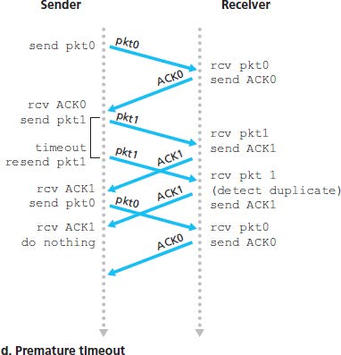
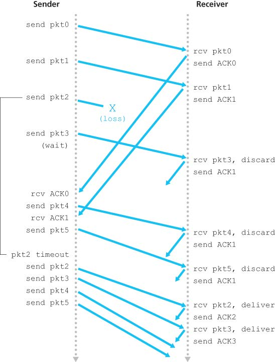

# Chapter 3 - Transport Layer

## 3.1 Introduction and Transport-Layer Services

A transport-layer protocol provides for **logical communication** between application processes running on different hosts.

Transport-layer protocols are implemented in the end systems but not in network routers. On the sending side, the transport layer converts the application-layer messages into transport-layer packets, known as transport-layer **segments**. The transport layer then passes the segment to the network layer at the sending end system. On the receiving side, the network layer extracts the transport-layer segment and passes the segment up to the transport layer. The transport layer then processes the received segment, making the data available to the receiving application.

### 3.1.1 Relationship Between Transport and Network Layers

A transport-layer protocol provides logical communication between _processes_ running on different hosts, a network-layer protocol provides logical-communication between _hosts_.

Certain services _can_ be offered by a transport protocol even when the underlying network protocol doesn’t offer the corresponding service at the network layer.

### 3.1.2 Overview of the Transport Layer in the Internet

Two transport-layer protocols: TCP and UDP.

The most fundamental responsibility of UDP and TCP is to extend IP’s delivery service between two end systems to a delivery between two processes running on the end systems. Extending host-to-host delivery to process-to-process delivery is called **transport-layer multiplexing** and **demultiplexing**. UDP and TCP also provide integrity checking by including error-detection fields in segments’ headers.

TCP offers several additional services:

*   **reliable data transfer**
*   **congestion control**

## 3.2 Multiplexing and Demultiplexing

At the receiving end, the transport layer examines the fields to identify the receiving socket and then directs the segment to that socket. The job of delivering the data in a transport-layer segment to the correct socket is called **demultiplexing**.

The job of gathering data chunks at the source host from different sockets, encapsulating each data chunk with header information to create segments and passing the segments to the network layer is called **multiplexing**.

Transport-layer multiplexing requires (1) that sockets have unique identifiers, and (2) that each segment have special fields that indicate the socket to which the segment is to be delivered. These special fields are the **source port number field** and the **destination port number field**. Each port number is a 16-bit number from 0 to 65535. The port numbers from 0 to 1023 are called **well-known port numbers** and are restricted.

Each socket in the host could be assigned a port number, and when a segment arrives at the host, the transport layer examines the destination port number in the segment and directs the segment to the corresponding socket. The segment’s data then passes through the socket into the attached process.

UDP sockets are connectionless: socket is fully identified by a two-tuple consisting of a destination IP address and a destination port number. If two UDP segments have different source IP addresses and/or source port numbers, but have the same destination IP and port number, two segments will be directed to the same destination process via the same destination socket.

TCP sockets are connection-oriented: socket is identified by a four-tuple (source IP + port, destination IP + port). Two arriving TCP segments with different IP address/port will be directed to two different sockets.

The server host may support many simultaneous TCP connection sockets, with each socket attached to a process and with each socket identified by its own four-tuple. When a TCP segment arrives at the host, all four fields are used to direct the segment to the appropriate socket.

3.3 Connectionless Transport: UDP
---------------------------------------------------------------------

UDP does just about as little as a transport protocol can do. In fact, if the application developer chooses UDP instead of TCP, then the application is almost directly talking with IP. With UDP there is no handshaking between sending and receiving transport-layer entities before sending a segment. Therefore UDP is said to be _connectionless_.

Some applications are better suited for UDP for some reasons:

*   **Finer application-level control over what data is sent and when.** UDP will package the data and immediately pass the segment to the network layer. While TCP has a congestion control mechanism that throttles the transport-layer TCP sender when one or more links become congested. TCP will also continue to resend a segment until the receipt has been acknowledged, which is not well matched to some applications needs (can tolerate some data loss).
*   **No connection establishment.** UDP does not introduce any delay to establish a connection.
*   **No connection state.** No buffers, congestion-control parameters and sequence and acknowledgement number parameters. A server devoted to a particular application can typically support many more active clients when the application runs over UDP.
*   **Small packet header overhead.** UDP has only 8 bytes of overhead (TCP = 20 bytes).

It _is_ possible for an application to have reliable data transfer when using UDP. This can be done if reliablity is built into the application itself.

### 3.3.1 UDP Segment Structure

### 3.3.2 UDP Checksum

UDP performs the 1s complement of the sum of all the 16-bit words in the segment, with any overflow encountered during the sum being wrapped around. The result is put in the checksum field of the UDP segment.

Although UDP provides error checking, it does not do anything to recover from an error. Some implementations of UDP simply discard the damaged segment; others pass the damaged segment to the application with a warning.

3.4 Principles of Reliable Data Transfer
------------------------------------------------------------------------------------

### 3.4.1 Building a Reliable Data Transfer Protocol

#### Over a Perfectly Reliable Channel

*   Nothing can go wrong
*   Sender simply accepts data from upper layer, creates a packet and sends it into the channel;
*   Receiver receives a packet, removes the data from the packet and passes the data up to the upper layer.

#### Over a Channel with Bit Errors

Assume the channel only has bit errors, and will NOT lose packets.

*   Positive acknowledgements and negative acknowledgements
*   **ARQ (Automatic Repeat reQuest) protocols**

Three capabilties are required in ARQ protocols to handle errors:

*   **Error detection.**
*   **Receiver feedback.**
*   **Retransmission.**

The **stop-and-wait** protocols:

*   The sender sends the data with a packet checksum and then waits for an ACK or NAK packet from the receiver. If ACK is received, then the packet has been received correctly and the sender waits for next data. Otherwise, the protocol retransmits the last packet and repeat. When the sender is waiting for ACK or NAK, it _cannot_ get more data from the upper layer.
*   The receiver just replies with either an ACK or a NAK when the packet arrives.

The problem in the above method is that if an ACK or NAK is corrupted, the sender has no way of knowing whether or not the receiver has correctly received the last data.

A simple solution is to add a new field to the data packet and have the sender number its data packets by putting a **sequence number** into this field. The receiver then need only check this sequence number to determine whether or not the received packet is a retransmission. For stop-and-wait protocol, a 1-bit sequence number will suffice.

#### Over a Lossy Channel with Bit Errors

Suppose that the sender transmits a data and either the data or ACK is lot (no reply from receiver). If the sender is willing to wait long enough so that it is certain that a packet has been lost, it can simply retransmit the data packet.

If a packet experiences a particulary large delay, the sender may retransmit the packet even though neither the packet nor its ACK have been lost. This introduces the possibility of **duplicate data packets**.

Implementing a time-based retransmission mechanism requires a **countdown timer** that can interrupt the sender after a given amount of time has expired. The sender will thus need to be able to (1) start the timer each time a packet is sent, (2) respond to a timer interrupt and (3) stop the timer.

### 3.4.2 Pipelined Reliable Data Transfer Protocols

Pipelining has the following consequences for reliable data transfer protocols:

*   The range of sequence numbers must be increased.
*   The sender and receiver sides of protocols may have to buffer more than one packets.
*   The range of sequence numbers needed and the buffering requirements will depend on the manner in which a data transfer protocol responds to lost, corrupted and overly delayed packets.

Two basic approaches: **Go-Back-N** and **selective repeat**.

### 3.4.3 Go-Back-N (GBN)

<!-- TODO -->

In GBN, the sender is allowed to transmit multiple packets without waiting for an acknowledgement, but is constrained to have no more than some maximum allowable number NNN of unacknowledged packets in the pipeline.

NNN is refereed to as the **window size** and the GBN protocol is a **sliding-window protocol**. If kkk is the number of bits in the packet sequence number field, the range of sequence numbers is thus $[0, 2^k-1]$.

The GBN sender must respond to three types of events:

*   **Invocation from above.** When the above layer sends some data, the sender first checks to see if the window is full. If the window is not full, a packet is created and sent and the sender updates the variables; otherwise the sender would either buffer this data, or have a synchronization mechanism (a semaphore or a flag) that would allow the upper layer to send data only when window is not full.
*   **Receipt of an ACK.** An acknowledgement for a packet with sequence number nnn will be taken to be a **cumulative acknowledgement**, indicating that all packets before nnn have been correctly received.
*   **A timeout event.** If timeout occurs, the sender resends all packets that have been previously sent but not yet acknowledged.

The receiver’s action is simple: if a packet with sequence number nnn is received correctly and is in order, the receiver sends an ACK for packet nnn and pass the data to upper layer. (The receiver discards out-of-order packets for simplicity of receiver buffering, but may need more retransmissions.) In all other cases, the receiver discards the packet and resends an ACK for the most recently received in-order packet.

### 3.4.4 Selective Repeat (SR)

Retransmission will require that the receiver indicidually acknowledge correctly received packets. The SR receiver will acknowledge a correctly received packet whether or not it is in order. Out-of-order packets are buffered until any missing packets are received.

Problem of SR with a too large window: a packet can be new data or a retransmission (an example with window size = 4):

**Window size of SR must be less than or equal to half the size of the sequence number space. ($\leq2^{k-1})$.**

## 3.5 Connection-Oriented Transport: TCP

### 3.5.1 The TCP Connection

TCP is **connection-oriented** because two processes must first handshake with each other before one process can send data to another. As part of TCP connection establishment, both sides of the connection will initialize many TCP state variables associated with the TCP connection.

A TCP connection provides a **full-duplex service**: if there is a TCP connection between process AAA and process BBB on another host, then application-layer data can flow from AAA to BBB at the same time as application-layer data flows from BBB to AAA.

A TCP connection is also always **point-to-point** between a single sender and a single receiver. Multicasting (one to many) is not possible with TCP.

When establishing a TCP connection, the client first sends a special TCP segment; the server responds with a second special TCP segment; and finally the client responds again with a third special segment. The first two segments carry no payload; the third of these segments may carry a payload. This connection-establishment procedure is often referred to as a **three-way handshake**.

Once a TCP connection is established, the two application processes can send data to each other. Once the data passes through the socket, the data is in the hands of TCP running in the client and TCP redirects this data to the connection’s **send buffer**. From time to time, TCP will grab chunks of data from the send buffer and pass the data to the network layer.

The maximum amount of data that can be grabbed and placed in a segment is limited by the **maximum segment size (MSS)**. The MSS is typically set by first determining the length of the largest link-layer frame that can be sent by the local sending host (**maximum transmission unit (MTU)**) and then setting the MSS to ensure that a TCP segment plus the TCP/IP header length (40 bytes) will fit into a single link-layer frame. Both Ethernet and PPP link-layer protocols have an MTU of 1500 bytes, thus a typical value of MSS is 1460 bytes.

> MSS is the maxium amount application-layer data in the segment, not the maximum size of the TCP segment including headers. (While MTU includes all headers.)

### 3.5.2 TCP Segment Structure

TCP header is 20 bytes long.

*   The 32-bit **sequence number field** and 32-bit **acknowledgement nmber field** are used by sender and receiver in implementing a reliable data transfer service.
*   The 16-bit **receive window** is used for flow control, indicating the number of bytes that a receiver is willing to accept.
*   The 4-bit **header length field** specified the length of the TCP header (including options field, which is typically empty thus the length is 20 bytes).
*   The **flag field** contains 8 bits.
    *   The **ACK bit** is used to indicate that the value carried in the acknowledgement filed is valid.
    *   The **RST**, **SYN**, **FIN** bits are used for connection setup and teardown.
    *   The CWR and ECE are used in explicit congestion notification.
    *   Setting the **PSH** bit indicates that the receiver should pass the data to the upper layer immediately.
    *   The **URG** bit is used to indicate that there is data in this segment that the sending-side upper-layer entity has markes as urgent. The location of the last byte of this urgent data is indicated by the 16-bit **urgent data pointer field**. TCP must inform the receiving-side upper-layer entity when urgent data exists and pass it a pointer to the end of the urgent data.

#### Sequence Numbers and Acknowledgement Numbers

TCP views data as an unstructured, but ordered, stream of bytes. TCP’s use of sequence numbers reflects this view in that sequence numbers are over the stream of transmitted bytes and not over the series of transmitted segments. The **sequence number for a segment** is therefore the byte-stream number of the first byte in the segment. （序列号是当前字节在文件中的偏移量）

The acknowledgment number that Host A puts in its segment is the sequence number of _the next byte_ Host A is expecting from Host B. （确认号是希望收到的下一个字节的偏移量）

> Suppose that Host A has received all bytes numbered 0 through 535 from B and suppose that it is about to send a segment to Host B. Host A is waiting for byte 536 and all the subsequent bytes in Host B’s data stream. So Host A puts 536 in the acknowledgment number field of the segment it sends to B.
> 
> As another example, suppose that Host A has received one segment from Host B containing bytes 0 through 535 and another segment containing bytes 900 through 1,000. For some reason Host A has not yet received bytes 536 through 899. In this example, Host A is still waiting for byte 536 (and beyond) in order to re-create B’s data stream. Thus, A’s next segment to B will contain 536 in the acknowledgment number field. Because TCP only acknowledges bytes up to the first missing byte in the stream, TCP is said to provide **cumulative acknowledgments**.

Note that the acknowledgment for client-to-server data is carried in a segment carrying server-to-client data; this acknowledgment is said to be **piggybacked** （捎带） on the server-to-client data segment.

### 3.5.3 Round-Trip Time Estimation and Timeout

（几个RTT测算公式）

### 3.5.4 Reliable Data Transfer

*   发送数据，启动计时器
*   超时重发，重启计时器
*   收到ACK，更新确认计数器

三种丢包重传的情况：（注意图二中只重传第一个没有确认的包，后面的不会重传）

TCP Fast Retransmit (by detecting **duplicate ACK** -> packet loss)

### 3.5.5 Flow Control

TCP provides flow control by having the sender maintain a **receive window** (rwnd). By keeping the amount of unacknowledged data less than the value of rwnd , Host A is assured that it is not overflowing the receive buffer at Host B.

### 3.5.6 TCP Connection Management

Connection establishment:

*   Step 1: the client sends a TCP segment with SYN bit set to 1 (TCP SYN segment) to server. The segment contains a random initial sequence number.
*   Step 2: the server allocates buffers and variables to the connection, and sends a connection-granted segment (SYNACK segment) to the client. The SYN bit is set to 1 and ACK number is set to client’s initial sequence number + 1. Server also chooses a random initial sequence number.
*   Step 3: the client also allocates buffers and variables to the connection. Then sends another segment with SYN bit set to 0 and ACK number to server’s sequence number + 1. This segment may carry client-to-server data in payload.

Connection closement:

*   Step 1: the client sends a segment with FIN bit set to 1.
*   Step 2: the server sends an acknowledgement segment, and then sends its own shutdown segment with FIN bit set to 1.
*   Step 3: the client acknowledges the server’s shutdown segment. And then it waits for 30 seconds before releasing resources (in case that ACK is lost).
*   Step 4: the server receives ACK and releases all resources.

> Port scanning: sending a TCP SYN segment
> 
> *   Receives a TCP SYNACK segment: port is open
> *   Receives a TCP RST segment: port is not used
> *   Receives nothing: blocked by firewall or something else

> SYN flood attack (DoS attack): send a large number of TCP SYN segments, but not completing the third handshaking step, exhausting the resources of the server.

## 3.6 Principles of Congestion Control

- 端到端拥塞控制
- 网络辅助的拥塞控制

## 3.7 TCP Congestion Control

加性增加，乘性减少

**TCP congestion-control algorithm**: (cwnd = congestion window, ssthresh = slow start threshold)

*   slow start：（指数）
    *   初始状态或出现超时时将发送窗口长度设置为1，此后每收到一个ACK则窗口长度+1（也就是每一轮之后翻倍）
    *   若窗口大小达到慢启动阈值则进入拥塞避免

> 窗口1+1=2后，发送的数据数也变为2，于是会收到2个ACK，则该RTT下窗口长度2+2=4，实现指数增长

*   congestion avoidance：（线性）
    *   收到新ACK时 cwnd = cwnd + MSS/cwnd

> MSS：最大报文段长度

*   fast recovery：（三个重复ACK时进入，以窗口锐减为开始）
    *   每收到一个重复的ACK则恢复1个发送窗口长度（指数）
    *   收到了新的ACK则恢复拥塞避免
    *   若超时则进入慢启动状态，阈值设为窗口的一半，窗口设为1

- Tahoe：有重复三个 ACK 时将窗口设置为1（旧版）
- Reno：有重复三个 ACK 时将阈值减半，窗口为阈值+3MSS（常用）

TCP 平均吞吐率：3 / 4 W，W 为拥塞窗口大小

TCP 公平性：

从 A 开始，到 B 时丢包，减半至 C（C 为 B 与原点的中点），如此反复不断逼近最优点
