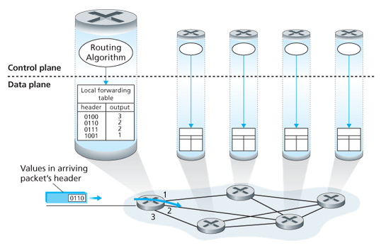

# Chapter 4 - The Network Layer: Data Plane

## 4.1 Overview of Network Layer

### 4.1.1 Forwarding and Routing: The Data and Control Planes

Primary role of the network layer: to move packets from a sending host to a receiving host.

Two important network-layer functions to move packets:

*   **Forwarding (switching)**: when a packet arrives at a router’s input link, the router must move the packet to the appropriate output link. A packet might also be blocked from exiting a router, or might be duplicated and sent over multiple outgoing links.
*   **Routing**: determine the route or path taken by packets as they flow from a sender to a receiver using **routing algorithms**.

**Forwarding** refers to the **router-local** action of transferring a packet from input link to output link, takes place at very short timescales, thus is typically implemented in hardware.

**Routing** refers to the **network-wide** process that determines the end-to-end paths that packets take, takes place on much longer timescales and often implemented in software.

**Forwarding table**: a router forwards a packet by examining the value of one or more fields in the arriving packet’s header, then using these header values to index into its forwarding table. The value in the forwarding table entry for thoes values indicates the outgoing link interface at that router to which the packet is to be forwarded.

#### Control Plane: The Traditional Approach

A routing algorithm runs in each and every router and both forwarding and routing function are contained within a router. The algorithm communicates with the routing algorithm in other routers to compute the values of its forwarding table.

The forwarding and routing functions can be configured directly by human network operators, and no routing protocols would be required.

#### Control Plane: The SDN Approach

A physically separate (from the routers) remove controller computes and distributes the forwarding tables to be used by each and every router. The routing device performs forwarding only while the remote controller computes and distributes forwarding tables.

This control-plane approach is at the heart of **software-defined networking (SDN)**, where network is software-defined because the controller that computes the tables and interacts with routers is implemented in software.

### 4.1.2 Network Service Model

The **network service model** defines the characteristics of end-to-end delivery of packets between sending and receiving hosts.

*   **Guaranteed delivery**: guarantees that a packets sent by a source host will eventually arrive at the destination host.
*   **Guaranteed delivery with bounded delay**: delivery within a host-to-host delay bound.
*   **In-order packet delivery**: packets arrive in the order they were sent.
*   **Guaranteed minimal bandwidth**: as long as the sending host transmits bits at a rate below the limit, all packets are eventually delivered to the destination host.
*   **Security**: encrypt all datagrams at the source and decrypt them at the destination.
*   Et cetera.

The Internet’s network layer provides a single service, known as **best-effort service**. Packets are neither guaranteed to be received in order nor is their eventual delivery even guaranteed. There is no guarantee on delay not there is a minimal bandwidth guarantee. (best-effort service = no service at all)

## 4.2 Virtual Circuit and Datagram Network

**Virtual Circuit** is a computer network that provides connectionless service, 
and **Datagram Network** is one provides connectivity service.

### 4.2.1 Virtual Circuit

Virtual-Circuit is used in ATM, which is dumped:)

The VC number of the packet might be changed. Why not keep the VC number as same? 
Cause that needs a rearrangement through the whole network.

### 4.2.2 Datagram Network

The address of the destination end system is stamped onto the packet in a datagram network.

虚电路：预先建立好路线；数据报：每个报文单独走

#### longest prefix matching 最长前缀匹配

Prefix Match|Link Interface
|---|---|
11001000 00010111 00010*** ********|0
11001000 00010111 00011000 ********|1
11001000 00010111 00011*** ********|2
otherwise |3

Ex：11001000 00010111 00011000 00011000 10101010 -> 1

一般而言，路由器仅需将部分地址转发至内网，其它的统统指向外网即可，于是不用记忆四十亿地址

## 4.3 What’s Inside a Router?

*   **Input ports**
    *   Performs the physical layer function of terminating an incoming physical link at a router.
    *   Performs link-layer functions needed to interoperate with the link layer at the other side of the incoming link.
    *   Most crucially, a lookup function is also performed at the input port. Here the forwarding table is consulted to determine the router output to which the packet should be forwarded via the switching fabric. Control packets are forwarded from input port to the routing processor.
*   **Switching fabric**: connects the router’s input ports to its output ports.
*   **Output ports**: stores packets received from the switching fabric and transmits these packets on the outgoing link by performing the necessary link-layer and physical-layer functions.
*   **Routing processor**: performs control-plane functions.
    *   In traditional routers, it executes the routing protocols, maintains routing tables and attached link state information, and computes the forwarding table for the router.
    *   In SDN routers, the routing processor is responsible for communicating with the remote controller in order to receive forwarding table entries and install these entries in input ports.

Input ports, output ports and switching fabric are almost always implemented in hardware. The control plane functions are usually implemented in software and execute on the routing processor.

### 4.3.1 Input Port Processing and Destination-Based Forwarding

The router matches a prefix of the packet’s destination address with the entries in the table. When there are multiple matches, the router uses the longest prefix matching rule.

Once the output port has been determined, the packet can be sent into the switching fabric. In some designs, a packet may be temporarily blocked from entering the switching fabric if packets from other input ports are currently using the fabric. A blocked packet will be queued at the input port and then scheduled to cross the fabric at a later point.

Other important actions:

*   physical and link-layer processing
*   version number, checksum and time-to-live field must be checked and the latter two fields rewritten
*   counters used for network management must be updated

Line termination | Data link processing | Lookup, fowarding, queuing|
---|---|---
物理层|链路层|---

### 4.3.2 Switching

**Switching via memory**: simplest, earliest method, where input and output ports functioned as traditional I/O devices in a traditional operating system. If memory bandwidth allows a maximum of $B$ packets per second to be written into or read from memory, then the overall forwarding throughput must be less then $B/2$. Two packets cannot be forwarded at the same time.（受限于内存速度）

**Switching via a bus**: an input port transfers a packet directly to the output port over a shared bus, without intervention by the routing processor. This is typically done by having the input port pre-pend a switch a switch-internal label (header) to the packet indicating the local output port. All output port receive the packet, but only the port that matches the label will keep the packet. The label is then removed at the output port. Only one packet can cross the bus at a time.（受限于总线带宽）

**Switching via an interconnection network**: A crossbar switch is an interconnection network consisting of $2N$ buses that connect $N$ input ports to $N$ output ports. Crossbar switches are capable of forwardning multiple packets in parallel, which is **non-blocking** (not blocked as long as no other packet is being forwarded to the same output port).

### 4.3.3 Output Port Processing

Output port takes packets from output port’s memory and transmits them over the output link. This includes selecting and de-queueing packets for transmission, and performing the needed link-layer and physical-layer transmission functions.

### 4.3.4 Where Does Queuing Occur?

Suppose input and output line speeds (transmission rates) all have an identical transmission rate of $R_{line}$ packets per seconds, and there are NNN input ports and NNN output ports.

All packets have the same fixed length and arrive to input ports in a synchronous manner (the time to send a packet on any link is equal to the time to receive a packet on any link, during this interval, either zero or one packets can arrive on an input link).

Define $R_{switch}$ as the rate at which packets can be moved from input port to output port. If $R_{switch}$ is $N$ times faster than $R_{line}$, then only negligible queueing will occur at the input ports. (In the worst case $N$ input lines are receiving packets and all packets are to be forwarded to the same output port, each batch of $N$ packets can be cleared before the next batch arrives.)

#### Input Queueing

If switch fabric is not fast enough, packet queuing can also occur at the input ports as packets must join input port queues to wait their turn to cross the fabric.

**Head-of-the-line (HOL) blocking** is a queued packet in an input queue must wait for transfer through the fabric (even though its output port is free) because it is blocked by another packet at the head of the line.

#### Output Queueing

When the output port cannot transmit all packets, the rest packets must be queued. The number of queued packets can grow large enough to exhaust available memory at the output port.

When there is no enough memory to buffer, a decision must be made to either drop the arriving packet (**drop-tail**) or remove one or more already-ququed packets to make room for new packet.

recommended buffer size with N flows: $\frac{RTT\cdot{C}}{\sqrt{N}}$

### 4.3.5 Packet Scheduling

#### First-In-First-Out (FIFO)

Also known as first-come-first served (FCFS), the output port delects packets for link transmission in the same order in which they arrived at the output link queue.

#### Priority Queueing

The priority queuing discipline will transmit a packet from the highest priority class that has a nonempty queue. The choice among packets in the same priority class is typically done in a FIFO manner.

#### Round Robin and Weighted Fair Queueing (WFQ)

A round robin scheduler alternates service among priority classes. The work-conserving queuing discipline will never allow the link to remain idle whenever there are packets queued. A work-conversing round robin discipline looks for a packet of a given class but finds none will immediately check the next class in the round robin sequence.

WFQ differs from RR that each class may receive a differential amount of service in any interval of time. (partition of service equals to wi/∑wjw\_i/\\sum w\_jwi/∑wj where wiw\_iwi is the weight of class iii.)

## 4.4 The Internet Protocol (IP)

### 4.4.1 IPv4 Datagram Format

*   **Version number**: IP protocol version of datagram.
*   **Header length**: determine where in the IP datagram the payload actually begins (typical IP datagram has a 20-byte header).
*   **Type of service (TOS)**: allow different types of IP datagrams to be distinguished from each other.（告诉路由器该数据需要时间敏感或是可靠敏感）
*   **Datagram length**: total length of IP datagram (header plus data), measured in bytes.
*   **Identifier, flags, fragmentation offset**: related to fragmentation (IPv6 does not allow for fragmentation)
*   **Time-to-live (TTL)**: ensure that datagrams do not circulate forever in the network. This field is **decremented by one** each time the datagram is processed by a router. If TTL reaches 0, a router must drop that datagram.
*   **Protocol**: used only when an datagram reaches its final destination. (6=TCP, 17=UDP) The protocol number is the glue that binds the network and transport layers together, whereas the port number is the glue that binds the transport and application layers together.
*   **Header checksum**
*   **Source and destination IP addresses**
*   **Options**
*   **Data (payload)**

头：
- TCP：20 字节（不含option）
- IP：20 字节（不含 option）

### 4.4.2 IPv4 Datagram Fragmentation

分片可能在任一个节点进行，还可能出现多次分片

The maximum amout of data that a link-layer frame can carry is called the **maximum transmission unit (MTU)**.（硬件限制）

Because each IP datagram is encapsulated within the link-layer frame for transport from one router to the next router, the MTU of the link-layer protocol places a hard limit on the length of an IP datagram.

When a destination host receives a series of datagrams from the same source, it needs to determine whether any of these datagrams are fragments of some original, larger datagram. If some datagram are fragments, it must further determine when it has received the last fragment and how the fragments should be pieced back together. IPv4 put **identification**, **flag** and **fragmentation offsets** in the IP datagram header.

The sending host increments the identification number for each datagram it sends. When a router needs to fragment a datagram, each resulting fragment is stamped with the source address, destination address and identification number of the origin datagram. The last fragment has a flag bit set to 0, whereas all other fragments have this bit set to 1 (has more fragments). The offset field is used to specify where the fragments fits within the original IP datagram.

- length：含 ip 头 的字节长度
- id：同一个分组的分片有相同 id
- flag：是否还有后续片
- offset：之前的所有片的字节长度除以 8（不含 ip 头）

### 4.4.3 IPv4 Addressing

_An IP address is technically associated with an interface, rather than with the host or router containing that interface._（地址分给网卡而不是主机）

Each IP address is 32 bits long (4 bytes), are written in so-called **dotted-decimal notation**. Each interface on every host and router in the global Internet must have an IP address that is globally unique (except behind NATs).

Interfaces interconnected to each other by a network that contains no routers (Ethernet switch or wireless access point) along with one router interface forms a **subnet**. For example, the upper-left subnet shares an address `223.1.1.0/24`, where the `/24` notation (**subnet mask**) indicates that the leftmost 24 btis define the subnet address. The `223.1.1.0/24` subnet consists of the three host interfaces and one router interface.

To determine the subnets, detach each interface from its host or router, creating islands of isolated networks, with interface terminating the end points of the isolated networks. Each of these isolated networks is called a **subnet**.

The Internet’s address assignment strategy is known as **Classless Interdomain Routing (CIDR)**, the 32-bit address is divided into two parts and has the form `a.b.c.d/x`, where xxx indicates the number of bits in the first part of the address.

The xxx most significant bits of an address constitude the network portion of the IP address (referred to as **prefix** of the address). IP addresses of devices within the organization will share the common prefix. The remaining 32-x32-x32-x bits can be thought of as distinguishing among devices within the organization, all of which have the same prefix.

Before CIDR was adopted, the network portions of an IP address were constrained to be 8, 16, or 24 bits in length, an addressing scheme known as **classful addressing**. Subnets with 8, 16, and 24-bit subnet addresses were known as class A, B, and C networks respectively.

The IP broadcast address is `255.255.255.255`. When a host sends a datagram with destination address `255.255.255.255`, the message is delivered to all hsots on the same subnet.

A 类 126个，127专用；B 类 $2^{14}-2$ 个；C 类主机号只有8位

- 主机全 0 为网络地址，路由器路由表现
- 全 0 为该网络的该主机
- 网络全 0 为本网络的某主机
- 主机全 1 为直接广播地址，某网络全部主机
- 全 1 为受限广播地址，本网络全部主机
- 127 开头为环回地址

- 子网：将主机位中的前几位设为子网号
- 子网掩码：将标准地址与掩码按位与得到子网号（故默认掩码为 255.255.255.0）
- 例如 255.255.240.0 （240=11110000）从B类网络的16位主机号借了4位作为子网号，即
- 子网号中全0全1保留，故子网至少要2位，主机号也至少2位

<!-- TODO -->

Addresses are loose by subnet

分子网只会减少能用的主机！子网只是方便路由器进行管理

VLSM：变长子网号。选取规模更大的子网的子网号时要注意不能与规模更小的子网号的头部相同。

**CIDR**：CIDR表示法： IP地址 ::= {<网络前缀>， <主机号>} / 网络前缀所占位数，例如128.14.35.7/20

#### Obtaining a Block of Addresses

A network administrator first contact its ISP, ISP divide its address block and give one of these blocks to organizations.

### The Dynamic Host Configuration Protocol (DHCP)

DHCP allows a host to obtain an IP address automatically. A given host receives the same IP address each time it connects to the network, or a host may be assigned a **temporaty IP address** that will be different each time the host connects to the network.

DHCP is referred to as a **plug-and-play** or **zeroconf** protocol.

*   **DHCP server discovery**: a newly arriving host finds a DHCP server using a **DHCP discover message**, which sends (broadcasts) within a UDP packet to port `67`.
*   **DHCP server offer**: A DHCP server receiving a DHCP discover message responds to the client with a **DHCP offer message** that is broadcast to all nodes on the subnet, containing the transaction ID, the proposed IP address, network mask and an IP **address lease time** (the amount of time for which the IP address will be valid).
*   **DHCP request**: the newly arriving client will choose from one or more offers and respond to its selected offer with a **DHCP request message**, echoing back the configuration parameters.
*   **DHCP ACK**: the server responds with a **DHCP ACK message** confirming the requested parameters.

### 4.4.4 Network Address Translation (NAT)

The NAT router behaves to the outside world as a single device with a single IP address.

When NAT router receives a datagram, it generates a new source port number for the datagram and replace the IP address and port number in it. When generating a new source port number, the NAT router can select any source port number that is not currently in the NAT translation table.

When NAT router receives a response, it indexes the NAT translation table using the destination IP address and port number to obtain the appropriate IP address and port in the NAT network, and rewrite the destination into the datagram.

用端口号表示内网连接

穿越NAT方法：
1. 静态配置：绑定路由器某端口与内网设备的某端口
2. UPnP：动态配置
3. 中继：将NAT信息登记到应用提供商的服务器

### 4.4.5 ICMP

internet control message protocol，主要通知报错信息

ICMP 报文包含一个类型字段和一个编码字段

ICMP通常被认为是IP的一部分，但从体系结构看是在IP之上，是3.5层。

traceroute就基于ICMP

### 4.4.6 IPv6

#### IPv6 Datagram Format

*   **Expanded addressing capabilites**: 128 bits of IP address, and introduced a new type of address called **anycast address** that allows a datagram to be delivered to any one of a group of hosts.
*   **A streamlined 40-byte header**: a fixed-length header allows for faster processing by a router.
*   **Flow labeling**: IPv6 has an elusive definition of a **flow**, allows labeling of packets belonging to particular flows for which the sender requests special handling.

> in ipv4: Datagram: five turple: {ip_src, ip_des, port_src, port_des, protocol_transport}

*   **Version**: value `6`.
*   **Traffic class**: 8 bits, priority, like TOS in IPv4 but more precise.
*   **Flow label**: 20 bits, identify a flow of datagrams.
*   **Payload length**: 16 bits, giving the number of bytes of payload.
*   **Next header**: identifies the protocol to which the contents in this datagram will delivered (TCP/UDP/etc.) like protocol field in IPv4.
*   **Hop limit**: TTL.
*   **Source and destination address**
*   **Data**

Several fields in IPv4 are no longer present in IPv6 datagram:

*   **Fragmentation**: IPv6 does not allow fragmentation. If an IPv6 datagram is too big, then the router drops the datagram and sends a “Packet Too Big” ICMP error message back to the sender.
*   **Header checksum**: the checksum is redundant.
*   **Options**: options is sotred in data, can be pointed to by next header field in IPv6.

#### Transitioning from IPv4 to IPv6

Tunneling:把ipv6的报文封装在ipv4的里，需要人工配置隧道

## 4.5 Generalized Forwarding and SDN

Packet switch contains a match-plus-action table (**flow table**) that is computed and distributed by a remote controller:

*   a set of header field values
*   a set of counters
*   a set of actions to be taken:
    *   forwarding
    *   dropping
    *   modify-field
