# Chapter 5 - The Network Layer: Control Plane

## 5.1 Introduction

How to compute, maintain and install flow tables?

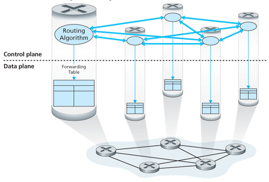

*   **Per-router control**: a routing algorithm runs in each and every router, e.g. OSPF and BGP protocols

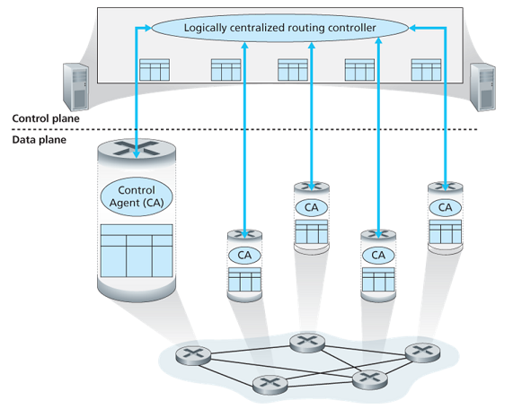

*   **Logically centralized control**: a logically centralized controller computes and distributes the forwarding tables, interacts with a control agent (CA) in each of the routers via a well-defined protocol.

## 5.2 Routing Algorithms

The goal of **routing algorithms** is to determine good (with least cost) paths from senders to receivers, through the network of routers.

*   A **centralized routing algorithm** computes the least-cost path using complete, global knowledge about the network. This requires the algorithm somehow obtain this information before calculating. Algorithms with global state information are often referred to as **link-state (LS) algorithms**, can be run at one site or be replicated in every router.
*   A **decentralized routing algorithm** calculate the least-cost path in an iterative, distributed manner. Through iterative process of calculation and exchange of information with its neighboring nodes, a node gradually calculates the least-cost path to a destination. A decentralized routing algorithm is called distance-vector (DV) algorithm.

Another classification is whether the routing algorithm is static or dynamic.

*   In **static routing algorithms**, routes change very slowly over time, often as a result of human intervention.
*   **Dynamic routing algorithms** change the routing paths as the network traffic loads or topology change. A dynamic algorithm can be run periodically or in direct response to topology or link cost changes. They may suffer from problems as routing loops and route oscillation.

A third classification is according to whether they are load-sensitive or load-insensitive.

*   In a **load-sensitive algorithm**, link costs vary dynamically to reflect the current level of congestion in the underlying link. If a high cost associated with a link that is congested, a routing algorithm will tend to choose other routes.
*   Today’s routing algorithms (RIP, OSPF, BGP) are **load-insensitive**, as a link’s cost does not explicitly reflect its current level of congestion.

路由器只关心下一跳去哪，而不关心整体的路径。路由算法负责维护转发表。

把网络抽象为有权图，路由算法就在该图中求解最短路径。

1. 全局路由算法：L-S
2. 分布路由算法：D-V

1. 静态路由算法：人工填写，若拓扑结构有变化（例如链路故障）就要人工及时修改
2. 动态路由算法

### 5.2.1 The Link-State (LS) Routing Algorithm

Link-State Packet，链路状态报文，即路由器测量与其直接相连的路由器的链路状态（延时），
生成LS报文，并向所有路由器广播，由此每个路由器都获得了完整网络拓扑结构。

一个LS报文记录从路由器A到路由器B的链路状态，路由器每收到一个邻居发来的LS报文就要应答，
并向其他路由器发送新收到的这个报文

> 每个路由器会对每个已收到的LS报文贴上一个序号和生存期，此后只会记录序号更大的LS报文

获得完整网络拓扑结构后使用Dijsktra算法（每次选一个距离最近的点，用它更新其他点的距离，具体略）

考虑流量的时候，会出现链路负载振荡的现象

### 5.2.2 The Distance-Vector (DV) Routing Algorithm

DV algorithm is

*   iterative
*   asynchronous
*   distributed: each node receives some information from neighbors, performs a calculation and then distributes the results to neighbors

Bellman-Ford equation: $$d(x,y)=\min{c(x,v)+d(v,y)}$$

Each node xxx maintains the following routing information:

*   For each neighbor vvv, the cost $c(x,v)$ from xxx to directly attached neighbor vvv,
*   Node xxx's distance vector $D_x=[D_x(y)]$ , containing xxx's estimate of its cost to all destinations yyy,
*   The distance vectors of each of its neighbors $D_y$.

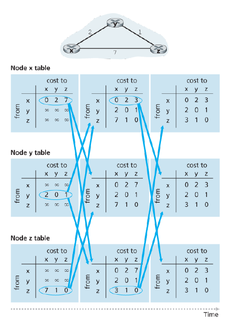

From time to time, each node sends a copy of its distance vector to each of its neighbors. When a node xxx receives a new distance vector from any of its neighbors www, it saves www's distance vector and then uses the Bellman-Ford equation to update its own vector.

Problem and technique:

*   Link failure
*   Routing loop
*   Poisoned reverse

DV：Distance vector，距离向量

路由器A计算自身到C的成本（A-C不直连）：获取邻居路由器B到C的成本，则A到C=A到B+B到C

当链路状态有变化时，将自己的DV发给邻居，邻居据此通过Bellman-Ford 算法重新计算，若有变化，则通知邻居

好消息更新快，坏消息更新慢：因为坏消息之前的状态会残留在邻居的通知内

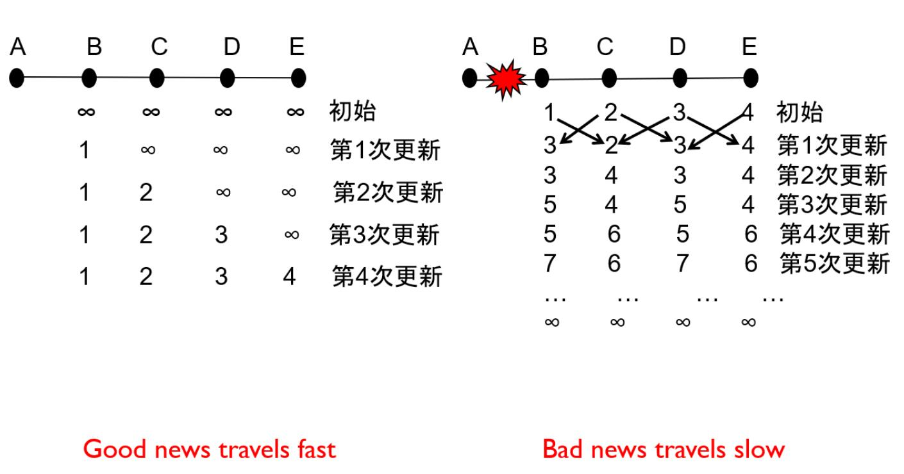

出现路由黑洞，通过毒性逆转解决，即当C通过B选路到达A时，C告诉B C到A的成本为无穷大
（然而该协议在环路内失效）

#### Comparison of LS and DV Routing Algorithms

*   Message complexity
*   Speed of coverage: DV can converge slowly and can have routing loops and suffers from count-to-infinity problem
*   Robustness

- 报文复杂性：DV仅在新的链路费用导致最优路径变化时才广播，而LS在任意变化下都广播
- 收敛速度：DV收敛慢，还有路由黑洞
- 鲁棒性：DV算法的一个不正确的节点计算值会扩散到整个网络

## 5.3 Intra-AS Routing in the Internet

One router is indistinguishable from another in the sense that all routers executed the same routing algorithm to compute routing paths through the network. This model is simplistic for two reasons:

*   Scale: As number of routers becomes large, the overhead involved in communicating, computing and storing routing information becomes prohibitive.
*   Administrative autonomy: an organization should be able to operato and administer its network as it wishes, while still being able to connect its network to other outside networks.

Both of these problems can be solved by organizing routers into **autonomous systems (ASs)** with each AS consisting of a group of routers that are under the same administrative control.

Routers within the same AS all run the same routing algorithm and have information about each other. The routing algorithm running within an autonomous system is called an **intra-autonomous system routing protocol**.

intra-AS Routing 也被称为 interior gateway protocols（IGP）

上述选路算法在大规模网络的迭代一定不会收敛，并且单个路由器不应受限于外部网络而被迫选用某种选路算法。

自治系统（Autonomous System，AS）用于解决这两个问题。

AS之间运行自治系统间选路协议（inter-AS routing，）
一个AS内部的路由器运行相同的选路算法（intra-AS routing），且拥有彼此之间的信息。
每个AS都有一个或多个负责连接外部网络，称为网关路由器。

AS routing 是要让 某个 AS 知道地址ip属于哪个 AS；
当这个地址属于两个AS时，还要在AS层面确定选哪条链路最优。（选路算法必须让每个ip只有一条路径）

### 5.3.1 RIP

Routing Information Protocol是基于DV的。

- RIP的成本计算是以跳数计，一跳就是1，最多支持15跳。
- 路由器每30秒与邻居打一次招呼（更新）
- 每次只能更新25个目的子网

路由器根据邻居发来的通告（即邻居自己的转发表）更新自身转发表。
若180秒未监听到邻居，就认为其不可达，并通告其他路由器。

路由器也可以使用RIP请求邻居到指定目的地的费用（以UDP的方式使用520端口）

### 5.3.2 OSPF

OSPF is a link-state protocol that uses flooding of link-state information and a Dijkstra’s least-cost path algorithm. With OSPF, each router constructs a complete topological map of the AS. Each router then locally runs Dijkstra’s shortest-path algorithm to determine a shortest-path tree to all subnets, with itself as the root node.

With OSPF, a router broadcasts routing information to all other routers in the AS, not just to neighbors. A router broadcasts link-state information whenever there is a change in a link’s state. It also broadcasts a link’s state perodically even if there is no change. The OSPF protocol must itself implement functionality such as reliable message transfer and link-state broadcast. The OSPF protocol also checks that links are operational (via a HELLO message) and allows an OSPF router to obtain a neighboring router’s database of network-wide link state.

Some of the advances embodied in OSPF:

*   **Security**. Exchanges between OSPF routers can be authenticated.（可以借助MD5）
*   **Multiple same-cost paths**.
*   **Integrated support for unicast and multicast routing**.
*   **Support or hierarchy within a single AS**. An OSPF autonomous system can be configured hierarchically into areas.

OSPF是RIP的后继者。==RIP是DV类算法的典型代表，而OSPF是LS的代表协议==。核心是一个使用泛洪链路状态信息的协议和Dijkstra算法。

OSPF 通告包含在OSPF报文中，而报文直接承载在IP分组中，不依赖TCP、UDP。

OSPF 将AS再细分为了多个区域（area），其中有一个主干（backbone）区域，负责为其他区域之间的流量选路。

- 内部路由器：不属于主干，只执行 intra-AS
- 区域边界路由器：同时属于区域和主干
- 主干路由器（非边界路由器）：内部路由器通过所在区域的主干路由器知晓通往其他区域的路由
- 边界路由器：与其它AS的路由器交流

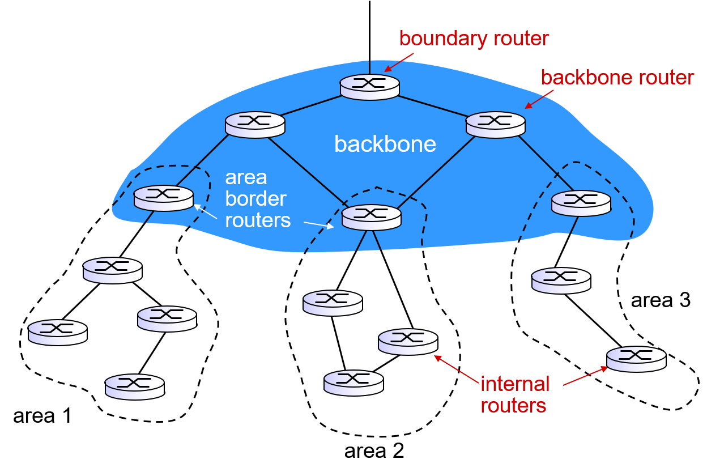

## 5.4 Routing Among the ISPs: BGP

In the Internet, all ASs run the same inter-AS routing protocol, called the Border Gateway Protocol, known as BGP.

### 5.4.1 The Role of BGP

In BGP, packets are routed to CIDRized prefixes, with each prefix representing a subnet or a collection of subnets. A router’s forwarding table has entries of the form $(x,l)$, where xxx is a prefix and lll is an interface number for one of the router’s interfaces.

As a inter-AS routing protocol, BGP provides each router a means to:

*   **Obtain prefix reachabilitiy information from neighboring ASs**. BGP allows each subnet to advertise its existence to the rest of the Internet.
*   **Determine the “best” routes to the prefixes.** To determine the best route, a router will locally run a BGP route-selection procedure.

### 5.4.2 Advertising BGP Route Information

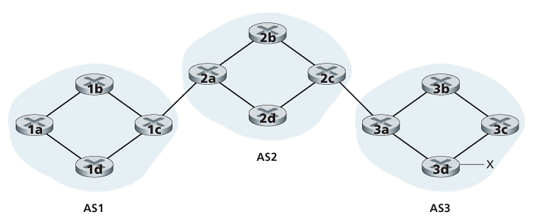

For each AS, each router is either a **gateway router** or an **internal router**. A gateway router is a router on the edge of an AS that directly connects to one or more routers in other ASs. An internal router connects only to hosts and routers within its own AS.

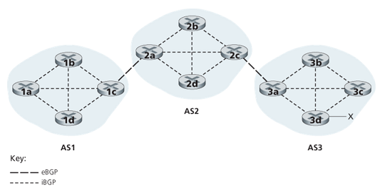

Pairs of routers exchange routing information over semi-permanent TCP connections using port 179. Each such TCP connection, along with all the BGP messages sent over the connection, is called a **BGP connection**. Furthermore, a BGP connection that spans two ASs is called an **external BGP (eBGP)** (vice versa, **internal BGP (iBGP)**). In order to propagate the reachability information, both iBGP and eBGP sessiona re used.

- eBGP：在AS之间传播可达信息，网关路由器用eBGP向其他网关路由器通告所在网络能够到达的其他网络
- iBGP：在AS内部传播可达信息，网关路由器用iBGP向所在网络的其他路由器通告eBGP获得的信息

eBGP 需要直接连接，iBGP不需要（TCP报文可以经过多跳）

### 5.4.3 Determining the Best Routes

prefix + attribute = route

When a router advertises a prefix across a BGP connection, it includes with the prefix serveral **BGP attributes**. In BGP jargon, a prefix along with its attributes is called a **route**. Two of the more important attributes are AS-PATH and NEXT-HOP.

prefix：CIDR化的ip地址，指代一个子网或者多个子网

The AS-PATH attribute contains the list of ASs through which the advertisement has passed. BGP routers also use the AS-PATH attribute to detect and prevent looping advertisements. If a router sees that its own AS is contained in the path, it will reject the advertisement.

The NEXT-HOP is the _IP address of the router interface that begins the AS-PATH_.

AS-PATH：当AS收到一个 prefix 时，就将自己的ASN添加到 prefix 中，以便于其它路由器检测和防止循环通告。

NEXT-HOP：记录了要路由到下一跳的AS所要通过的AS内部的路由器

若路由器知道了到达目的AS的多条路径，则通过以下方式来选择路径：
- 最短 AS-PATH
- 最近 NEXT-HOP 路由器：hot potato routing
- 附加准则

BGP报文有四种格式：
- OPEN：建立一个到邻居或认证发送方的TCP连接
- **UPDATE**：广播新路径（或撤销旧路径）
- KEEPALIVE：在没有更新时保持TCP连接，同时也作为OPEN的ack
- NOTIFICATION：通报先前信息的错误，也用于关闭TCP连接

e.g.: a update msg: `prefix:138.16.64/22; AS-PATH: AS3 AS131; NEXT-HOP: 201.44.13.125`

#### BGP routing policy

policy分为inport和outport，即对入口的过滤和出口的过滤。

**inport policy**:

若一个用户网络同时连接两个提供商网络，则称其为 双选（dual-homed）网络。

双选网络（x）通常不会告诉其提供商网络（B）它自身与另一个提供商网络（C）相连，
否则就有可能有从B到C的流量通过双选网络转发，这对x毫无意义（除非给钱）。

同理，B也不会告诉C其与A相连，否则有可能C会通过B到A，而非直连A。

甚至可以设置夜间走B，日间走C。

**outport policy**:

B告知A可以从B到x，A也可以不信任之，忽略该通告

intra-AS不支持任何policy，只关注性能

#### BGP Notes

BGP 只计算 AS 跳数，不计算路由器跳数，即：BGP选择的是AS-path最短的路径，与路由器个数无关

Next-Hop 不会保留源路由器的端口号，而是改为发布者的端口号，便于回溯

#### Hot Potato Routing

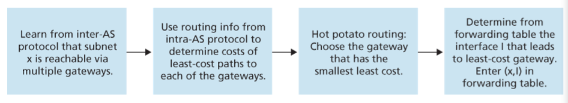

In hot potato routing, the route chosen is that route with the least cost to the NEXT-HOP router beginning that route.

Hot potate routing is a selfish algorithm - it tries to reduce the cost in its own AS while ignoring other components of the end-to-end costs outside its AS.

In pratice, BGP uses an algorithm that is more complicated than hot potato routing. For any given destination prefix, the input into BGP’s route-selection algorithm is the set of all routes to that prefix that have been learned and accepted by the router. If there are multiple routes to same prefix, then BGP sequentially invokes the following elimination rules until one route remains:

1.  A route is assigned a **local reference** value as one of its attributes. The local preference could have been set by the router or could have been learned from another router in the same AS. The value of the local preference attribute is a policy decision that is left entirely up to the AS’s network administrator. The routes with the highest local preference values are selected.
2.  From the remaining routes, the route with shortest AS-PATH is selected.
3.  From the remaining routes, the route with the closest NEXT-HOP router is selected (hot potato).
4.  If more than one route still remains, the router uses BGP identifiers to select the route.

### 5.4.4 IP-Anycast

BGP is often used to implement the IP-anycast serice, which is commonly used in DNS.

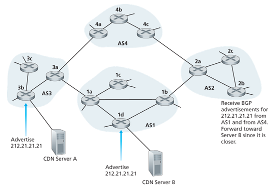

During the IP-anycast configuration stage, the CDN company assigns the _same_ IP address to each of its servers and uses standard BGP to advertise this IP address from each of the servers.

When a BGP router receives multiple route advertisements for this address, it treats these advertisements as providing different paths to the same physical location (different actually). Each router will locally use the BGP route-selection algorithm to pick the best route to that IP address.

### 5.4.5 Routing Policy

（一些设置策略，略）

### 5.4.6 Putting the Pieces Together: Obtaining Internet Presence

*   IP addressing
*   Domain name and DNS
*   BGP propagation

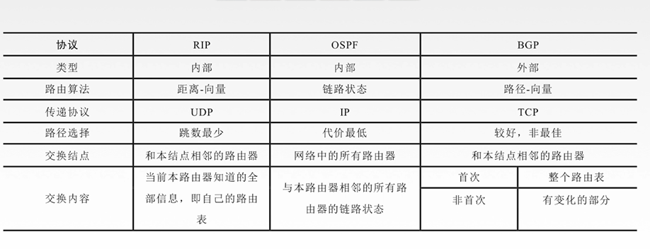

## 广播和多播选路

### 广播

源不必把一个报文发多次，每次设定不同目的，而是只要发一次，在路由时广播。

节点转发过就不必再转发，节点通过序号来辨别，即转发的报文只递增不递减。

用生成树的形式实现，源作为树的根。

### 组播（多播）

地址为D类，即`1110`开头。组播地址需要申请。

保留的组播地址：`224.0.0.x`
- x = 1：本子网所有系统
- x = 2：本子网所有路由器
- x = 4：本子网所有DVMRP路由器
- x = 5：本子网所有OSPF路由器
- x = 6：本子网所有OSPF指派路由器
- x = 9：本子网所有RIPv2路由器
- x = 13：本子网所有PIM路由器

组播范围利用 TTL 来实现（过一次路由器TTL-1）
|范围|TTL|地址范围|描述|
|---|---|---|---|
|链路|1|`224.0.0.0~224.0.0.255`|只在局域网内传送
|部门|32|`239.255.0.0~239.255.255.255`|只在部门内传送
|组织|64|`239.192.0.0~239.195.255.255`|只在组织内传送
|全局|255|`224.0.1.0~238.255.255.255`|可在Internet内传送

IP组播地址到MAC组播地址的映射：IP的后23位直接映射到MAC地址的后23位（IP前4位固定，中间5位未映射）
> 由于有未映射的字段，因此可能出现 IP 不同，MAC 相同的异常情况

#### IGMP

Internet Group Management Protocol，互联网组管理协议，既不属于传输层，也不属于网络层

IGMP 管理路由器上的组播组，并维护状态表来进行转发。

#### 组播路由

组播主机向ICANN申请组播组，然后其它想加入的计算机向自己的路由器请求加入改组。

拓扑结构上会形成一个~~以组播源为根的~~树。
- 共享树：所有的广播源都在该树内
    1. SPT：最短路径树（Dijkstra，OSPF原生支持）
    2. RPF：反向道路传递（Reverse Path Forwarding）
        - **若**组播报文从某一**返回中心的最短链路**输入，**则**将该报文向所有输出链路广播，**否则**忽略该报文
        - 剪枝（prune）：若一个路由器发现所在局域网无人收听，则向上游路由器发送剪枝报文
        - 过一段时间后重复 flood，prune 操作
        - 不依赖全局信息
- 基于源的树：基于发送方生成的树
    1.  minimal spanning tree：最小生成树。复杂度太高
    2.  CBT：Center Based Tree
        - 合理选择一个中心（center）
        - 边界路由器发送接枝报文给上游路由器，然后完成接枝或成为中心
  - 若组播源更改为组内的另一主机，就要重新生成树，但共享树不用

#### DVMRP

DVMRP：Distance Vector Multicast Routing Protocol

在 OSPF 上加上剪枝：每隔一段时间重复 flood，prune 操作，即忽略之前剪枝过的区域

#### 隧道

有些路由器不支持组播，就打包在单播报文里穿透之。

## 5.5 The SDN Control Plane

Four key characteristics of an SDN architecture:

*   **Flow-based forwarding.** Packet forwarding by SDN-controllered switches can be based on any number of header field values in the transport-layer, network-layer or link-layer header.
*   **Separation of data plane and control plane.**
*   **Network control functions: external to data-plane switches.**
*   **A programmable network.** The network is programmable through the network-control applications running in the control plane.

### 5.5.1 SDN Controller and SDN Network-control APplications

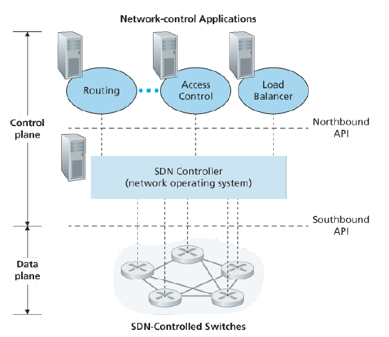

A SDN controller’s functionality can be broadly organized into three layers.

*   **A communication layer: communicating between the SDN controller and controlled network devices.** SDN controller controls the operation of a remote SDN-enabled switch, host or other devices. A device must be able to communicate locally-observed events to the controller. These events provide the SDN controller with an up-to-date view of the network’s state.
*   **A network-wide state-management layer.**
*   **The interface to the network-control application layer.** The northbound API allows network-control applications to read/write network state and flow tables within the state-management layer.

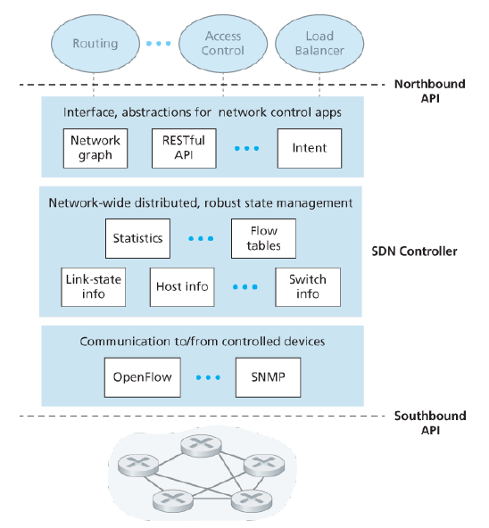

### 5.5.2 OpenFlow Protocol

The OpenFlow protocol operates between an SDN controller and an SDN-controlled switch or other device implementing the OpenFlow API. The OpenFlow protocol operates over TCP, with a default port number of 6653.

Among the important messages flowing from the controller to the controlled switch are the following:

*   **Configuration.** Allows the controller to query and set a switch’s configuration parameters.
*   **Modify-State.** Used by a controller to add/delete or modify entries in the switch’s flow table.
*   **Read-State.** Collect statistics and counter values from the switch.
*   **Send-Packet.** Send a specific packet out of a specified port at the controlled switch.

Among the messages flowing from the switch to the controller are the following:

*   **Flow-Removed.** Inform the controller that a flow table entry has been removed.
*   **Port-Status.** Inform the controller of a change in port status.
*   **Packet-in.** A packet arriving and not matching any flow table entry is sent to the controller for additional processing. (Matched packets may also be sent as an action taken on a match.)

An example in link-state change:

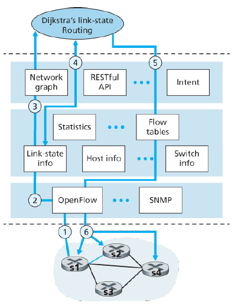

### 5.5.4 SDN: Past and Future

（略）

## 5.6 ICMP: The Internet Control Message Protocol

ICMP is used by hosts and routers to communicate network-layer information to each other. The most typical use of ICMP is for error reporting.

ICMP is often considered part of IP, but architecturally it lies just above IP, as ICMP messages are carried inside IP datagrams. When a host receives an IP datagram with ICMP as the upper-layer protocol, it demultiplexes the datagram’s contents to ICMP.

ICMP messages have a type and a code field, and contain the header and the first 8 bytes of the IP datagram that caused the ICMP message to be generated in the first place.

The well-known ping program sends an ICMP type 8 code 0 message to the specified host. The destination host, seeing the echo request, sends back a type 0 code 0 ICMP echo reply.

Source quench message is designed to perform congestion control - to allow a congested router to send an ICMP source quench message to a host to force that host to reduce its transmission rate.

Traceroute is implemented with ICMP messages. According to the rules of the IP protocol, the $n-th$ router observes that the TTL of $n-th$ datagram (is set to nnn originally) has just expired, the router discards the datagram and sends an ICMP warning message to the source (type 11 code 0). This warning message includes the name of the router and its IP address.

One of the datagrams will eventually arrive the destination host, with a UDP segment with an unlikely port number, the destination host sends a port unreachable ICMP message (type 3 code 3) back to the source. The source would know it does not need to send additional probe packets.

## 5.7 Network Maganement and SNMP

Network management includes the deployment, integration, and coordination of the hardware, software, and human elements to monitor, test, poll, configure, analyze, evaluate, and control the network and element resources to meet the real-time, operational performance, and Quality of Service requirements at a reasonable cost.

*   MIB = Management Information Base
*   SNMP = Simple Network Management Protocol
*   PDU = Protocol Data Unit

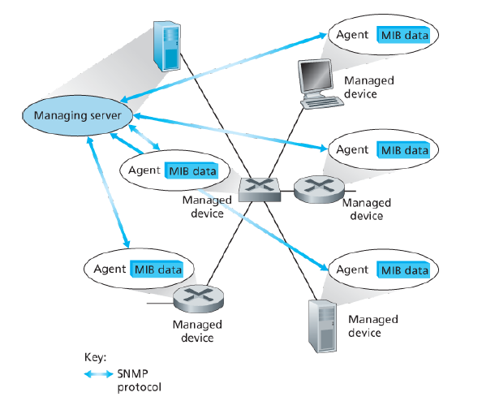

The Simple Network Management Protocol version 2 (SNMPv2) is an application-layer protocol used to convey network-management control and information messages between a managing server and an agent executing on behalf of that managing server.

The most common usage of SNMP is in a request-response mode in which an SNMP managing server sends a request to an SNMP agent, who receives the request, performs some action, and sends a reply to the request. Typically, a request will be used to query (retrieve) or modify (set) MIB object values associated with a managed device. A second common usage of SNMP is for an agent to send an unsolicited message, known as a trap message, to a managing server. Trap messages are used to notify a managing server of an exceptional situation (e.g., a link interface going up or down) that has resulted in changes to MIB object values.