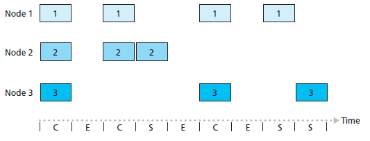
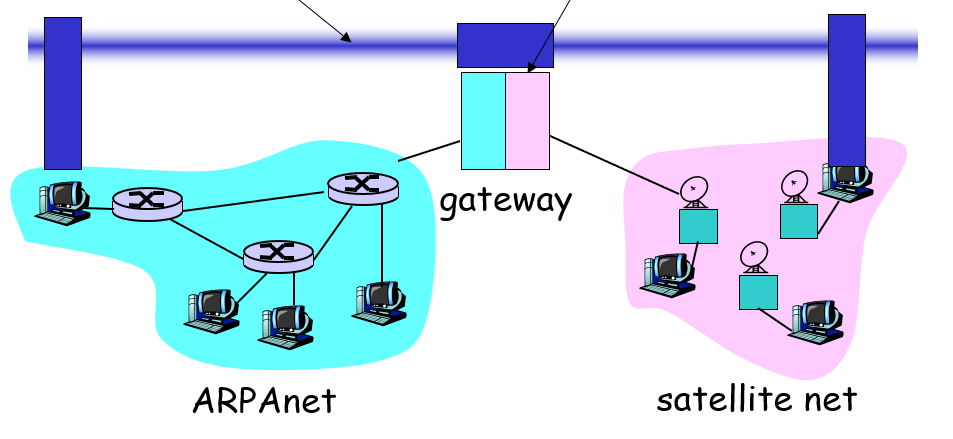

# 第6章 - 链路层和局域网

## 6.1 链路层概述

*   运行链路层协议的任何设备均称为节点（node）
*   沿着通信路径连接相邻节点的通信信道称为链路（link）
*   在经过特定的链路时，传输节点将数据报封装在链路层帧中，并将该帧传输到链路中

### 链路层提供的服务

*   成帧（framing）：有帧头帧尾，故又称帧定界
*   链路接入（媒体访问控制协议/MAC）
*   可靠交付（相邻节点间可靠，不保证端到端可靠，因为可能在节点被抛弃）
*   流量控制
*   差错检测和纠正
*   半双工和全双工

> 链路：加上可靠性控制的电路

### 链路层在何处实现

*   主体部分：网络适配器（network adapter）/网络接口卡（Network Interface Card, NIC）
*   网络适配器核心是链路层控制器，一个实现了许多链路层服务的专用芯片
*   链路层功能大多是硬件实现的，但部分是在运行于主机CPU上的软件中实现的

链路层是硬件和软件的结合体，即是协议栈中软件和硬件交接的地方。

0.5层：驱动，在软件做；1.5层：网卡，在硬件做。

> 源到目的可能经过多种链路层协议

## 6.2 差错检测和纠正

*   差错检测和纠正比特（Error-Detection-and-Correction, EDC）
*   未检出比特差错（undetected bit error）

3种技术（具体见[数据通信笔记](https://doowzs.com/docs/45-dc2019/6/)）：

*   奇偶校验
    *   加上校验位后共有奇数个 1 or偶数个 1
    *   二维：在纵向也进行奇偶校验，如此能够实现差错纠正
    *   最短校验和：一般在将数据排成接近正方形的格式能实现最短校验和
*   检验和（checksum，适用于运输层）、因特网检验和
    *   切成16位一段，取二进制补码，求和，把进位加回最低位
*   循环冗余检测（CRC，适用于适配器中的链路层）：多项式编码、生成多项式
    *   数据 D，r+1 位的生成多项式 G（最高次为r），G 的最高位须为1
    *   发送方选择 r 个附加比特 R，附加到 D 之后，使得得到的 d+r 能够用模2算术被 G 整除
    *   接收方若发现不能整除，则出错
    *   R 实际就是 (D<<r)/G 的余数（此处除法每步是异或，不是减法！）
    *   codeword：D后接R

> 若 G 中 $x^r, x^0$ 的系数非0，则可以检测所有 1 比特差错
> 
> 若 G 中含有 至少三项的因式~~（$2^r-1>=d+r$）~~，则可以检测所有 2 比特差错
> 
> 若 G 中含因式 x+1，则可以检测所有奇数比特差错
> 
> 可以检测长度不大于 r 的差错，大于 r 的不一定能检测到

G 的各项系数为 1 或 0，所有运算均模 2

## 6.3 多路访问链路和协议

两种类型的网络链路：点对点链路和广播链路。

*   点对点链路
    *   由链路一端的单个发送方和另一端的单个接收方组成
    *   点对点协议（point-to-point protocol, PPP）、高级数据链路控制协议（HDLC）
*   广播链路
    *   多个发送和接收节点都连接到相同的、单一的、共享的广播信道上
    *   任何一个节点传输一个帧，信道广播该帧，每个其他节点都收到一个副本
    *   以太网、无线局域网

多路访问问题（multiple access problem）：如何协调多个发送和接收节点对一个共享广播信道的访问？

*   多路访问协议（multiple access protocol）：节点通过**这些**协议来规范它们在共享的广播信道上的传输行为，并且不需要一个单独的信道进行管理。又称**介质访问控制协议**。
*   碰撞（collide）：多个节点同时传输帧，所有节点同时接到多个帧，没有一个节点能够有效的获得任何传输的帧。
*   3种类型的协议：
    *   信道划分协议（channel partitioning protocol）：借助频分、时分、码分划分信道
    *   随机接入协议（random access protocol）：允许冲突，协议负责从冲突中恢复
    *   轮流协议（taking-turns protocol）：轮流让信道担任管理者

在理想情况下，对于速率为$R$ bps的广播信道，多路访问协议应该具有以下所需要的特性：

*   当仅有一个节点发送数据时，该节点具有RRR bps的吞吐量；
*   当由MMM个节点发送数据时，每个节点（平均）吞吐量为 $R/M$ bps；
*   协议是分散的，不会因为某主节点故障导致系统崩溃；
*   协议是简单的，实现不昂贵。

### 信道划分协议

前两种详见[数据通信笔记](https://doowzs.com/docs/45-dc2019/8/)。

用户数固定

*   时分多路复用（TDM）
    *   时间帧（time frame）、时隙（slot）
    *   完全避免碰撞
    *   两个主要缺陷：
        *   节点被限制于 $R/N$ bps的平均速率
        *   节点必须总是等待它在传输序列中的轮次
*   频分多路复用（FDM）
    *   具有TDM同样的优点和缺点
    *   限制一个节点只能使用 $R/N$ bps的带宽
*   码分多址（Code Division Multiple Access, CDMA）
    *   每个节点分配一种不同的编码
    *   技术细节见[~~第7章~~](https://doowzs.com/docs/52-net/7)

### 随机接入协议

随机接入协议中，一个传输节点总是以**信道的全部速率**进行发送。当有碰撞时，涉及碰撞的每个节点反复地重发它的帧（分组），直到该帧无碰撞的通过为止。

但是当一个节点经历一次碰撞时，它不必立刻重发该帧，而是等待一个随机时延（独立地选择随机时延）。

常见的随机接入协议：

*   ALOHA：纯 ALOHA 和 时隙 ALOHA
*   载波侦听多路访问（CSMA）（以太网）

> ALOHA 是夏威夷语里的问候语，世界上第一个无线网络 ALOHA 就是为了解决夏威夷群岛之间的通信问题

#### 纯 ALOHA

*   当一帧首次到达（一个网络层数据报在发送节点从网络层传递下来），节点立刻将该帧完整地传输进广播信道。
*   如果帧的传输经历了碰撞，该节点立即（完全传输后）以概率 $p$ 重传该帧。
*   否则，该节点等待一个帧传输时间。在此等待后，以概率 $p$ 传输该帧，或者以概率 $1-p$ 再等待一个帧传输时间。

成功传输要求其他节点在2个时间间隔内不传输（即只要与其它帧有部分重叠，就判定为冲突），因此一个节点成功传输的概率是 $p(1-p)^{2(N-1)}$，纯ALOHA协议的最大效率为 $1/2e$，其中 N 为节点总数。

#### 时隙 ALOHA

作出假设：

*   所有帧都是$L$比特长
*   一个时隙等于传输一帧的时间 $L/R$
*   结点只在时隙起点开始传输帧
*   结点是同步的，每个节点都知道时隙何时开始
*   如果一个时隙中有两个或更多个碰撞帧，则所有节点在该时隙结束之前检测到碰撞事件

令$p$是一个概率，则每个节点中时隙ALOHA的操作为：

*   当节点有一个新帧要发送时，它等到下一个时隙开始并在该时隙传输整个帧；
*   如果没有碰撞，该节点成功传输，不需要考虑重传；
*   如果有碰撞，则该节点在时隙结束之前检测到碰撞。该节点以概率$p$在后续的每个时隙中重传它的帧，直到该帧被无碰撞地传输出去。

优点：

*   当某节点是唯一活跃的节点时，允许以全速$R$连续传输。
*   分散的：每个节点检测碰撞并独立地决定什么时候重传（但仍然需要对时隙同步，即各节点时钟同步）。
*   极为简单。

效率：当有大量的活跃节点并且每个节点总有大量的帧要发送时，长期运行中成功时隙（刚好有一个节点传输的时隙）的份额。

假设有$N$个节点，则一个给定节点成功传送的概率是$p(1-p)^{N-1}$，任意一个结点成功传送的概率是$Np(1-p)^{N-1}$。因此，时隙 ALOHA 的效率是 $Np(1-p)^{N-1}$。协议的最大效率为 $1/e=0.371$。

#### 载波侦听多路访问（CSMA）

载波侦听多路访问（CSMA）和具有碰撞检测的CSMA（CSMA/CD）协议族中包括两个规则：

*   载波侦听（carrier sensing）：一个节点在**传输前先侦听信道**。如果来自另一个节点的帧正向信道上发送，节点则等待直到检测到一小段时间没有传输，然后开始传输。
*   碰撞检测（collision detection）：当一个节点在传输时一直在侦听信道，如果检测到另一个节点正在传输干扰帧，就停止传输并等待一段随机时间。

由于信道传播时延，即使在侦听当前信道，仍然可能导致碰撞发生。传播时延越大，载波侦听节点不能侦听到网络中**另一个节点已经开始传输**的机会就越大。

#### 具有碰撞检测的载波侦听多路访问（CSMA/CD）

1.  适配器从网络层获得一条数据报，准备链路层帧，并将帧放入适配器缓存中；
2.  如果适配器侦听到信道空闲，它开始传输帧。否则则等待直到侦听到没有信号能量时才开始传输帧。
> 1-persist CSMA，1 指等待的概率为 1，也有概率为 0 或 p 的。为 0：信道忙就睡一会再来看看
3.  在传输过程中，适配器监视来自其他使用该广播信道的适配器的信号能量的存在。
4.  如果适配器传输整个帧而未检测到来自其他适配器的信号能量，则传输成功；否则中止传输，等待一个随机时间然后重复第二步骤（等待信道空闲）。
5.  二进制指数后退（binary exponential backoff）算法：当传输一个给定帧并经历了一连串的$n$次碰撞后，**均匀地随机**地从 $0,1,2,\dots,2^{n-1}$ 中选择一个间隔时间长度 $K$。对于以太网，一个节点等待的实际时间量是 $512K$ 比特时间，$n$ 能取的最大值在10以内。

> 比特时间：传1bit所需时间

CSMA/CD效率：当有大量的活跃节点，每个节点有大量帧要发送时，帧在信道中无碰撞地传输的那部分时间在长期运行时间中所占的份额。

$$\eta =\frac{1}{1+5t_{prop}/t_{trans}}$$

> 无线信道里无法进行 CD ，因此 802.11 选用的是 CSMA/CA（冲突避免）

### 轮流协议

*   轮询协议（polling protocol）
    *   主站点以循环的方式轮询（poll）每个节点
    *   优点：消除了碰撞与空时隙，效率更高
    *   缺点：引入了轮询时延、主节点故障则信道不可操作
*   令牌传递协议（token-passing protocol，击鼓传花）
    *   一个称为令牌的小的特殊帧在节点之间以某种固定的次序进行交换
    *   一个节点收到令牌时，仅当它有一些帧要发送时它才持有这个令牌；否则它立即向下一个节点转发该令牌
    *   缺点：一些节点的故障会导致整个信道崩溃；一个节点忘记释放令牌会使循环阻塞

### DOCSIS：电缆因特网接入的链路层协议

*   数据经电缆服务接口（CMTS）规范定义了电缆数据网络体系结构机器协议
*   使用FDM将下行和上行网络划分为多个频率信道，均为广播信道；下行为单路访问，上行为多路访问
*   CMTS在下行信道上通过发送称为MAP报文的控制报文，指定哪个电缆调制解调器能够在时隙中传输由报文指定的时间间隔，避免碰撞
*   电缆调制解调器在一组特殊的时间间隙内向CMTS发送时隙请求帧来向CMTS报告有数据要发送，采用随机接入方式传输，可能相互碰撞；如果在下一个MAP报文中没有收到对请求分配的响应，则可推断出遇到碰撞，采用二进制指数回退等待一段时间后重新请求

## 6.4 交换局域网

### 链路层寻址和ARP

#### MAC地址

*   主机和路由器不具有链路层地址
*   它们的适配器（网络接口）具有链路层地址
*   具有多个网络接口的主机具有与之相关联的多个链路层地址
*   链路层交换机并不具有与接口相关联的链路层地址（交换机交换是透明的）

链路层地址有不同的称呼：LAN地址、物理地址、MAC地址。

MAC地址长度为6字节（48位），有 $2^{48}$ 个可能的MAC地址。此处假设某个适配器的MAC地址是固定的，没有两块适配器具有相同的地址（可以软件重写）。

*   适配器要发送一个帧时，将目的适配器的MAC地址插入到该帧中，并将该帧发送到局域网上。
*   若适配器需要让局域网上的其他适配器来接收并处理它打算发送的帧，将插入一个特殊的**MAC广播地址**`ff:ff:ff:ff:ff:ff`。
*   一台交换机偶尔将一个入帧广播到它的所有接口，适配器可以接收一个并非向它寻址的帧。
*   适配器接收到一个帧时，将检查该帧中的目的MAC地址是否与它自己的MAC地址匹配。如果匹配，该适配器提取出封装的数据报并向上传递；否则丢弃该帧。

#### ARP 地址解析协议

网络层地址（因特网中的IP地址）和链路层地址（MAC地址）需要进行转换，对于因特网而言，这是地址解析协议（Address Resolution Protocol, ARP）的任务。ARP协议是一个跨越链路层和网络层边界两边的协议。

下面是在ARP表中添加一条记录的过程，TTL一般为20分钟。假设交换机会广播所有帧。

*   发送方构造一个称为ARP分组（ARP packet）的特殊分组，一个ARP分组有几个字段：发送、接收IP地址以及MAC地址。ARP查询分组的目的时查询子网上所有其他主机和路由器，以确定对于要解析的IP地址的MAC地址。
*   适配器封装ARP分组，用**广播地址**作为帧的目的地址，将帧传输进子网中。
*   目标主机给查询主机发送回一个带有所希望映射的响应ARP分组（使用**标准帧**而不是广播地址），然后查询主机更新ARP表，并发送IP数据报。

#### 发送数据报到子网以外

*   每台主机仅有一个IP地址和一个适配器
*   一台路由器对它的**每个接口都有一个IP地址**
*   路由器的每个接口都有一个ARP模块和一个适配器
*   网络中每个适配器都有自己的MAC地址

假设子网1的网络地址为`111.111.111/24`，子网2的网络地址为`222.222.222/24`。

*   发送数据报不能使用子网2适配器的MAC地址，因为子网1没有任何适配器与之匹配
*   发送主机使用ARP获得**路由器接口的MAC**地址，然后创建一个帧将该帧发送到子网1中
*   子网1的路由器适配器看到该链路层是向它寻址的，将这个帧传递给路由器的网络层
*   路由器通过转发表得知转发的子网2接口，并将数据报告诉子网2的适配器，该接口使用ARP获取目标MAC地址
*   子网2接口**用目标MAC地址重新封装**成一个新的帧发送到子网2中

> 这是“缺省网关地址”方式，还有“代理ARP”方式

### 以太网

*   第一个广泛部署的高速局域网
*   实现简单、廉价
*   以太网的数据速率不断提高
*   以太网硬件便宜

集线器（hub）：物理层设备，作用于各个比特而不是帧。收到一个bit之后重新生成（放大）并向所有接口传输出去。基于集线器的星形拓扑的以太网是一个广播局域网，同时只能有一台设备发送信息。

#### 以太网帧结构

*   前同步码 preamble（8字节）：前7字节都为`10101010`，最后字节为`10101011`，用于唤醒接受适配器并同步时钟
*   目的MAC地址（6字节）
*   源MAC地址（6字节）
*   类型字段 type（2字节）：让适配器知道需要将内容传递给哪个网络层协议（分解）：IP，IPX，Apple Talk
*   数据字段（46-1500字节）：承载IP数据报，若为空，则以太会强制加入46字节的PAD，凑满64字节的最小帧长度
*   CRC（4字节）

> 使用曼彻斯特编码，包含时钟信息。用锁相环进行时钟同步。~~不会有人没学过通信电子线路吧，不会吧不会吧~~

以太网技术向网络层提供：

*   **无连接服务**：发送数据报帧无需事先握手
*   **不可靠服务**：接收器进行CRC校验，不管是否通过都不返回确认（ACK）/否定确认（NEG）帧

最小帧长度：64字节（确保冲突检测，512bit在10Mbps下传输需要51.2μs），最大帧长度：1518字节

#### 以太网技术

*   10BASE-T
*   10BASE-2
*   100BASE-T
*   1000BASE-LX
*   10GBASE-T

其中10：10Mbps；BASE：基带以太网（媒体仅承载以太网流量）；T/2/LX：物理媒体，T为双绞铜线。

转发器（repeater）：物理层设备，能够在输入端接收信号并在输出端再生该信号。

参数|   10Mbps| 100Mbps|    1Gbps|  10Gbps
----|---|---|---|---
比特时间|100ns|  10ns  |  1ns    |0.1ns
冲突窗口|51.2μs|5.12μs |4.096μs  |
帧间间隔|9.6μs |0.96μs |0.096μs  |
冲突重发次数|16|   16  |16       |
冲突回退限制|10|  10   |10       |
阻塞帧（冲突信号）|4字节|4字节   |4字节
最大帧长度|1518字节|1518字节|1518字节|1518字节
最小帧长度|64字节|64字节|416字节（载波扩展）|64字节

10Gpbs使用专线，交换机间不存在多路通信，无需CSMA

吉比特以太网（802.3z）：

*   使用标准以太网帧格式
*   允许点对点链路以及共享的广播信道
*   使用CSMA/CD来共享广播信道，节点之间的最大距离必须严格限制
*   对于点对点信道，允许在两个方向上都已40Gbps全双工操作

#### 链路层交换机

*   过滤（filtering）：决定一个帧应该转发到某个接口还是应当将其丢弃
*   转发（forwarding）：决定一个帧应该被导向哪个接口，并把该帧移动到哪些接口
*   交换机表：包含某局域网上某些主机和路由器的（不是全部）的MAC地址、通向该MAC的交换机接口、时间

假定目的地址为`dd:dd:dd:dd:dd:dd`，从接口 $x$ 到达：

*   交换机表没有目的地址表项，此时交换机向除 $x$ 以外的所有接口转发该帧的副本（广播）
*   交换机表有一个表项与接口 $x$ 连接起来，执行过滤功能
*   交换机表有一个表项将接口 $y{\neq}x$ 连接起来，该帧被转发到与接口 $y$ 相连的局域网网段

自学习：

*   交换机表初始为空
*   对于每个接口收到的每个入帧，交换机存储源地址、接口、时间（雁过拔毛，A从1口发来数据，那以后发给A就走1口）
*   对于未知端口的目标MAC地址，交换机向除发送端口外的端口做广播（同一端口的收发不需要通过交换机）
*   如果在一段时间（老化期（aging time））后，交换机没有接收到该地址作为源地址的帧，就在表中删除这个地址

交换机是即插即用设备（plug-and-play device），因为他们不需要网络管理员或用户的干预。交换机也是双工的，任何交换机接口可以同时发送和接收。

链路层交换机的性质：

*   消除碰撞：没有因碰撞而浪费的带宽
*   异质的链路：交换机将链路彼此隔离，局域网中的不同链路能够以不同的速率运行并且能够在不同的媒体上运行
*   管理：除了提供强化的安全性，交换机也易于进行网络管理（如从内部断开异常适配器）

交换机毒化（switch poisoning）：向交换机发送大量的具有不同伪造源MAC地址的分组，用伪造表项填满了交换机表，没有为合法主机留下空间。

交换器 v.s. 路由器：

*   交换机
    *   即插即用，自学习
    *   相对高的分组过滤和转发效率
    *   必须处理高至**第二层**（链路层）的帧
    *   对于广播风暴不提供任何保护措施
*   路由器
    *   需要人为地配置IP地址，通过路由算法学习
    *   当网络中存在冗余路径时，分组通常不会通过路由器循环
    *   必须处理高至**第三层**（网络层）的帧
    *   对第二层的广播风暴提供防火墙保护

通常路由器在交换机的上层，连接多个交换机

- 集线器 hub
  - 一个口收到的信号，原封不动的发送给所有其他的口。
  - 工作在物理层。
- 网桥 bridge
  - 与 hub 相比，网桥会过滤 mac，只有目的mac地址匹配的数据才会发送到出口。
  - 工作在链路层
- 交换机 switch
  - 可以看做多个网桥的集成，但是也有三层交换机，即实现了部分路由功能的交换机
  - 工作在链路层
- 路由器
  - 基于 IP 做转发
  - 工作在网络层

#### 虚拟局域网 VLAN

1. 物理位置不固定，但所属网络不变
2. 大型局域网内做 ARP 或 DHCP 时会引起广播风暴，需要缩小广播范围

支持VLAN的交换机允许经一个单一的物理局域网基础设施定义多个虚拟局域网，**即把交换机下的一个局域网分为多个**，在一个VLAN内的主机彼此通信。 在一个基于端口的VLAN中，交换机的端口由网络管理员划分为组，每个组构成一个VLAN，在每个VLAN的端口形成一个广播域。

跨 VLAN 通信：必须经过路由器，即便这两个 VLAN 属于同一交换机。或者使用特殊的三层交换机

VLAN干线连接（VLAN trunking）：（跨交换机 VLAN）

每台交换机上的一个特殊端口被配置为干线端口，以互联这些VLAN交换机。该干线端口属于所有VLAN，发送到任何VLAN的帧经过干线链路转发到其他交换机。

802.1Q帧：在以太网帧中插入了**VLAN标识符**（type 前）

## 6.5 PPP 协议

Point to Point Data Link Control
- 没有多个用户，就不需要 MAC 和 MAC 地址
- 异步传输，两帧间隔随意
- 全双工、拨号都支持
- Point to Point Protocol 或 HDLC

### PPP 需求

- 成帧：把网络层报文封装到链路层帧，并且能够解封装到不同的高层协议
- 比特传输：若用户数据出现了和帧头帧尾一样的数据，需要能检测出并正确传输
- 差错检测：但是不用纠错
- 链接活性：能检测链路层的故障，并向网络层通知
- 能支持网络层的协商，自动配置 IP 地址

### PPP 帧格式

套用了HDLC的帧格式

- 帧头帧尾各 1 字节：都是 01111110（7e）
- 地址全 1：点到点了你要啥地址啊
- 控制字段固定：不实现差错控制
- 协议字段 1 或 2 字节：高层协议
- 用户数据
- CRC：2 或 4 字节

### 字节插入

为了允许用户发送 01111110，在用户发送的 01111110 前无条件插入 01111101（7d）。

为了允许用户发送 01111101，在用户发送的 01111101 前无条件插入 01111101（7d）。

接收方看到一个 7d，就把其看作转义字符，而其后的是用户数据。

### PPP Data Control Protocol

1. LCP（Link Control Protocol）：配置 PPP 连接
2. NCP（Network Control Protocol）

### PPP 认证

PPPoE：PPP over Ethernet

## 6.6 链路虚拟化：网络作为链路层

*   多协议标签交换
*   标签交换路由器
*   流量工程
*   虚拟专用网

将不同的物理层的网络连接起来的技术，IP over Everything

### ATM 异步传输模式

Asynchronous Transfer Mode，目标是取代 TCP/IP 和有线电视等等，现在只是一种链路层

使用固定报文长度 cell switch，加速硬件处理

由于 ATM 目标过于雄伟，QoS要求太高，成本异乎寻常的高

### MPLS 多协议标签交换

Multiprotocol Label Switching，2.5 层，现在用于加快 IP 转发的查找速度

在 PPP 头 和 IP 头 之间增加一个 MPLS 头
- label 20字节：为了正确转发
- Exp 3字节
- S 1字节
- TTL 5字节

#### 支持 MPLS 的路由器

- 原有 IP 转发：若目的地址一样，则路径一样
- MPLS：不仅根据目的地址选择路径，还根据源地址选择不同的路径——流量工程
  - 修改 link-state 等路由协议
  - 还要使用资源预约协议

MPLS 转发表：

|in label|out label|dest|out interface|解释|
|---|---|---|---|---|
||10|A|0|接收到label为10的数据，送往0号端口
||9|A|1|
|8|6|B|2|接收到label为8的数据，将其label替换为6，送往2号端口

就不用最长前缀匹配了

## 6.7 数据中心网络

*   数据中心网络
*   刀片（blade）
*   机架顶部（Top of Rack, TOR）交换机
*   边界路由器
*   数据中心网络设计
*   负载均衡器
*   路由器和交换机体系结构
*   全连接拓扑
*   模块化数据中心

## 6.8 回顾：Web页面请求的历程

*   DHCP、UDP、IP、以太网
*   DNS、ARP
*   域内路由选择到DNS服务器
*   TCP、HTTP

1. DHCP：获取 IP
    *   客户端：dst:255.255.255.255:67, src:0.0.0.0:68
    *   服务器：dst:255.255.255.255:68
    *   DHCP->UDP->IP->Eth->Phy
    *   路由器根据以太网帧里的type，取出 IP 报文，做转发
    *   根据 IP 报文里的 protocol，取出 UDP 报文
    *   DHCP discover, offer, request, ACK
2. ARP：从 IP 到 MAC
3. DNS：域名到 IP
    *   目标MAC为缺省网关的
4. 建立 TCP 连接
5. HTTP request / reply