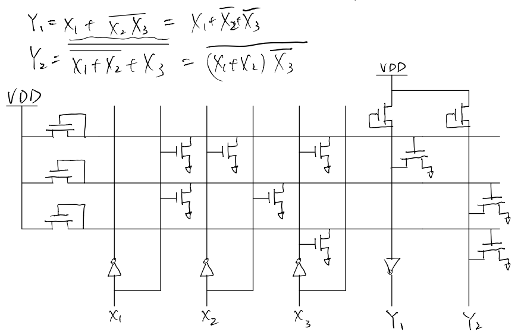
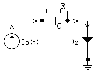
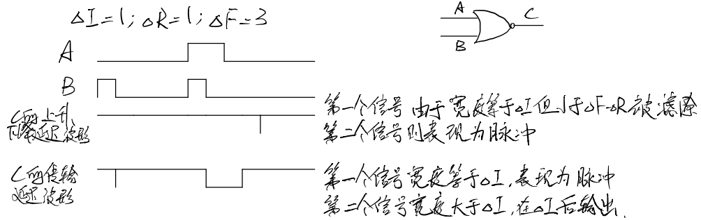

# 1 绪论

## VLSI 的设计思想

**VLSI 设计思想**：
- 分层分级
- 每层、级间均有严格的接口定义

**VLSI 的主要设计方法**
- 自底向上：根据现有的简单功能块或积木块单元，逐级向上组合，直至实现 VLSI 的总体功能。每一级的功能及尺寸以及与上下级接口均有严格定义。
- 自顶向下：层次性设计。将要设计的 VLSI 系统逐级分解成较简单的功能，直至达到可进行高效设计的、足够简单的功能块。同样，每一级将要完成的功能以及上一级和下一级的接口均有严格的规定；
  - 系统级   算法
  - 寄存器级 有限状态机
  - 门级     布尔方程
  - 网表     连接关系
  - 版图     器件布局

## CAD 软件内容

- 逻辑设计阶段：逻辑综合、逻辑模拟、逻辑图的自动输入
- 电路设计阶段：电路分析、时域分析
- 版图设计阶段：逻辑划分、自动布局布线
- 工艺设计阶段：工艺模拟、器件分析

## EDIF、CIF 等格式

1. EDIF 是电路级规范，在电路图绘制，电路行为及结构文本描述、逻辑描述、PCB 设计、ASIC版图设计和其它分析综合工具间建立起一个公共标准
2. CIF 是版图级规范，采用层次式结构的图形描述，便于设计师进行阅读、修改、组合和跟踪；同时，CIF 文件描述了一个完整芯片的设计

两者的关键特征是实现了共享和继承，是实现并行设计和设计升级的框架协议。

## VLSI 设计流程及各设计阶段的内容

1. 逻辑设计：
   1. 逻辑处理（S-EDIT）：将组合逻辑化归为 与非 和 或非，用 宏结构 连接所要实现的数字系统， 最后将高层次的系统描述转化为硬件
   2. 逻辑模拟（T-SPICE）：验证逻辑设计的正确性，并进行故障模拟
2. 电路分析
   1. 主要目的是确定电路性能的电路结构和元件参数，同时考虑环境影响，来辅助完善设计
3. 版图设计（L-EDIT）
   1. 根据前期设计确定 掩膜版图
4. 工艺模拟
   1. 对制造中的各流程的工艺参数进行模拟，针对不同情况进行优化

## 可靠性和可测性设计

可测性设计的目标是实现设计的可控性和可观测性。

**可控性**是指用一个有限位长的输入码可以使所设计的芯片置于任何一种可能的状态。

**可观测性**是指所设计芯片的任何一种可能状态均可通过观测一个测试码的输出结果来得到，即在外部可测量芯片内部的状态。

### 可测性 DFT（design for testability）

- 直流特性测试：检验芯片好坏和可靠性。包括输入特性、输出特性、转移特性和功能项目。
- 交流特性测试：又称动态特性测试，测试脉冲的传输特性。
- 逻辑功能测试：通过设计生成测试图形、测试码、测试矢量，得到实际测试结果

### 可靠性 DFR（design for reliability）

定义：IC 在规定的条件和时间内完成规定任务的概率

目的：提高和保证电路正常工作的概率

包括：
- 元件和数值留有冗余度
- Memory 电路的坏块处理
- 增加 ESD 保护电路
- 合理布局的热设计
- 合理布线避免串扰和电迁移

# 2 专用集成电路 CAD 设计基础

<!-- ## 为何要发展 ASIC，什么是 ASIC，IC的分类方式 -->

## 全定制、半定制电路的区别

- 全定制电路的全套集成电路研制过程都是为用­户定制的，其设计方法是全套掩膜版，有标准单元法，功能块法，优化阵列法等。
- 半定制电路的大部分设计和制备过程并非定制，而是已事先完成大部分，只需根据用户要求进行最终的制备烧­结，有固定门阵列、可编程逻辑器件和现场可编程门阵列等。

## ASIC 的主要结构

1. 全定制 ASIC
   1. 行式结构
   2. 积木块结构
   3. 规则阵列结构
2. 半定制 ASIC
   1. 固定门阵列
   2. 可编程逻辑器件
   3. 现场可编程门阵列

## 用固定门阵列实现 $y=\overline{a+b+c}$

## 用 E/D NMOS PLA 实现 $Y=X_1+\overline{X_2X_3}$ 和 $Y=\overline{X_1+X_2}+X_3$

先化成最小项

# 3 CAD 电路分析基础

## 对图示电路做综合分析

### 1 直流工作点分析

$$\left\{\begin{array}{l}
I_{0}=\frac{V_{1}-V_{2}}{R} \\
I_{0}=I_{D_{2}}+V_{2} G_{D_{2}}
\end{array}\right.$$

$$\left[\begin{array}{cc}
\frac{1}{R} & -\frac{1}{R} \\
0 & G_{D_{2}}
\end{array}\right]\left[\begin{array}{l}
V_{1} \\
V_{2}
\end{array}\right]=\left[\begin{array}{cc}
I_{0} \\
I_{0} -I_{2}
\end{array}\right]$$

先用节点电压法（即对每个节点列电流等式），再以电压的系数合并同类项

### 2 瞬态分析

$$\left\{\begin{array}{l}
\left.I_{0}(t)=I_{c k}+\frac{V_{1}-V_{2}}{R}+C V_{1}-V_{2}\right) G_{c k} \\
I_{0}(t)=I_{D_{2}}+V_{2} G_{D_{2}}
\end{array}\right.$$

$$\left[\begin{array}{cc}
\frac{1}{R}+G_{c k} & -\frac{1}{R}-G_{c k} \\
0 & V_{2}
\end{array}\right]\left[\begin{array}{c}
V_{1} \\
V_{2}
\end{array}\right]=\left[\begin{array}{c}
I_{0}(t)-I_{c k} \\
I_{0}(t)-I_{D_2}
\end{array}\right]$$

瞬态就是电感电容伴随模型

- 电容的伴随模型：
  - $G_{ck}=\frac{C}{h}$
  - $i_C=C\frac{dV}{dt}=\frac{C}{h}[V(k+1)-V(k)]$
  - h 为时间步长
- 电感的伴随模型：（电流不能突变
  - $G_{LK}=\frac{h}{2L}$
  - $I_{(k)}=i_{k-1}+G_{LK}V_{k-1}$
- 各类元件都可以用诺顿等效模型：电导和电流源并联

### 交流

交流就是电流为 $I_se^{-j\phi}$，电容阻抗 $\frac{1}{j\omega{C}}$，电感阻抗 $j\omega{L}$

本课中计算时都用电导表示，最后再展开

# 4 CAD 逻辑模拟基础

## 对图示电路进行延迟分析，并按要求画出波形图。分析延迟：$\Delta{I}=1,\Delta{R}=1,\Delta{F}=3$

1. 传输延迟 $\Delta{t}$：信号通过元件和导线传播引起的延时
2. 上升、下降延迟 $\Delta{R}$，$\Delta{F}$：器件输出从0到1的时延 / 从1到0。两者宽度不等时会改变脉冲宽度
3. 模糊延迟 $\Delta{M}-\Delta{m}$：最大延迟 $\Delta{M}$ 和最小延迟 $\Delta{m}$ 之间的信号值不是精确可测的
4. 惯性延迟 $\Delta{I}$：为使器件转换状态，对于输入的一个变化所必须维持的最小持续时间称为元件的惯性延迟。若输入脉冲宽度不到 $\Delta{I}$ 则会被门过滤；若大于等于 $\Delta{I}$ ，则器件表现出不小于 $\Delta{I}$ 的传输延迟

惯性延迟优先级最高（不然就没法解释答案了！）

## 逻辑模拟

#### 三值模拟
用0，1，μ表示一个信号状态的逻辑模拟
- $\mu=\bar{\mu}$
- 

## 故障

s-a-0：stack at 0，卡在了 0。

### 路径敏化法

**路径敏化法步骤**:
1. 反映故障：确定输入，在故障部位产生需要的值（s-a-1故障时为0，s-a-0故障时为1）。
2. 传播故障：选择一条从故障部位到达输出的路径，并且确定这条路经的另一些信号值，以便将故障传播到输出。
3. 确定输入：使得产生 2 中规定的信号值。

### D 算法

- D表示正常电路值为1而故障电路值为0的信号；
- $\bar{D}$ 表示正常电路值为0而故障电路值为1的信号。
- D立方代数运算与布尔代数相同，不过此时门的输入为4值（0，1，D ，$\bar{D}$）。

有：$D+\bar{D}=1$,$\bar{D}+\bar{D}=\bar{D}$,$D+D=D$,
$D\cdot\bar{D}=0$,$D\cdot{D}=D$,$\bar{D}\cdot\bar{D}=\bar{D}$

传播立方：无关故障，要考虑各路出错的可能（不过似乎只考虑 D，不考虑 D反

D 驱动操作：先选取故障原始 D 立方，然后先与传播立方相交，再与原始立方相交

# 5 CAD 版图设计基础

## 布线

### 垂直约束图

1. 列出约束关系
2. 从没有下边的端子开始，绘制垂直约束图（VCG）

### 水平带图

自左向右扫描，当某列上有线网结束时，做个记号。
**如在后面的第j列上有新的线网开始时，则新的重迭区从第j列开始，而前一个重迭区在j-1列结束。**
也有一些特殊情况，**若同一列既有线网结束又有线网开始，则可以划分为一个独立的区**；
若此时前面的分区没有划分，则合并为一个分区。

## 自动布图包含哪些内容，分别涉及哪些常用的算法？

- 自动布图包含：逻辑划分，电路排列，连线。
- 涉及的算法：结群，布图规划和布局，总体布线，总体压缩，无网格的通道布线和通孔，线长优化。

## 如何处理总体布线和通道在线的关系，李氏算法主要解决什么问题

- 总体布线是划分通道，是线网在各通道的分配
- 通道布线是在通道中排列线网，进行线网的走线

李氏算法是最小路径算法的一个应用，用于将线网分配到各
通道。

