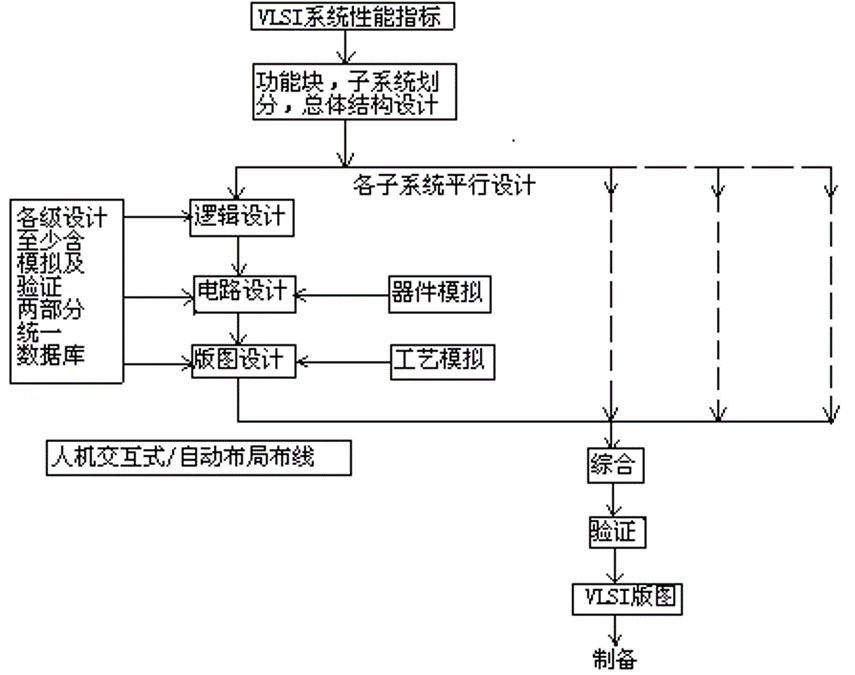

集成电路CAD的主要内容：
- 电路分析
- 逻辑模拟
- 版图设计
- 工艺模拟

EDA：电子设计自动化（Electronic Design Automation）

VLSI：Very Large Scale Integration，超大规模集成电路

**VLSI 设计思想**：
- 分层分级
- 每层、级间均有严格的接口定义

**VLSI 的主要设计方法**
- 自底向上：根据现有的简单功能块或积木块单元，逐级向上组合，直至实现 VLSI 的总体功能。同样，每一级的功能及尺寸以及与上下级接口均有严格定义。
- 自顶向下：层次性设计。将要设计的 VLSI 系统逐级分解成较简单的功能，直至达到可进行高效设计的、足够简单的功能块，每一级将要完成的功能以及上一级和下一级的接口均有严格的规定；
  - 系统级   算法
  - 寄存器级 有限状态机
  - 门级     布尔方程
  - 网表     连接关系
  - 版图     器件布局

VLSI 由 LSI 组成，LSI 由 MSL 组成，MSL 由 LSL 组成。

复杂电路总可以分解为较简单的电路。

## 1-2 IC 设计中的方法

### 1-2-1 Framework

Framework 是一种规范，由国际 CAD 框架协会制定：
- EDIF 网表（电子设计自动化中介格式）
- CIF 网表（加州理工中介格式）

关键特征：实现了共享和继承，是实现并行设计和设计升级的框架协议。

### 2 并行工程

一种系统化、集成化、并行的产品及相关过程的开发模式

### 3 逻辑综合优化

逻辑综合功能将高层次的系统行为设计自动翻译成几级逻辑电路描述，使设计与工艺相对独立。

优化则是对于上述综合生成的网表，根据布尔方程式功能等效的原则用更小更快的综合结果替代一些复杂的单元，与指定的库映射生成新的网表。

## 1-3 VLSI 设计流程

### 1-3-1 逻辑设计阶段

1. 逻辑处理
   1. 将所要实现的数字系统中的组合逻辑部分最小化为 *与非* 和 *或非*；
   2. 将所要实现的数字系统用一些宏结构经过连接来实现；
   3. 将高层次的系统描述逐步转换成与实现技术相关的硬件。
2. 逻辑模拟
   1. 验证逻辑设计的正确性；
   2. 进行故障模拟，产生故障诊断的测试码。
   -  分为门级、功能级、寄存器级三类

### 1-3-2 电路分析

定义：根据电路给定的元件参数进行性能模拟和分析，并给出模拟结果，为设计者提供修改建议

目的：确定电路性能的电路结构和元件参数，考虑环境、工艺偏差导致的性能变化。

常用软件：SPICE ：
- 主要功能：
  - 直流分析
  - 交流小信号分析
  - 瞬态分析
  - 不同温度下分析

### 1-3-3 版图设计

定义：根据逻辑和电路功能要求以及工艺制造的约束条件来设计掩膜版图

常用软件：LEDIT， VIRTUOSO

### 1-3-4 工艺模拟

定义：对制造中的各流程工艺参数进行模拟，根据具体情况对不合格的设计进行修正

## 1-4 SOC 的设计方法

主要使用自顶向下设计方法，分为
- 高层综合：行为级设计和结构级设计
- 逻辑综合：逻辑设计和电路设计
- 物理综合：版图级设计

也可分为
- 前端设计：系统、功能、结构和电路设计
- 后端设计：版图设计

## 1-5 可测性和可靠性

可测性设计的目标是实现设计的可控性和可观测性。

**可控性**是指用一个有限位长的输入码可以使所设计的芯片置于任何一种可能的状态。

**可观测性**是指所设计芯片的任何一种可能状态均可通过观测一个测试码的输出结果来得到，即在外部可测量芯片内部的状态。

### 1-5-1 可测性 DFT（design for testability）

- 直流特性测试：检验芯片好坏和可靠性。包括输入特性、输出特性、转移特性和功能项目。
- 交流特性测试：又称动态特性测试，测试脉冲的传输特性。
- 逻辑功能测试：通过设计生成测试图形、测试码、测试矢量，得到实际测试结果

### 1-5-2 可靠性 DFR（design for reliability）

定义：IC 在规定的条件和时间内完成规定任务的概率

目的：提高和保证电路正常工作的概率

包括：
- 元件和数值留有冗余度
- Memory 电路的坏块处理
- 增加 ESD 保护电路
- 合理布局的热设计
- 合理布线避免串扰和电迁移

