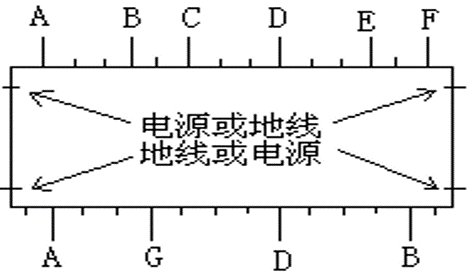

## 2-1 IC 分类

- 按工艺分类：双极(Bipolar) 、金属氧化物半导体CMOS):
- 按功能分类：模拟(Analog) 、数字(Digital) 、数／模混合(Mix);
- 按用途分类：通用(GSIC) 、专用(ASIC):
- 按设计方式分类： 半定制(Semi-Custom) 、全定制(Full-Custom) 。
- 按结构形式分类：单片集成电路(Chip) 、膜集成电路(Hybird Circuits);
- 按规模分类：小规模(SSI) 、中规模(MSI) 、大规模(LSI) 、超大规模(VLSI), ULSI 、GLSI 均认为是VLSI:
- 按制造方法分类：掩膜(MASK) 、电可编程(e-Programmable) 。

### 2-1-1 工艺分类

- 常规工艺电路：
  - 双极(BJT): 多子器件，电流大，驱动大；
  - MOS: 少子器件，面积小，速度快。
- 特殊工艺电路：
  - BiMOS: 速度和功率的平衡；
  - DMOS: 双扩散MOS, 高压大功率；
  - BCD: 现在流行的工艺，综合了双极、CMOS 、DMOS 工艺特点。

#### PN 结

PN结的形成：参见 [1-2 PN结](https://www.sciroccogti.top/notes/模电/AC-1.html#1-2-pn结)

扩散运动（正偏）电流较大，漂移运动（反偏）电流较小，是以为半导体

两种载流子：电子 和 空穴

#### BJT

饱和区、放大区、截止区

常用公式：
- $I_E=I_C+I_B$
- $I_C=\bar{\beta}I_B\approx\bar{\alpha}I_E$

*   **放大模式**：发射结加正向电压，集电结加反向电压，$V_{CE}>0.3V$
*   **饱和模式**：均正偏，$V_{CB}=0.4V,V_{BE}=0.7V$（掺杂浓度不同）
*   **截止模式**：均反偏

- 集电结正偏：集电极高于基极
- 发射结正偏：基极高于发射极

在晶圆上制作（一般是 P 型衬底）

1. P 型衬底（P-sub）
2. N+ 埋层（buried layer）
3. N 型外延

#### MOS

||N沟道|P沟道|
|---|---|---|
|非饱和区|$v_{GS}>V_{GS(th)}$ $v_{DS}<v_{GS}-V_{GS(th)}$|$v_{GS}<V_{GS(th)}$ $v_{DS}>v_{GS}-V_{GS(th)}$|
|饱和区|$v_{GS}>V_{GS(th)}$ $v_{DS}>v_{GS}-V_{GS(th)}$|$v_{GS}<V_{GS(th)}$ $v_{DS}<v_{GS}-V_{GS(th)}$|

**非饱和区**：$I_D=\frac{\mu_nC_{OX}W}{2l}[2(V_{GS}-V_{GS(th)})V_{DS}-V_{DS}^2]$
*   $v_{DS}$很小时：$I_D=\frac{\mu_nC_{OX}W}{l}(V_{GS}-V_{GS(th)})V_{DS}$
*   计及沟道长度调制效应时：$I_D=\frac{\mu_nC_{OX}W}{2l}(V_{GS}-V_{GS(th)})(1-\frac{V_{DS}}{V_A})=\frac{\mu_nC_{OX}W}{2l}(V_{GS}-V_{GS(th)})(1-{\lambda}V_{DS})$（源漏电压差导致漏极电流变化）

**饱和区**：$I_D=\frac{\mu_nC_{OX}W}{2l}(V_{GS}-V_{GS(th)})^2$

#### BiMOS 代表器件：IGBT

IGBT（Insulated Gate Bipolar Transistor）是一个非通即断的开关，相当于一个由 MOS 驱动的厚基区 PNP 型晶体管。

分为：
- N 沟道 IGBT，N-IGBT，NMOS 驱动
- P 沟道 IGBT，P-IGBT，PMOS 驱动

导通和截断由栅极 G 和发射极 E 间电压$V_{GE}$决定，当$V_{CE}$大于开启电压$V_{CE(th)}$时，NMOS 内形成沟道并为 PNP 双极型晶体管提供基极电流，驱动 IGBT 导通。

#### 特性对比

- 双极(BJT)：多子器件，电流大，驱动大；
- MOS：少子器件，面积小，速度快；
- BiMOS：速度和功率的平衡；

### 2-1-2 模拟集成电路设计特点

- 模拟IC的应用环境对工艺造成的电气参数的**离散性**要求很高，常采用**负反馈**技术来保证电气性能指标的一致性和稳定性；
- 在基本放大电路中多采用漂移小、对称性好的**差分放大器**和**有源负载放大器**；
- 电路设计和**版图设计**配合实施匹配性设计；
- 偏置电路不用电阻而用**温度补偿效果较好的恒压源、恒流源**；
- 设计中多用有源器件而少用电阻，或者用有源器件代替无源器件：
  - 大电阻很占面积，不如电流镜
  - 电阻误差有时高达20%
- 采用比例电阻，不用绝对值设计，二极管用三极管实现
  - 比例电阻：$r=\frac{\Delta{V}}{\Delta{I}}$

### 2-1-3 通用和专用 IC

专用集成电路 ASIC 相对通用而言，但两者没有明显界限

ASIC 可分为：ASCP 和 ASSP
- ASCP：Application Specification Customed Product，面向专用的定制产品
- ASSP：Application Specification Standard Product，面向专用的通用标准产品

### 2-1-4 专用集成电路的设计方式

分为全定制、半定制电路
> 有人认为应分为全定制、半定制、可编程三类，这种分法实际上是突出了可编程类器件。 

#### 全定制电路

针对某一用户设计的集成电路，包括从电路图输入开始，完成逻辑或电路验证、版图生成、掩膜（MASK）制备到芯片制作的全套集成电路研制过程 。

#### 半定制电路

并非针对某一用户，有一定的 *母板* 结构

只设计全套掩膜版中的一块或数块，包括门阵列法和可编程阵列法等

> ASIC的主要优点
>>  降低了产品的综合成本
>>  提高了产品可靠性
>>  提高了产品的保密程度和竞争能力
>>  降低了电子产品的功耗
>>  提高了电子产品的工作速度
>>  大大减少了电子产品的体积和重量

## 2-2 专用集成电路的主要结构形式

### 2-2-1 主要结构形式

1. 全定制 ASIC
   - 行式结构
   - 积木块机构
   - 规则阵列结构
2. 半定制 ASIC
   - 固定门阵列
   - 可编程逻辑器件
   - FPGA

#### 行式结构

芯片中央为单元阵列和布线通道，芯片四周是输入输出

#### 积木块结构

所谓的积木块结构是一种大的单元的布图结构，这些单元可以是一种CAD 产品的规则结
构，也可以是一块优化门阵列，还可以是人工精心设计的电路单元或者存储器阵列。标准专用
电路通常采用积木块结构。

单片机这种结构的布线通常将连线按数据流和控制流进
行分类，采用面向线网的布线方法。所谓面向线网的布线方法是指布线的优化是按照线网顺
序进行。

#### 规则阵列结构

一般为两级阵列：与阵列 和 或阵列

#### 固定门阵列

固定门阵列实现 ASIC 是在预先生产的门阵列母片上进行布线，来完成 ASIC 的一种结构
和设计技术。

#### 可编程逻辑器件 PLD

- PROM：
  - PROM(Programable Read Only Memory)其基本结构包括一个固定的“与”阵列，其输出加到一个可编程的“或”阵列之上，主要用于有效计算机程序和数据。
- PAL：
  - PAL(Programable Array Logic)器件即可编程阵列逻辑器件，由一个可编程的“与”阵列和一个固定的“或”阵列组成。其对“与”阵列可编程特性使输入项可以增多，而“或”阵列固定使器件简化。
- GAL：
  - GAL（Gate Array Logic）是一种通用阵列逻辑器件，是一种可电擦写、可重复编程、可以加密的PLD。GAL器件是将一个可编程的“与”阵列连接到输出逻辑宏单元（OLMC）上输出，通过对OLMC的编程，就可在符合各种逻辑设计的需求方面，给设计者提供更大的灵活性。
- EPLD：
  - EPLD（Erasable Programable Logic Devices）是一种可擦除的可编程逻辑器件，它是将EPROM直接合成于PLD 芯片之中。不同型号的EPLD大都由不同个数的宏单元组成，每个宏单元一般包括三个组成部分：逻辑阵列、可编程寄存触发器、可编程I/O控制模块。
- FPGA：
  - FPGA（Field Program Gate Array）是由掩膜可编程门阵列和可编程逻辑器件二者演变而来，将它们的特性并在一起。 

半定制电路有较快的设计和生产周期

全定制电路可以采用MPW的方式来试制电路从而减小风险和制造成本

### 2-2-2 门阵列

门阵列是一种规则化的版图结构，采用行式结构，
常采用标准 *与非门*、*或非门* 定义的门单元排列在行式结构的单元行内。

是结构决定逻辑的一种阵列

本课程涉及的门阵列
1. 固定门阵列
2. 优化门阵列
3. CMOS门阵列

#### 固定门阵列

固定门阵列的设计方法又称“母片”法，是一种母片式半定制技术。 

固定门阵列具有规则的结构，即有固定大小、固定结构、固定I/O数量的门阵列。

#### 优化门阵列

属于全定制集成电路

是不规则的门阵列结构，即其单元行宽度不完全相同，每行单元数有多有少，布线通道的容量也不完全相同

#### CMOS 门阵列

相比 TTL、ECL 等，CMOS 门阵列工艺较简单，布线、电源和地线也较好处理

### 2-2-3 标准单元

标准单元设计方法又称库单元法，采用逻辑单元版图，按芯片的功能要求排列成专用电路。

电源线和地线通常安排在单元的上下端，从单元的左右两侧同时出线。
电源、地线在两侧的位置要相同，线的宽度要一致，以便单元间电源、地线的对接。 

单元的输入/输出端安排在单元的上、下两边，要求至少有一个输入端或输出端可以在单元的上、下两边方向引出，
单元在上、下边引出线的位置及间隔以某个数值单位进行量化。
引线具有上下出线的能力的目的是为了线网能够穿越单元，
位置和间隔量化的目的是使CAD布线简洁，目标明确。

### 2-2-4 可编程逻辑阵列 PLA

用掩膜编程技术 或 熔丝编程、电场编程技术来实现

PLA 利用两级 ROM 结构构成的 *与阵列* 和 *或阵列*，
其中 *与阵列* 只能外部输入内部输出，*或阵列* 只能外部输出，内部输入。

可编程MOS结构：
栅极为多晶硅浮栅，未编程时浮栅无电子沟道完全闭合，始终断开；
编程后浮栅内引入负电荷，当控制栅有高电势时排斥浮栅，浮栅打开沟道，MOS正常工作。
