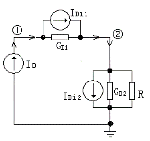
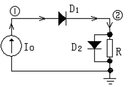
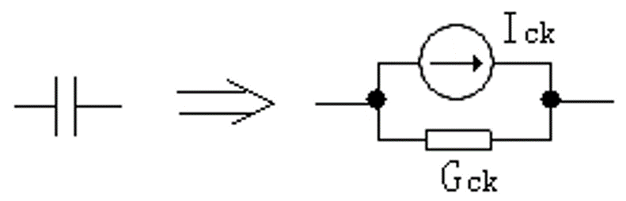
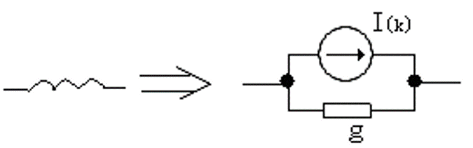
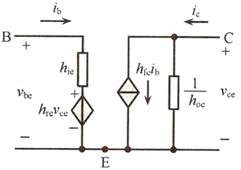
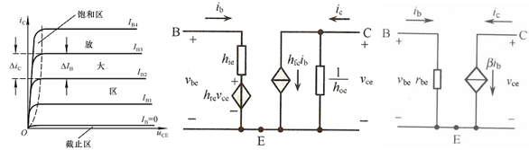

## 3-1 电路模拟原理

### 3-1-1 电路分析的 CAD 基本方法

人工分析 -> 实验分析 -> CAD 分析

1. 人工分析
2. 实验分析
3. CAD 分析：把方程转为计算机可解的形式
   1. 建立电路元器件的模型
   2. 电路拓扑的描述
   3. 建立电路方程
   4. 编写计算机程序
   5. 显示计算结果

### 3-1-2 集成电路的 CAD 分析

电路功能分析：

直流分析、交流稳态分析、瞬态分析、灵敏度分析、容差分析和噪声分析以及温度影响分析等

- 欧姆定理
- 基尔霍夫定理
- KCL 电流定律
- KVL 电压定律

- 节点电压法（方程数少，常用于 CAD）
- 支路电流法

节点电压法运用 VCR（元件的伏安关系） 和 KCL，对GND、参考节点以外的 N-2 个节点列方程

## 3-2 基本电路分析

### 3-2-1 线性电路的直流分析

直流分析也称为直流稳态分析，做直流分析时，电路中的电容视为开路，电感视为短路。
网络的节点和支路必须编号。

节点电压法不能处理独立源支路，阻抗为0支路和流控元件。

电路矩阵的一般形式为：Y*V=I 或 Yn*Vn=In

其中，Y 为导纳矩阵，V 为电压，I 为电流
- Y矩阵的主对角线上的元素为电路中相应节点上的自导纳，总为正；
- 非主对角线元素为电路节点的互导纳，总为负

> 自导纳：与该节点相连的导纳之和
> 
> 互导纳：该节点与相邻节点的连接支路上的导纳之和

### 3-2-2 线性电路的交流分析

直流分析和交流稳态分析的主要差别是：
在交流分析中Y和所有数都是复数，即系数矩阵Y，电流向量I和电压向量V都会是复数矩阵和复数向量，所需求解的方程是一个复数方程。
此外，通常要考虑求解频带内的一系列的频率点，对每个频率点都要进行完整的分析。

### 3-2-3 非线性电路的直流分析

非线性电路难以有解析式，常用数值方法求解，譬如用 *牛顿-拉夫森迭代* 

参见 [如何通俗易懂地讲解牛顿迭代法？](https://www.matongxue.com/madocs/205.html)

电路原型：

物理模型：

数学模型：

$$\left[\begin{array}{cc}
G_{D 1}^{(0)} & -G_{D 1}^{(0)} \\
-G_{D 1}^{(0)} & G_{D 1}^{(0)}+G_{D 2}^{(0)}+\frac{1}{R}
\end{array}\right]\left[\begin{array}{c}
V_{1}^{(1)} \\
V_{2}^{(1)}
\end{array}\right]=\left[\begin{array}{c}
I_{0}-I_{D i 1}^{(0)} \\
I_{D i 1}^{(0)}-I_{D i 2}^{(0)}
\end{array}\right]$$

### 3-2-4 非线性电路的交流分析

在每个频率下分别分析

### 3-2-5 瞬态分析

计算电路遇到一个瞬时的激励时的瞬态过程

电容：$i_C=C\frac{dV}{dt}$

电感：$U_L=L\frac{di_L}{dt}$

方法：用基尔霍夫电流定律列出节点方程，是一个微分方程组，用数值积分来求解。

欧拉法：用差商代替导数，即用$\frac{V(k+1)-V(k)}{h}$代替$\frac{dy}{dx}$

隐式欧拉法：用$\frac{V(k+1)-V(k)}{h}$代替$\frac{dy_{n+1}}{dx_{n+1}}$

用积分梯度近似可得：
- 电容的伴随模型：

  - $G_{ck}=\frac{C}{h}$
  - $i_C=C\frac{dV}{dt}=\frac{C}{h}[V(k+1)-V(k)]$
  - h 为时间步长

- 电感的伴随模型：（电流不能突变

  - $G_{LK}=\frac{h}{2L}$
  - $I_{(k)}=i_{k-1}+G_{LK}V_{k-1}$

- 各类元件都可以用诺顿等效模型：电导和电流源并联

## 3-3 基本电路元器件模型

### 3-3-2 三极管的 H 参数模型

- 输入电压函数：$V_{BE}=f_1(i_B,v_{CE})$
- 输出电流函数：$i_{C}=f_2(i_B,v_{CE})$

对以上二式采用全微分法，可得到 $V_{BE}$ 和 $i_C$ 的微变增益一般表达式，即
$$dv_{BE}=
\frac{\partial{v_{BE}}}{\partial{i_B}}|_{dv_{CE}=0}{\cdot}di_B+
\frac{\partial{v_{BE}}}{\partial{v_{CE}}}|_{di_{B}=0}{\cdot}dv_{CE}$$

$$di_C=
\frac{\partial{i_C}}{\partial{i_B}}|_{dv_{CE}=0}{\cdot}di_B+
\frac{\partial{i_C}}{\partial{v_{CE}}}|_{di_{B}=0}{\cdot}dv_{CE}$$

可见 $dv_{BE}$ $dv_{CE}$ $di_C$ $di_B$ 为交流分量，
用 $v_{be}$ $v_{ce}$ $i_c$ $i_b$

得到方程组：
- 输入电压方程 $v_{be}=h_{ie}i_b+h_{re}v_{ce}$；BE 间可以等效成一个电阻与一个受控电压源串联
- 输出电流方程 $i_c=h_{fe}i_b+h_{oe}v_{ce}$；CE 间可以等效为一个受控电流源与一个电阻并联

> i: input, o: output, r: reverse, f: forward

$\left[\begin{array}{cc}h_{ie}&h_{re}\\h_{fe}&h_{oe}\end{array}\right]$
中的四个元素量纲不同，故称混合参数（H 参数）

晶体管的H参数模型：

在放大区，输入端等效为一个动态输入电阻$r_{be}$，输出端等效为一个电流$i_b$控制的电流源$\beta{i_b}$

三极晶体管放大区H参数等效模型：

### 3-3-3 三极管的 SPICE 模型

从工艺到电气模型都包含在内
