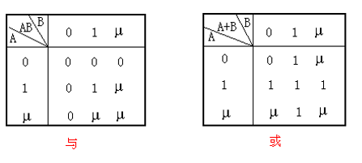
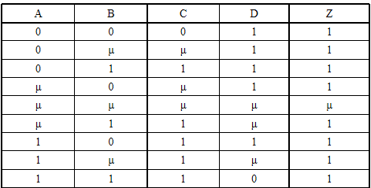

## 4-1 逻辑模拟

在计算机上建立数字电路模型，并向其施加一个输入序列激励，计算电路中的响应

逻辑模拟的主要用途
1. 评价新的设计。检验逻辑的正确性，获得电路的竞争、冒险和电路振荡条件的资料；
2. 分析故障。用测试序列分析故障，包括在一定的故障条件下的电路工作特性，和给定的测试序列下获得的故障分辨率。

### 4-1-1 逻辑故障的产生

#### 冒险

对于单个逻辑信号，由于延迟的原因，组合电路可能产生瞬态错误或尖峰脉冲，称为冒险。

冒险：电路输出有瞬间的错误“毛刺”

#### 竞争

对于多路信号，在若干信号同时改变时会引起竞争。在竞争的条件下，电路的动作取决于信号变化的实际次序。

竞争：某个输入变量通过两条或两条以上的途径传到输出端，由于每条途径延迟时间不同，到达输出门的时间就有先有后

### 4-1-2 逻辑模拟方式

#### 逻辑模拟的分级

分为 门级，功能级，寄存器级

1. 门级模拟：检查各门，检验逻辑和时序的正确性
2. 功能级模拟：以功能块为基本部件，检查其逻辑电路的正确性
3. 寄存器级模拟：检查设计的指令流程和在寄存器中传输的情况

逻辑模拟系统可用精确性、有效性、通用性来评价
1. **精确性**指信号值与时间的关系必须严格对应于实际电路所呈现的关系；
2. **有效性**指模拟过程有效而成本低；
3. **通用性**指程序能够处理各种各样的逻辑电路。

### 4-2 逻辑模拟的模型和算法

门级或混合级的模拟是逻辑模拟的主要方式。

逻辑模拟主要是验证逻辑功能和时间延迟

### 4-2-1 器件的延迟模型

延迟有时是好事（振荡器），有时也是坏事（引起故障）

奇数个反相器形成振荡器，偶数个形成锁存器

前级反相器驱动能力弱，容易起振

1. 传输延迟 $\Delta{t}$：信号通过元件和导线传播引起的延时
2. 上升、下降延迟 $\Delta{R}$，$\Delta{F}$：器件输出从0到1的时延 / 从1到0。两者宽度不等时会改变脉冲宽度
3. 模糊延迟 $\Delta{M}-\Delta{m}$：最大延迟 $\Delta{M}$ 和最小延迟 $\Delta{m}$ 之间的信号值不是精确可测的

4. 惯性延迟 $\Delta{I}$：为使器件转换状态，对于输入的一个变化所必须维持的最小持续时间称为元件的惯性延迟。若输入脉冲宽度不到 $\Delta{I}$ 则会被门过滤；若大于等于 $\Delta{I}$ ，则器件表现出不小于 $\Delta{I}$ 的传输延迟

### 4-2-2 多值模拟

信号有不定状态，即有可能为0，也可能为1的状态。

#### 三值模拟
用0，1，μ表示一个信号状态的逻辑模拟
- $\mu=\bar{\mu}$
- 

**定理：组合电路C在输入序列X(t)→X(t+1)时，信号线Z存在静态冒险的充分必要条件是信号响应为0µ0或1µ1。**

三值模拟的用途：
1. 表示冒险
2. 表示初始态
3. 确定后级电路哪些会出现输入变化，哪些不会以确定面向事件的模拟

#### 五值模拟

0到1 和 1到0 作为一个值，未知量单独用 μ

#### 八值模拟

- 静态0值，静态1值，
- 无冒险0→1，无冒险1→0，静态0冒险，静态1冒险，
- 动态冒险0→1，动态冒险1→0

### 4-2-3 基本模拟程序的结构

#### 编译法

#### 表格驱动面向事件

## 4-3 测试码生成

逻辑模拟主要作用：
1. 评价系统
2. 分析故障

### 4-3-1 故障测试

用于测试电路的一组输入 / 输出信号叫做测试码或测试矢量

#### 测试方法

1. 完全测试：两种定义：
   1. 对应输入的所有可能的信号进行测试，共有2N个测试输入，N为输入端数，它可以测到包括冗余故障以外的所有节点，但会出现一个节点被几次测试的问题
   2. 对除冗余故障以外的所有节点的故障测试，对应每个故障产生一组测试矢量。这一定义的测试矢量小于上一定义
2. 功能测试
   - 只就电路功能进行测试，只要电路满足功能的完成即可。
   - 显然会出现有些节点重复测试、有些节点没被测试的情况。
   - 通常对ASIC采用功能测试，而对CPU之类的芯片采用完全测试

### 4-3-2 故障检测

设节点A有故障As-a-1：

为使A的故障在Z点有反映，必须使所有通路全打开，让Z=A。

∵B=0，F=A，C=1，G=A，D=E=0时Z=A，所以要使Z=A，那么为反映节点A的故障A=0，必须B=D=E=0，C=1。

正常情况，若A=0，则Z=0。而有故障情况，A=0，Z=1，表明有故障。

若G有故障“1”，为反映G，让Z=G，则D=E=0。为反映G=1故障，门2 输出FC=0，则C=0或F=0。则A=0，B=0即对应输入A，B，C，D，E为00×00或××000。共有5个输入序列能反映G=1故障，即00000，00100，01000，10000，11000。

**冗余故障**：即使出错也不会影响电路的最终输出

电路的三值真值表可以看出，这仍然是一个静态1冒险的电路，若需要固定输出1电平，就要避免输出μ状态，即A、B不允许同时改变状态。

A、B端接一个双稳态电路，那么在电路上电的初始状态输出μ状态之后，A、B不允许同时为0或1状态，从电路的三值真值表可以看出，这个电路避免了成为一个静态1冒险的电路，可以实现固定输出1电平。

### 4-3-3 故障模型

1. 物理故障：开路、短路、老化
2. 逻辑故障：
   - 固定型故障：当某个信号线的信号被固定在某个逻辑电平的电位上，即为固定型故障。如果该线（或该点）固定在逻辑高电平上，则称为固定1故障（stuck-at-1），记为（s-a-1）；若信号固定在逻辑低电平上，则称为固定0故障（stuck-at-0），记为（s-a-0）。
   - 桥接故障：当两条以上信号线短路在一起并建立逻辑时，就会产生桥接故障。若故障涉及n个线网（n＞2），就称为n重桥接故障，否则称为简单桥接故障。一般在芯片原始的输入端口比较容易发生多重桥接故障。
     1. 元件输入端之间的桥接故障：导致 线与、线或，有可能会改变电路的拓扑结构
     2. 反馈桥接：桥接线跨接在输入输出端，将组合电路转变为时序电路，使电路出现振荡或反馈
   - 时滞故障：一种动态故障，在高频时因为元件延时而出现，低频则无

### 4-3-4 路径敏化法

两种测试码产生方法：
- 代数法：根据描述电路的布尔等式求解出测试矢量
- 算法：用电路机理跟踪、敏化路径，使得故障效应传播到电路的原始输出，然后给原始输入分配满足故障传播和生成条件的值

**路径敏化法**：

为使输入$\vec{X_i}$能够检测信号点 As-a-j(j=0,1) 的故障，$\vec{X_i}$必须保持正常（无故障）电路的信号点A为$\vec{j}$值（暴露故障），这只给出了对检测该故障的必要条件，但并不是充分的。
同时，故障信号的效应必须由故障部位或故障原始点沿某条路径传播到输出 

**路径敏化法步骤**:
1. 反映故障：确定输入，在故障部位产生需要的值（s-a-1故障时为0，s-a-0故障时为1）。
2. 传播故障：选择一条从故障部位到达输出的路径，并且确定这条路经的另一些信号值，以便将故障传播到输出。
3. 确定输入：使得产生 2 中规定的信号值。

### 4-3-5 D 算法

D-算法是一种多路径敏化法，基于 D-立方

#### 布尔函数的立方表示法

布尔函数可以用以下方法表示：
1. 卡诺图，真值表
2. 几何表示法
   -  布尔函数可用集合体上所有使f=1的点的集合来表示，又可用所有使f=0的点的集合来表示。
   -  f=1；S1={A1，B1，C1，D1}；
   -  f=0；S0={A0，B0，C0，D0}。
3. 立方表示法：利用函数的有1顶点构成的各个子立方体来表示布尔函数。例如有两个子立方体（A1,D1）和(C1,B1)，它们的坐标可以分别写成(X1,X2,X3)=(1,0,X)和(0,X,0)，每一个坐标叫做一个立方。

$$f=X_1\overline{X_2}+\overline{X_1}\cdot\overline{X_3}$$

#### 奇异立方

将f与$\bar{f}$的立方连同f的值一并列出。表中的每一行（包含自变量与函数值）称为函数的奇异立方。
这个表实质上是函数真值表的压缩形式，这个表又称为函数f的奇异覆盖。

#### D-算法的符号与运算

- D表示正常电路值为1而故障电路值为0的信号；
- $\bar{D}$ 表示正常电路值为0而故障电路值为1的信号。
- D立方代数运算与布尔代数相同，不过此时门的输入为4值（0，1，D ，$\bar{D}$）。

有：$D+\bar{D}=1$,$\bar{D}+\bar{D}=\bar{D}$,$D+D=D$,
$D\cdot\bar{D}=0$,$D\cdot{D}=D$,$\bar{D}\cdot\bar{D}=\bar{D}$

#### 原始立方

原始立方表示产生规定输出而要求的最小输入条件

#### 故障原始-D立方

故障原始-立方是反映故障的最小条件

#### 传播-立方

表示将故障进行传播，即对路径进行敏化，
将元件中的一个（或几个）输入错误信号传播到输出所需要的最小输入条件

#### 立方的交

定义：两个立方中对应具有相同值的位置上，相交值即为该值；
如果在某个位置上，其中一个立方为不定值x时，相交值即为该位置上另一立方的值；
若两个立方 αi，βj在某个位置上有确定的但不相等的值，则交不存在。

例：δ=0x10，ε=x110，γ=1x1x，则δ∩ε=0110，ε∩γ=1110，δ∩γ为空（第一位不一致）

#### 算法实现

1. 根据电路组成，在计算机中建立所有门的原始、故障、传播立方。
2. 选择被测故障的一个故障原始 D-立方（反映故障）。通常存在选择性：三输入与非的Zs-a-0有三种选择，初始选择是任意的，但在算法实现中可能需要放弃原选择而返回进行其它选择，这称为后退，后退可能需要重复进行，直到所有可能选择都被考虑过为止。
3. 敏化从故障源到输出所选路径（故障传播），通过故障原始D-立方或已产生的测试码和传播D-立方的交来传播故障效应，建立故障传播路径并任选一条，这一过程称为D-驱动，D-驱动一直进行到某个原始输出端为 D 或 $\bar{D}$。
4. 一致性操作（线合理性）即导出相应的初级输入值。在D-驱动过程中，经D-交运算形成的元件信号值称为测试立方$t_c$ (未确定的可认为是x) 。

