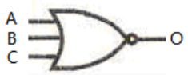

版图设计属于后端设计部分。

集成电路版图设计就是指将电路设计电路图或电路描述语言映射到物理描述层面，从而可以将设计好的电路映射到晶圆上生产。

版图是包含集成电路的器件类型，器件尺寸，器件之间的相对位置以及各个器件之间的连接关系等相关物理信息的图形，这些图形由位于不同绘图层上的图形构成。

从自动化程度划分版图设计方法：
1. 全自动版图设计
2. 半自动设计
3. 人工设计

从版图设计类型划分：
1. 标准版图设计
2. 半定制版图设计
3. 全定制版图设计

两种主要的版图设计方式：
- 一种是几乎所有部件的高度都相等的**标准化方式**，如多单元（Polycell）或标准单元（Standard cell）方式，常通过自动布图设计系统的版图，如SPR（Standard Placement Routing）等实现
- 另一种是针对各种不同大小的部件的方式，狭义来说就是**积木块方式**（Building Block）。这种方式允许存在像RAM、ROM、移位寄存器等规模很大的部件或子模块，因而适用的范围也较广，采用BBL（Building Block Layout）等方式实现，如BPR（Block Placement Routing）。

布图的分级：
- Top down的布图设计一般都是分级设计，布图规划是是一个软件的划分过程，主要针对软模块（网表）
- 而布局是针对全部硬模块，并且是Bottom up的布图设计，它可以是分级设计，也可以不是分级设计

一旦模块设计完成，有了具体的物理版图，它就是一个硬模块，也称为IP硬核（Hard core）。
在分级设计过程中，待设计的模块也可为软模块，即软核（Soft core）。
最低一级的是基本单元，可以是硬的，也可以是软的。
硬核与具体Foundry的制造工艺结合紧密，软核在验证正确后，可以形成固核（Custom core），也可以形成多种的硬核。

## 5-1 逻辑划分

布图规划的输入是一个有层次的网表，这个网表描述了功能方块（如RAM，ROM，ALU等），方块内的逻辑单元（如NAND，NOR，触发器等）和逻辑单元的接线端子。

网表是ASIC的逻辑描述；平面布局是ASIC的物理描述；因此，布图规划就是逻辑描述（网表）和物理描述（平面布局）之间的映射。

### 5-1-1 划分要求

逻辑划分的原则是：
1. 逻辑功能块的功能完整性：
每个模块完成一定的功能，即模块对应的子电路在电学上、逻辑上是相对独立的。
2. 连线尽量在模块内实现：
使每个模块的内部均有较强的连接关系，同时使模块间有尽量弱的连接关系。

一个电路系统As，它可以划分为m个子块，每个子块有对应的面积$S(A_i)$和端子数$E(A_i)$；
子块的面积和端子数有约束条件，一般存在上限

### 5-1-2 典型算法

#### 简单连接度法

若用B(Ai)表示单元Ai所有的外部连接的集合，则
- 两个单元Ai，Aj之间的连接度（即连接数）为：$Con(A_i,A_j)=|B(A_i)∩B(A_j)|$
- Ai，Aj之间的分离度（即无关连线之和）为：$Dis(A_i,A_j)=|B(A_i)∪B(A_j)-Con(A_i,A_j)|$

$Con(A_i,A_j)=5$,$Dis(A_i,A_j)=7$

算法过程：
1. 任何一个电路都是由若干单元构成，在待划分的单元集A中取出一个单元$a_1$，第一次划分选取原则是$a_1$具有与其它单元最少连线的单元，表示为$Con(a_1,A-a_1)$**最小**，放入划分集Ai中，Ai由ɸ变成${a_1}$，A变成$A-{a_1}$。
2. 在A中取出一个单元a2，使Con(Ai，a2)为**最大**，即最相关。如果存在两个以上连接度相同的单元，则选Dis(Ai，a2)**最小**的单元，即a2与其它单元有弱的连接关系。
3. 检查$\begin{cases}S(A_i)≤S_{max}\\E(A_i)≤E_{max}\end{cases}$，
如满足条件则$\begin{cases}A_i=A_i+{a_2}\\A=A-{a_2}\end{cases}$转（2）继续执行；若不满足条件，则转（4）。
4. 检查A=ɸ，若不满足条件，i=i+1，转（1）产生新的划分集；否则结束划分过程，输出划分结果。

### 5-1-3 框架规划

#### I/O 和电源规划

#### 时钟规划

## 5-2 布局

布局就是要在满足有关约束条件下对已划分后的n个组件寻找一个最优放置方案，以使某一个或多个目标函数为最优或较优，这需要制定一定的测量技术和算法规则。

布局一般在一个平面上实现。

#### 布局的目标函数与约束条件

1. 几何要求：满足设计要求，不能重叠，单元间划出布线通道，面积尽可能小
2. 拓扑要求：具有强连接的单元间的距离要求，譬如最长线网长度限制

#### 理想的布局目标

1. 保证100%能完成布线
1. 关键线网的最小化延迟
1. 使芯片上放置的单元尽可能紧密

#### 优化的目标

1. 最小化能量耗散
1. 最小化信号间的交叉

#### 量化的具体目标

1. 总的互连线长度的最小化估计
1. 满足关键线网的时钟需要
1. 最小化互连线拥挤情况

### 5-2-1 距离树

距离树是一个近似的指标,是一种互连线长度的定量方式，用曼哈顿距离计算

反映了一个线网的所有节点的结构图被称为树

#### 几种常用的树

1. 最小生成树：其顶点是线网的个顶点的最小长度树
2. 最小斯坦纳树：其顶点是包含线网的个点的最小长度树，线网本身的连线包含在树内
3. 最小链：从源点开始，连接所有的个点，除起点和终点的连接度为1之外，其余点连接度为2，并以最小长度连接个顶点
4. 矩形半周长：包围线网的所有顶点的矩形的半个周长

### 5-2-2 布局处理算法

### 5-2-3 初始布局

#### 初始描述

初始布局就是在满足约束条件的情况下，按照一定的目标，把单元安放在芯片的特定位置上。
为以后的布局迭代改善提供较好的初始条件

**单元布局描述**:

其布局描述为：
- cell A  2，3，4，5
- cell B  1，6
- cell C  1，2，7
- cell D  3，4，7
- cell E  5，6

#### 规则

1. 选择规则：主要以未安置单元与已安置单元的连接度为依据
2. 安置规则：一般总是将待安置单元放在已安置单元的邻域的空位上。这些空位的集合称为候选单元位置集Sp

究竟安放在哪个位置，需要采用上述的四种距离树中的一种来进行估算

以最小生成树为计算规则进行安置，单元应安置在所有线网总距离为最小的位置上

## 5-2 布线

布线就是在满足工艺规则和电学规则情况下，完成给定的信号线网连接，并使布线结果最佳

通常将布线分成总体布线和详细布线两部分；另外根据对象的不同又可分为面向线网的布线和面向通道的布线；根据布线区域也可以分为门间布线与通道布线

总体布线主要是面向整个线网的布线，而详细布线更多的是指通道布线和通道内的面向线网的布线；一般情况下，除了门间布线是单元(或模块)内部的布线外，其余都是指单元(或模块)外部的布线

### 5-3-1 门间布线

即单元内布线

#### 门阵列

以三输入与非门为例

1. 符号表示：
2. 端点描述：`in：A，B，C  out：O`
3. 版图连接描述：
   1. 线段描述：横线段由三个数据组成：纵坐标、起点横坐标、终点横坐标。竖线段也由三个数据组成：横坐标、起点纵坐标、终点纵坐标。都是三个数据，区别为横线的第一个数据前有个“-”号。
   2. 输入输出描述：
      1. 输入：INPUT 端子号，上出线端坐标，下出线端坐标；
      2. 输出：OUT 端子号，上出线端坐标，下出线端坐标。

<!-- ### 5-3-2 总体布线

### 5-3-3 详细布线 -->

### 5-3-2 通道布线算法

#### 布线区与通道区：

1. 布线区是一个总体的概念，是指芯片中除电路单元所占区域以外的能进行布线的区域。
2. 通道区指的是被电路单元布局分割后出现的各个分离的矩形区域

#### 二边通道布线模型

所谓二边通道指的是通道具有二边平行边界的通道。在给定通道的上下边界上等距的分布着各个线网的端子。除0以外的相同端子号代表是同一线网，把各出线端按号加以连接就构成了线网，0号端子表示在该位置是空的引线端。左右两端的引线用对应的端子号标注，其出线的上下位置是自由的，即该端点可以用导线延伸。除固定门阵列外，通道宽度可根据线网的多少调节宽度。

#### 双层布线的严格分层

对于二边通道布线，通常必须用双层布线，即两层金属层布线，中间绝缘层；
或一层半布线，即多晶竖线，金属横线

#### 垂直约束图

为了防止同列的竖直线重叠，则水平线所处的上下位置关系必须符合一定的约束条件。采用一个有向图来表示这种约束关系，称为垂直约束图VCG。

#### 水平重叠区（带区）

重叠区是通道区中一个尽可能大的连续的列的集合，通过重叠区（包括通过重叠区中某些列）的任何二条线网都不允许在同一条水平布线通道上。

自左向右扫描，当某列上有线网结束时，做个记号。
**如在后面的第j列上有新的线网开始时，则新的重迭区从第j列开始，而前一个重迭区在j-1列结束。**
也有一些特殊情况，**若同一列既有线网结束又有线网开始，则可以划分为一个独立的区**；
若此时前面的分区没有划分，则合并为一个分区。

### 5-3-3 面向布线区的布线方法

第一步进行总体布线，第二步进行通道布线。

#### 总体布线

总体布线是将布线区划分成通道及线网区的分配
1. 通道划分：对于如门阵列、标准单元等的行式结构的芯片形式，其单元区间的区域即为水平通道区。同时单元的硅栅或预留的穿线道即为垂直通道。线网的分配和布线主要在水平通道内进行。
2. 线网在各通道的分配：将线网分配到各个通道的算法的主要依据是对两点间路径的分配

- 李氏算法：有两种方法
   1. 现要连接A→B，通过李氏算法的单源波扩散可以找出一条无任何阻挡的最短路径（阴影部分是布线障碍区），可见从A到B的最短路径为10步，共有有两种走法。
   2. 为双源波扩散的李氏迷宫算法，为源X和目标Y之间寻找一条最短路径。在X源端和Y目标端同时发出一个波，向外扩散，在每个格子上编号，一旦两个扩散波相遇，即可完成连接，如果有两个格子编号一样，优先选择不拐弯的格子

- 海塔算法：一种线搜索算法，使用线而非波来寻找连接。比李氏算法更有效率
- 线网划分：
  1. 将线网按李氏算法分配到各通道，如是多点线网，则进行分解，两两连接。会导致部分通道要布的线超过其通道容量，称之为**关键通道**
  2. 将线网中的部分拆除，一般先拆溢出最大的线网，有多种布线方案的线网也拆。被拆的线网需要分配到非关键通道。重复该过程直到所有所有通道线网密度小于通道容量为止（有时这个过程进行到所有通道的线网分布比较均匀时为止）。

#### 通道布线

主要是考虑线网的排列顺序和如何走线。有多种算法，这里只考虑二边通道布线的算法。

1. 无约束左端算法
   - 各线网间不存在垂直约束关系，每个线网在通道内只有一条水平线。只要决定这个水平线的位置，便完成了该线网的安置。
   - 因为不存在垂直约束，两个线网的垂直线不会相交。垂直线可以从出线端所在列连接所对应的水平线
2. 有约束左端算法
   - 当前能布的线网是活动线网，如果活动线网中有线网已布线，就要修改垂直约束图；
   - 然后又产生新的活动线网，布线中新产生的活动线网与原有的活动线网同等的参加布线；
   - 布线仍按水平布线线道顺序进行，布线集始终由活动线网组成

活动线网：VCG 的最下层

同一批活动线网中，从左向右铺

**水平重叠区**划分通道，保证通道数能够完成**通道布线**
