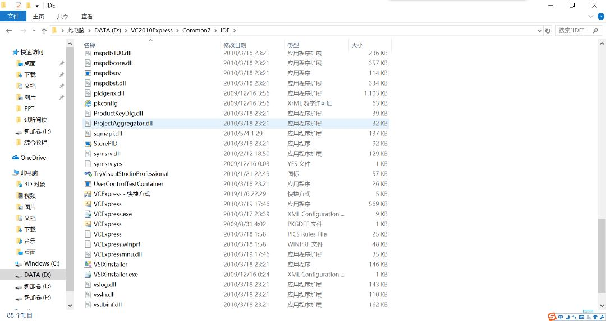

#   VS安装教程

##  安装顺序建议
### 大一
*   为适配<a href="#VC6">Visual C++6.0</a>，建议先安装*VS2010*
*   **但是！！！** *VS2010*试用期仅有30天，由于大二的缘故（在下一栏解释），建议先安装<a href="#VC2010">Visual C++2010 Express</a>（<a href="#crack">除非你能破解</a>）

### 大二短学期
*   为适配可能会遇到的MFC学习，建议安装<a href="#VS2010">Visual Studio 2010</a>
*   若已安装Visual C++2010 Express，建议先行卸载
*   **注意**：Visual Studio 2010仅有30天试用期，因此请勿提前安装（<a href="#crack">除非你能破解</a>）

### 之后
*   推荐使用<a href="#VSlatest">Visual Studio 最新版本</a>
*   如果是非Windows平台，推荐使用[JetBrains全家桶](https://www.jetbrains.com/)，在此不再赘述

##  <a name="VC6">Visual C++6.0</a>
为表示对VC6.0的鄙视、不屑和不推荐，故不写教程🙃

##  <a name="VC2010">Visual C++2010 Express</a>
*   下载链接：[百度网盘](https://pan.baidu.com/s/1nj0YWsiMLNVf8qW1wBC5-g)
*   提取码: `n8td`

### 启动
感谢予笙同学的反馈！

本程序安装完后，不会自动创建快捷方式，请在安装目录下，进入`\Common7\IDE\`，如图，此处可见`VCExpress.exe`，双击即可启动~

##  <a name="VS2010">Visual Studio 2010</a>
*   下载链接：[百度网盘](https://pan.baidu.com/s/1Fe84F-eMc4cdgNQ6Ap_CtQ)
*   提取码: `ve5h`

#### <a name="crack">网传破解方法（失效）</a>
*   方法一：在控制面版的在卸载向导中输入序列号
`YCFHQ-9DWCY-DKV88-T2TMH-G7BHP`
*   方法二：
    1.   解压`.iso`后找到`setup\setup.sdb`
    2.   用*记事本*打开，找到：`[Product Key]YR3W8FCM2B7BKF9HMQFTCH7WK`
    3.   将其替换成：`YCFHQ9DWCYDKV88T2TMHG7BHP`

##  <a name="VSlatest">Visual Studio最新版本</a>
[微软官网](https://visualstudio.microsoft.com/)下载安装*Community版本*

>   注意：使用学生身份【即教育邮箱（东南大学：seu邮箱，可在[信息门户](https://my.seu.edu.cn)内访问）】可以使用数年的*Pro版本*，但实质与*Community版本*差别不大
