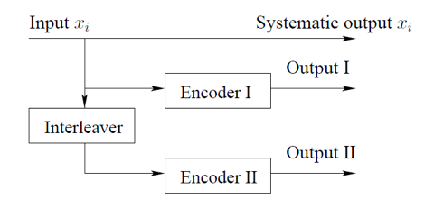
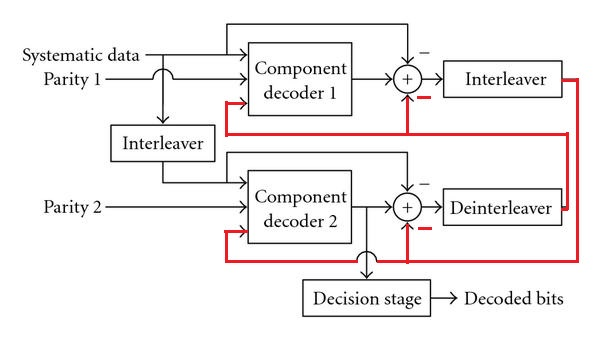
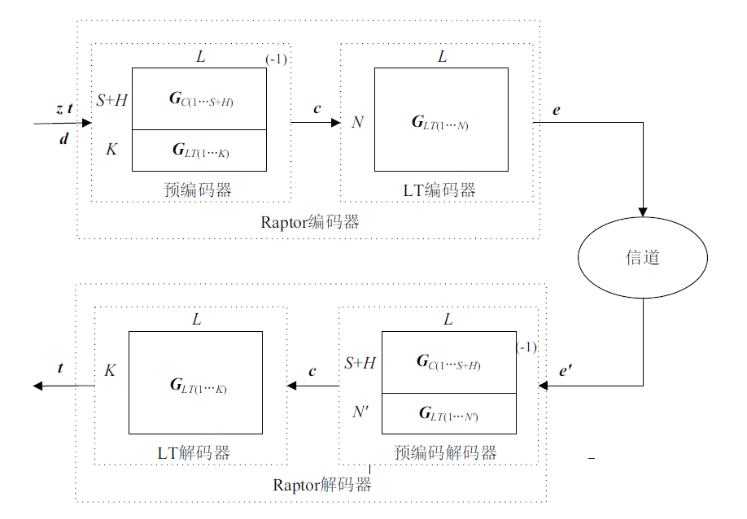
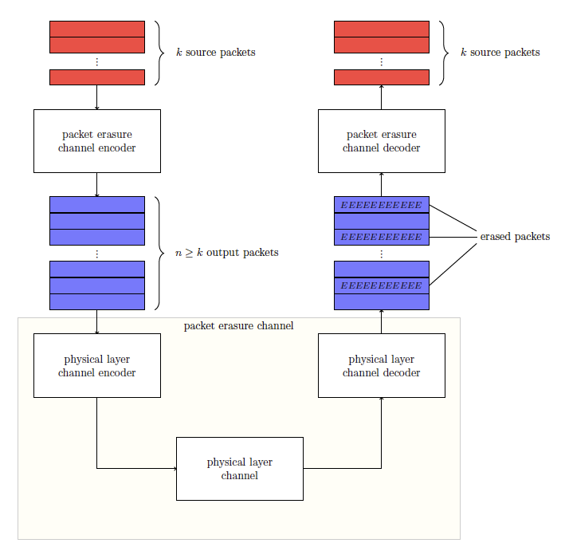

::: slot page-top

:::

# 通信原理笔记

$c = [b|m] = m [P|I_k] = m G$，G 为生成矩阵，b 为校验位，m 为信息位，c 为码字

校验矩阵 $H = [I_{n-k}|P^T]$

## 概念

- 导频：为测量或监控的目的而发送的信号
- 信道估计：从接收数据中将假定的某个信道模型的模型参数（一般指信道矩阵）估计出来
- 信道矩阵：传输概率矩阵
- 信道状态信息：接收端评估 CSI 并将其量化反馈给发送端。包含 信道矩阵，信号散射，环境衰弱，距离衰弱 等

## 外文缩写

- BP：置信传播 or 反向传播
- CSI：信道状态信息
- FDD：频分双工
- MMSE：最小均方误差
- BCJR：一种定义在网格图上的用来最大化纠错编码的后验概率的算法，主要用于卷积编码。
- LLR：	Log-Likelihood Ratio
- BLER：Block Error Rate
- MDS：maximum distance separable code，极大距离可分码
- ML：maximum likelihood
- NCG：net coding gain，净编码增益，BER 为一定水平时（譬如 $10^{-15}$）时，有 FEC 相较于无 FEC 带来的 SNR 的提升

### 5G 缩写

- SSB：Synchronization Signal and PBCH block，由主同步信号(Primary Synchronization Signals, 简称PSS)、辅同步信号(SSS)、PBCH三部分共同组成
- PDCCH：物理下行控制信道
- PDSCH：物理下行共享信道
- CSI-RS：信道状态指示参考信号
- PRACH：物理随机接入信道
- PUCCH：物理上行控制信道
- PUSCH：物理上行共享信道
- SRS：Sounding Reference Signal，探测参考信号

## 生词表

- interleaver：交织器
- permute：排列

## 信道编码

信道编码属于物理层，这里主要介绍无线物理层

在手机等移动通信设备中，信道编码大都由基带芯片实现。

LDPC 与 Turbo 码都属于 compound code（系列码）

### Turbo 码

[Turbo 码: 一个辉煌时代的落幕](https://zhuanlan.zhihu.com/p/23112534)

要想尽可能逼近香农信道容量的理论极限，就要不停增大线性分组码的码字长度，以至于最大似然解码器的计算复杂度不断提升，最终物理上都不可能实现这样的解码器。

Turbo 的编码器非常简单，由两个并行的卷积码编码器组成。所谓卷积码，即输出为输入和一段已知序列的卷积。与其对应的分组码则是将序列分段，每段序列和编码矩阵相乘得到输出序列（在后续发展中，Turbo 码也拥有了分组码版本）。在 Turbo 码中，输入序列 在进入第二个编码器时须经过一个交织器 (Interleaver)，用于将序列打乱。两个编码器的输出(Output I 和 II)共同作为校验信息添加到信息序列(Systematic output)之后，对抗信道引起的错误。

Turbo 码 使用伪随机交织器，其目的是：
1. 将 一半的turbo码中 容易产生的错误 与 另一半中 不太可能产生的错误绑定
2. 在遇到匹配错误的解码时仍能有稳定的表现，这种错误的解码在信道统计信息未知或错误时常见。

此处 output 就是 parity

值得注意的是，Turbo码的强大主要来源于其解码器。从下图 Turbo 码解码器中可以看到，整个解码过程与编码过程形成对应关系，信息序列 (Systematic data) 和相应的校验序列 (Parity 1 and 2) 分别输入两个解码器，而后各自的输出经过一个减法运算并通过交织和解交织( Deinterleaver) 后反馈给另一个解码器。
**Turbo 的核心正是这一减法和反馈，图中由红线标注。这一小小的连线堪称上帝之手，它将解码技术，甚至是信息理论推向了一个新的时代。**
为什么要做减法呢? 因为输出信息被分解为内信息 (intrinsic information) 和外信息 (extrinsic information)，通过减法从输出信息中取出外信息并将其反馈给另一个解码器。**在迭代解码过程中，接收信息错误不断地被纠正，最后无限逼近香农极限。整个解码过程信息在两个极为简单的解码器间不断地轮转，像一台无比强大的涡轮机，因而得名Turbo。**

#### RSC 码

RSC（recursive systematic convolutional）码

#### LDPC

由于篇幅过长，单开一篇：[LDPC 笔记](/2021/03/26/2021-03-26-LDPC/)

## 喷泉码

> *摘自维基百科*：

**喷泉码**（也称为**无码率抹除码**）是一类抹除码，这种编码能够从一组给定的源符号序列中产生一串不限长度的编码符号序列，在理想情况下，从编码符号序列中获得大小和源符号相同或稍大的任意子集，便可恢复源符号。术语“喷泉”或“无码率”是指此类编码不表现出固定的编码率。

最优的喷泉码应当能够从任意 k 个编码符号中恢复出 k 个源符号（每个 source block 中 有 k 个 source symbol）。喷泉码被认为具有高效的编解码算法，能以高概率从任意 k’ 个编码符号恢复 k 个源符号（k’ 仅稍大于 k）。

LT 码是第一种实际可用的喷泉码。随后提出的 Raptor 码和在线码加入了输入符号的预编码阶段，从而实现了编解码的线性时间复杂度。

喷泉码可灵活适用于固定编码率或无法先验确定出固定编码率的地方，及需要高效编解码大量数据之处。

- absolute overhead：δ 为接收到的多余的符号数，即 m - k，其中 m 为接收到的符号数，k 为发送的符号数
- relative overhead：$\epsilon=\frac{\delta}{k}$

### LT 码

LT：Luby Transform

LT 码是非系统的喷泉码，其编码先根据一个*度分布函数*产生一个*随机度数值 d*，随后从大小为 K *信源符号*集合中随机且不重复地抽取 d 个信源符号，最后将抽出的 d 个信源符号*异或*求和得到一个*编码符号*。

LT 码就由度分布来定义

LT 码的译码通常采用复杂度较低的置信传播算法，在接收端 BP 算法先根据编码信息生成 Tanner 图，随后信息在变量节点和校验节点间**不断流动**并且消除无用的边，最后恢复出全部 K 个变量节点的值。

LT 也可使用高斯消去进行译码

#### 随机线性喷泉码

LRFC：Linear Random Fountain Codes

随机线性喷泉码可以由给定的 K 个信源符号编出任意多的编码符号，其生成矩阵是一个半无限的随机二进制矩阵，即编码矩阵中随机等概的出现 0 和 1。将原始信源符号向量 t 与生成矩阵 G 相乘即得到编码符号向量 e：
$$e_{[0:\infty]}=G_{[\infty\times{K}]}\cdot{t_{[0:K-1]}}$$

编码符号被封装成数据包送入删除信道中传输，其中部分数据包被删除，接收端一直接收数据包，直到成功接收 N' 个。发送端传输每个编码数据包前会在数据包上添加一个*编码符号标识*（Encoding Symbol Identity, ESI），接收端根据 ESI **使用相同的随机数发生器**，就可获知生成该编码数据包的全部随机信息。额外添加传输的 ESI 相对于数据包长度只增加很小的开销。如果 $N' < K$，接收端没有收到足够多的信息，不可能恢复全部的原始发送信息。当 $N'\geq{K}$ 时，只要接收的编码数据包构成的随机矩阵中含有一个 $K\times{K}$ 维的可逆子矩阵 G'，就可成功译码：
$$t_{[0:K-1]}=G'^{-1}_{[K\times{K}]}\cdot{e'}_{[0:N'-1]}$$
其中 e' 是接收到的 N' 个编码符号的向量。

### Raptor 码

Raptor 码首先使用常规的*高码率线性分组码*对信源符号进行一次*预编码*得到*中间符号*，
再对中间符号使用一个具有很小平均度数的 LT 码进行编码，
接收端在接收到一定数量的 Raptor 码数据包后首先恢复出中间符号，然后再得到最终的*信源符号*。

编码器分为两个部分，分别是预编码器和 LT 编码器，两者都可用一个生成矩阵表示。其中 t 为 K 个信源符号组成的向量，在 t 的前面添加 (S +H) 个全零符号，就得到了编码器的输入符号向量 d：
$$d_{[0:L-1]}=[z^T_{[0:S+H-1]}t^T_{[0:K-1]}]^T$$

记预编码器的编码矩阵为 A ，将 d 与 A 的逆矩阵相乘就得到了预编码生成的中间符号向量 c
$$c_{[0:L-1]}=A^{-1}_{[L\times{L}]}\cdot{d_{[0:L-1]}}$$

raptor码主要思想是把待发送的文件分成同样长度的 K 组，称为 K 个输入符号，每一组长度可能只有 1 bit，也可能有数百乃至数千比特。Raptor 码的编码过程由预编码过程和 LT 码 的编码过程组成，预编码过程将原始输入单元通过某种传统的纠错码转换为中间编码校验单元，然后将中间编码校验单元作为 LT 码 的输入单元进行编码，这样在 Raptor 码的解码过程中利用 LT 码技术解码只需要恢复固定比例的中间编码校验单元，再利用传统纠错码的解码性质就可以恢复所有的输入单元。根据中间编码校验单元所处的层次可以划分为单层校验预编码技术和多层校验预编码技术。

## 删除信道

### BER

二进制删除信道

信道容量：$C=1-\sigma [bits/channel use]$，其中 $\sigma$ 为 发0收E的概率

### QER

Q 进制删除信道，即词典为 0~Q-1和E

信道容量：$C=1-\sigma [symbols/channel use]$，$C_b=log_2(q)C [bits/channel use]$

### PEC

Packet 删除信道，即输入为一个 L 个符号组成的数组

信道容量：$C=1-\sigma [symbols/channel use]$，$C_b=LC [bits/channel use]$

PEC 编码器接收 k 个包，生成 n 个包，来使得每个数据帧都被一个删除码保护（？）；
接收端先在物理层对各包进行校验（使用包内CRC），并丢弃出错的包，然后从剩余包中解码出 k 个源数据包。

## 交织

交织器用于将不同包中的数据交织，这可能可以弱化无线通信中的突发错误（burst error），使其逆转为普通的随机错误。

突发错误：由信道衰落（譬如信号受到强烈干扰）等导致的集中的错误。与随机错误不同的是，突发错误往往集中在一段时间，而随机错误则十分均匀。

如下图所示，一种颜色代表一个数据包（packet）。

## 经验之谈

BCH 码在 1w 码长下基本纠正 4bit 错误

