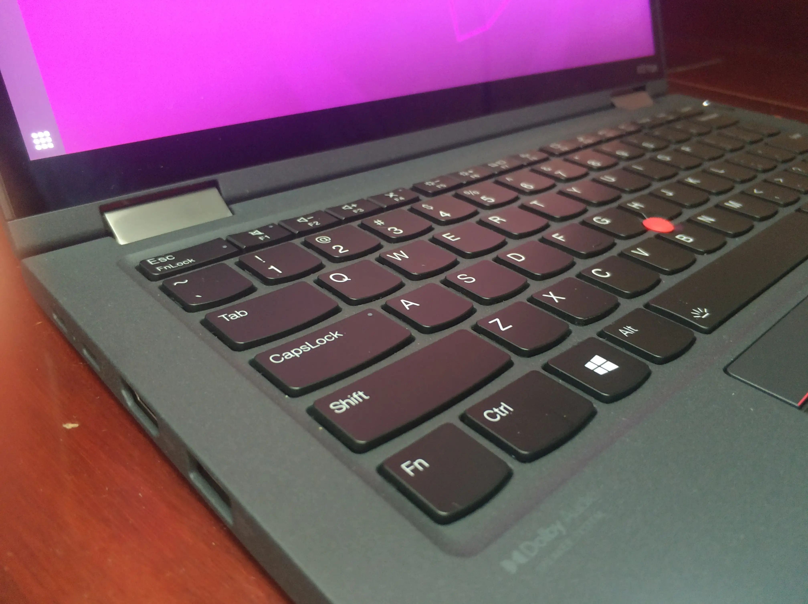

::: slot page-top

:::

## Bios 调整

进入 Bios 方法：开机时择机按下 Enter 键，出现菜单后根据指示按下 F1。

这台笔记本非常奇怪地把 *Fn* 键放在了最左下角，而 *Ctrl* 则屈居其右。
好在工程师也觉得这很奇怪，因此在 Bios 中预设了交换两者位置的选项：Config->Keyboard->Fn and Ctrl Key swap。

<!--  TODO -->

按照惯例，再把功能键关闭（也就是按下 Fn+F1 才能关闭音量云云）：Config->Keyboard->F1-F12 as Primary Function。

如果要像我一样用 Ventoy 等对安全启动支持不太好的方式安装系统的话，可以提前关闭 *Secure Boot*：Security->Secure Boot。安装完后可以重新开启，并不影响系统正常使用。

## 安装 Ubuntu

本次选用 *Ubuntu 20.04.2 LTS*。
考虑到日常使用，因此选择了支持 [deepin-wine](https://github.com/zq1997/deepin-wine)较好的版本。诸如 *21.04* 等版本目前尚有微信无法打开等问题。

但由于 *ThinkPad X13 Yoga Gen2* 使用了 i7-1165G7，其上的 *Xe* 核显并不受 *20.04* 支持（废话，20.04 出的时候还没 11 代 U 呢），因此在安装的时候存在分辨率仅有 800x640 的问题。这里只能使用 Tab 键盲猜 *下一步* 位置等操作来完成安装步骤。

此外，由于目前电脑都默认启用 *Secure Boot*，而我在用 [Ventoy](https://github.com/ventoy/Ventoy) 进行安装时始终无法进入安装系统，最终只好在安装时关闭 *Secure Boot*，安装完毕后再启用之。后续见 [[issue]: Failed to secure boot](https://github.com/ventoy/Ventoy/issues/1024)。

## 指纹识别

能用指纹当然要用指纹了。

首先照常：
```bash
sudo apt update
sudo apt upgrade
```

然后更新驱动：
```Bash
fwupdmgr get-updates
fwupdmgr update
```

更新完后记得重启电脑。会进行较长时间的 Bios 自检（不清楚是否是更新驱动导致的）

启用指纹识别：
```Bash
sudo pam-auth-update
```
用空格启用指纹，tab 到 *确定* 一栏再回车。

于是就能在 设置->用户->指纹 录入指纹了。

通过 pam，`sudo` 时可以用指纹代替密码，非常非常方便。

> 此节参考：https://zhuanlan.zhihu.com/p/267160188 https://www.cnblogs.com/qingchuwudi/p/13359417.html

## 类 Windows Hello 的人脸识别

同样使用红外和相机进行识别，还是很方便的。

这里使用 [Howdy](https://github.com/Boltgolt/howdy)

[如何确定 device_path](https://github.com/boltgolt/howdy/issues/533#issuecomment-829116906)

## Ubuntu 配置

不显示挂载的硬盘：
```bash
gsettings set org.gnome.shell.extensions.dash-to-dock show-mounts false
```

添加休眠模式：参考[gnome-shell-extension-hibernate-status](https://github.com/arelange/gnome-shell-extension-hibernate-status) 的介绍，并安装[该插件](https://extensions.gnome.org/extension/755/hibernate-status-button/)
